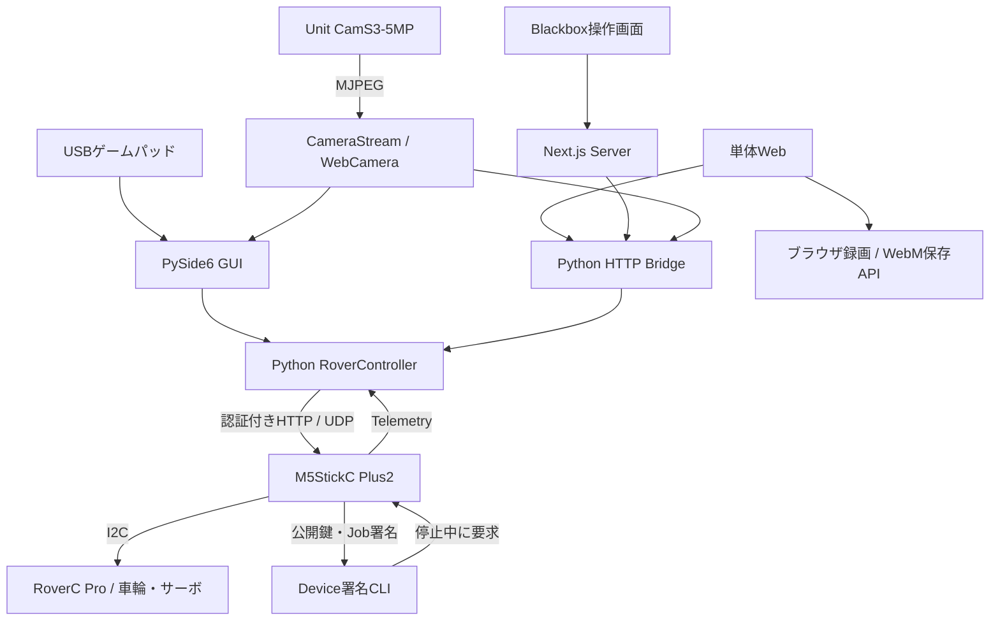

# Verifiable Blackbox — M5Stack RoverC Architecture

作成日: 2026-09-26

## 1. 目的と機能範囲

M5StickC Plus2を搭載したRoverC ProをローカルWi-Fiから操作する。走行・グリッパー・カメラ・停止処理を共通の制御層へまとめ、単体Web、デスクトップGUI、Verifiable Blackboxの操作画面から利用できる構成にする。

| 機能 | 内容 |
|---|---|
| 走行 | 前後・横・斜め移動、旋回、速度制限、モーター出力の段階変更 |
| グリッパー | 開く、長押しで閉じる、解放、GUIでの位置保存・ゆるめる操作 |
| 状態確認 | 接続、ARM、I2C、指令値、出力設定値、RSSI、停止理由 |
| 操作画面 | 単体Web、PySide6 GUI、日英切替、ゲームパッド |
| カメラ | Unit CamS3-5MPからのMJPEG受信、映像表示、ON/OFF、再接続 |
| 録画 | 単体WebでのWebM録画とPCへの保存 |
| ネットワーク | Home／Hotspotの明示切替、探索、USBからの復旧 |
| Device署名 | 停止・DISARM中のJob識別情報へのP-256署名 |
| アプリ接続 | Python Bridgeを通じた操作・カメラ中継 |

モーター値とサーボ角度は指令・設定値として扱う。実速度、移動距離、把持力、作業完了の計測値ではない。映像表示、操作終了、機体署名のいずれも、自動的な支払いのトリガーにはしない。

## 2. ハードウェアと全体構成

対象機器はM5StickC Plus2、RoverC Pro、Unit CamS3-5MP。Rover制御とカメラは別のFirmware・給電・ネットワーク接続を持つ。PCと機器は相互通信できる同じLANを利用する。



| 接続 | 設定 |
|---|---|
| Rover I2C | address `0x38`、SDA GPIO0、SCL GPIO26 |
| Rover HTTP | port 80、`X-Rover-Token`による認証 |
| Rover UDP | port 4210、走行指令・探索・Telemetry |
| カメラ | HTTPの`/capture`、port 81の`/stream`、mDNS `rover-camera.local` |
| Python Bridge | `127.0.0.1:8765`、起動ごとのBearer token |

グリッパーはS1を使い、S2は追加サーボ用とする。カメラのUSBポートと走行用M5のUSBポートを区別し、COM番号やIPをコードへ固定しない。

## 3. 技術構成とディレクトリ

走行FirmwareはPlatformIO・Arduino・M5Unified、カメラはArduino ESP32、PC側はPython・requests・PySide6・pygame-ceを使用する。利用するSDK・board・依存関係はビルド確認後に固定する。カメラはハードウェア検出値に適合するdriverとPSRAM設定を選択する。

```text
M5stack_RoverC/
├── ARCHITECTURE.md
├── TASKS.md
├── README.md / .gitignore
├── m5stick-rover/
│   ├── platformio.ini
│   ├── include/wifi_profiles.h
│   ├── include/secrets.h.example
│   └── src/main.cpp / device_signature.cpp / device_signature.h
├── camera-firmware/
│   ├── RoverCamera/              # MJPEG・HTTP・Wi-Fi設定
│   └── DetectCamera/             # ハードウェア版の確認
├── rover-python/
│   ├── app.py                    # GUI
│   ├── rover_client.py           # 探索・状態・停止・診断CLI
│   ├── web_bridge_server.py      # 単体Web／アプリ中継
│   ├── pyproject.toml / requirements.txt / .env.example
│   ├── rover/
│   │   ├── api.py / protocol.py / models.py
│   │   ├── control.py / mixer.py / config.py
│   │   ├── web_bridge.py / web_camera.py / camera.py
│   │   ├── gamepad.py / i18n.py / widgets.py
│   │   └── network_switch.py
│   ├── web/                      # HTML・CSS・操作・録画JavaScript
│   ├── config/                   # 設定テンプレートとローカル設定
│   ├── tests/
│   ├── recordings/               # 実行時生成、Git対象外
│   └── logs/                     # 実行時生成、Git対象外
├── start_rover_web.cmd
├── start_rover_home.cmd / start_rover_hotspot.cmd
└── docs/                         # 組立・起動・校正・接続復旧
```

Firmware、通信、入力、画面描画、カメラ受信を分離する。WebとGUIはPythonの同じ通信・設定モジュールを利用する。GUI・単体Web・Blackboxの実機操作は同時に接続せず、機体のARM sessionは一つのControllerが所有する。

## 4. Firmwareと通信

### 機体の状態

起動時はモーター出力をゼロにし、DISARM状態でWi-FiとI2Cを初期化する。認証されたARM要求とI2C正常確認後に操作sessionを開始する。別sessionからのARMは拒否する。

入力`x/y/z`を4輪の出力へ変換し、速度上限と車輪ごとの極性を適用する。通常の加減速は20ms周期・出力差5を基準に段階変更し、停止要求は通常の加減速待ちを介さずゼロ出力を要求する。

### UDP形式

little-endianの固定長packetを使う。HTTP statusのサービスprotocol番号と、UDP packetのversionは別に扱う。

| packet | 内容 |
|---|---|
| Control / 34 bytes | magic `0x52565232`、version `1`、flags、size、session ID、sequence、x/y/z、速度上限、サーボ角度、reserved、token hash、CRC32 |
| Telemetry / 36 bytes | magic `0x54454C32`、version `1`、flags、size、sequence、uptime、x/y/z、4輪出力、サーボ角度、RSSI、速度上限、packet age、CRC32 |

操作flagsはdeadman、emergency stop、gripper valid、aux servo valid。TelemetryはI2C・ARM・motors・Wi-Fiの状態と停止理由を返す。PythonとFirmwareでfield順序・型・byte数・CRCを一致させ、サイズ不正、CRC不正、session違い、古いsequenceを拒否する。

UDP token hashはFNV-1a、CRC32は破損検出用であり、暗号学的な署名や暗号化には使わない。機体通信は信頼するローカルLAN内に限定する。

操作送信は25Hz、Telemetryは100ms周期を基準とする。探索要求は`ROVER_DISCOVER_V1`。Telemetryは最新の応答を利用し、遅延したpacketから画面や操作許可を巻き戻さない。

### 機体HTTP API

| API | 用途 |
|---|---|
| `GET /status` | 状態、protocol、UDP port、出力値、停止理由 |
| `POST /arm` | session IDを指定してARM |
| `POST /disarm`、`POST /stop` | 出力停止とDISARM |
| `POST /config` | DISARM中の速度上限・車輪極性設定 |
| `POST /drive` | 50〜1000msに制限した診断用の各輪出力 |
| `GET/POST /network` | Wi-Fi profile確認・明示選択 |
| `/device-signature*` | 署名buildでのみ提供する機体署名API |

HTTP操作には機体の`X-Rover-Token`を使用する。診断用の駆動は通常の探索・状態確認とコマンドを分ける。

## 5. 停止と復帰

| 層 | 条件 | 動作と復帰 |
|---|---|---|
| Firmware | 起動、Button A、明示Stop／DISARM | ゼロ出力・DISARM。操作再開にはARMが必要 |
| Firmware | 操作packetが1000ms途絶 | ゼロ出力、LINK WAIT。同じsessionの新しい入力で復帰可能 |
| Firmware | Wi-Fi切断・I2C異常 | 停止処理。再接続・I2C復旧だけで走行を始めない |
| Web Bridge | 長押し更新が450ms途絶 | ゼロ指令、操作一時停止。明示releaseまで後続の駆動を拒否 |
| Web Bridge | Telemetryが800ms以上古い、DISARM、I2C異常 | Stopを試みて切断。失敗はerror表示 |
| Web Bridge | 接続後の無操作が60秒 | 停止・切断 |
| Browser | ボタン解放 | 増加したsequenceでreleaseを送りゼロ指令 |
| Browser | Stop、ページ離脱、タブ非表示 | 停止・切断を要求。画面終了時の送信だけに依存せずBridge期限も適用 |
| GUI | マウス／サーボ入力の更新が1秒途絶 | 古い指令を再送せずゼロ入力 |
| Gamepad | 入力取得が250ms以上停止 | ゼロ入力。GUI描画とは別スレッドで取得 |

BridgeはTelemetryのuptime進行とpacket ageも検査する。通信断やI2C障害で停止を確認できない場合は「停止確認できない」と表示し、成功扱いにしない。HTTP応答やゼロ設定値は物理的な静止の測定ではない。

## 6. 操作画面とPython Bridge

### 単体Webとアプリ中継

`web_bridge_server.py --web`は単体WebとAPIを起動し、`--camera`はアプリ中継でカメラAPIを有効にする。`--no-browser`はブラウザ自動起動を抑制する。どちらも起動・画面表示だけではARMせず、「接続」操作でsessionを開始する。

| Bridge API | 用途 |
|---|---|
| `GET /status` | 接続状態、Telemetry freshness、操作一時停止、機体情報 |
| `POST /activate` | Controller作成、接続、ARM、ゼロ指令、Web session発行 |
| `POST /drive` | session・sequence・方向・速度35/60/85を検査して操作更新 |
| `POST /release` | 同じsessionの新しいsequenceで走行・閉じ増しを停止 |
| `POST /stop` | 停止要求。状態をpollして完了／errorを確認 |
| `POST /gripper` | `open`／`close`、session・sequenceによる開閉操作 |
| `GET/POST /camera` | カメラ状態・接続先設定 |
| `GET /camera/frame` | 最新JPEG。新鮮な画像がなければ204 |
| `POST /camera/power` | PC側の映像受信ON/OFF |
| `POST /camera/recordings` | 単体WebのWebM保存 |

通常のPOST本文はJSON・最大2048 bytes。APIはBearer token、単体WebはHost・Originも検査する。単体Web用tokenはローカル画面へ渡し、Blackbox接続用tokenはNext.js ServerとBridgeだけで共有する。機体のAPI tokenはBrowserへ渡さない。

### グリッパー

「開く」は1回の要求で設定角度へ動かす。「閉じる」は長押し中だけ小刻みに更新し、Telemetryのsequenceと角度設定値で受信確認を行ってから次へ進む。Webの段階幅は2°、更新間隔は120msを基準にする。GUIは1°単位の閉じ増し、3°ゆるめる操作、位置保存・呼出を提供する。

解放時は閉じ増しを止め、最後の角度設定を保持する。Firmwareのグリッパー範囲は10〜90°、追加サーボは45〜135°とし、機体校正でさらに制限できるようにする。力・接触・実角度は計測しない。

### GUIとゲームパッド

GUIの起動を操作モードの開始とし、自動探索・接続・ARMを行う。接続直後はゼロ入力とし、ゲームパッドはスティックの中立確認後に有効にする。Webの明示接続とは起動動作を分ける。

左スティックは前後・横移動、右スティックXは旋回、A/Bはグリッパー、十字キーは速度、StartはStopへ割り当てる。画面ボタンも提供し、ゲームパッドなしで使えるようにする。マウスの短押しは約0.35秒、長押しは保持中の操作とする。通信・ゲームパッド読取・カメラ受信をGUI描画から分離する。

## 7. カメラ・録画・Wi-Fi

カメラFirmwareはSTA modeでLANへ接続し、JPEG／MJPEGを提供する。ネットワーク切替APIは認証する。映像の配信を機体署名付きEvidenceや暗号化映像とは扱わない。

CameraStreamは別スレッドで受信し、最新フレームだけを保持する。2秒以上古い画像、切断中の画像、タブ非表示中の画像は表示しない。カメラURLと受信ON/OFFをPC設定へ保存し、OFFにしてもURLを保持する。受信ON/OFFはカメラ機器の電源操作とは区別する。

単体Webではブラウザの録画機能で音声なしWebMを生成する。10分または約120MBを上限にし、カメラOFF・切断・タブ非表示で録画を終了する。Serverの受入上限は128MiBとし、Content-Type・実受信量・WebM headerを確認する。Serverが生成したファイル名で`recordings/`へ保存し、不完全なファイルを残さない。保存失敗時はブラウザからの保存手段を示す。

Home／Hotspotは名前付きprofileとして管理し、利用者の明示操作で選択する。PC・Rover・カメラの接続先と疎通を照合し、設定変更前に停止する。勝手な別profileへの切替は行わない。Wi-Fi処理は停止処理を塞がず、USBシリアルの`network home`等で復旧できるようにする。Windowsのネットワーク切替は専用モジュールへ分離し、他OSでは手動接続の手順を示す。

## 8. Device署名

署名機能は`m5stick-c-plus2-signature`のbuildで有効にし、通常buildはAPIと鍵生成を含めない。秘密鍵はNVSへ保存し、壊れた鍵を自動で再生成しない。署名処理は低優先度の別taskで行い、停止・watchdog・通信処理を継続する。

```text
schemaHash = SHA-256(UTF-8("DeviceJobSignatureV1"))
digest = SHA-256(abi.encode(schemaHash, uint256 chainId, address core, uint256 jobId))
publicKey = qx || qy    # 64 bytes
signature = r || s     # 64 bytes、P-256、low-S
```

機体が128 bytesのメッセージを構成してhash化し、そのdigestへ署名する。要求は`chain_id`・`job_id`が32-byte hex word、`core`が20-byte hex。

| API | 動作 |
|---|---|
| `POST /device-signature/key` | 停止・DISARM中に鍵を準備して公開鍵を取得 |
| `POST /device-signature` | Job識別情報の署名を要求 |
| `GET /device-signature` | `idle / busy / ready / error`と結果を取得 |

すべて機体tokenで認証する。ARM中の署名と、署名処理中のARMは409で拒否する。処理中は202、同一要求の直近結果はRAMキャッシュから返す。再起動後は公開鍵を保持するが、署名bytesの一致までは要求しない。

署名はJob識別情報への機体鍵の署名であり、Jobの存在・Evidenceの正しさ・作業完了を保証しない。NVS保存はSecure Elementによる保護とは区別する。P-256照合、ENS読取、ERC-7913照合はアプリの独立署名部品が担当する。

## 9. Blackboxとの接続と設定

[Blackboxアプリ](../app_Verifiable_Blackbox/docs/ARCHITECTURE.md)はNext.js ServerからBridgeを呼ぶ。アプリlauncherの`ROVER_PYTHON_ROOT`へこのフォルダの`rover-python`の絶対パスを、必要に応じて`ROVER_PYTHON`へ仮想環境のPythonを設定する。アプリrootからの相対位置は`../M5stack_RoverC/rover-python`。

アプリ側が起動ごとの`VBB_BRIDGE_TOKEN`を生成し、Bridgeへ渡す。Ethereum秘密鍵、RPC資格情報、Phala設定はBridgeへ渡さない。Job管理、利用者承認、Phala検証、決済、台帳はアプリ側が担当する。

Bridgeは`physicalMovementVerified=false`、`paymentEnabled=false`を返し、非ゼロ指令・停止・グリッパー操作からEvidenceを自動生成しない。合成EvidenceのCLIを用意する場合は試験用と明記し、操作経路へ接続しない。アプリの`/api/demo/rover/complete`による自動決済は利用しない。

`secrets.h`、`.env`、実機設定、NVS／Flash backup、署名結果、録画、ログ、仮想環境、ビルド生成物はGit対象外とする。テンプレートはダミー値だけを含める。開発の変更履歴はGitのログで管理する。

## 10. 実装計画

[TASKS.md](TASKS.md)に、Firmware・Python・操作画面・カメラ・ネットワーク・署名・アプリ接続・実機試験のタスクと完了条件を定義する。
