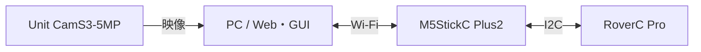

# M5Stack RoverC Pro Remote

**Wi-Fi経由でRoverを走らせ、グリッパーとカメラを操作するアプリです。**

[English](README.md)

前後・横・斜め移動と旋回、グリッパー開閉、ライブ映像、Web録画に対応しています。画面は日英切替でき、GUIではUSBゲームパッドも使えます。

## 必要なもの

| 機材 | 用途 |
|---|---|
| [M5StickC Plus2](https://shop.m5stack.com/products/m5stickc-plus2-esp32-mini-iot-development-kit) + [RoverC Pro](https://shop.m5stack.com/products/roverc-prow-o-m5stickc) | コントローラーと車体。グリッパーは車体に付属。 |
| PC・USBデータケーブル・2.4 GHz Wi-Fi | 設定・書込み・操作用。PCと機器は同じLANに接続。 |
| [Unit CamS3-5MP](https://shop.m5stack.com/products/unit-cams3-wi-fi-camera-5mp) | 映像を使う場合。Grove2USB-C・ケーブル・5 V電源も必要。 |
| USBゲームパッド | 任意。マウスだけでも操作可能。 |

対象コントローラーはPlus2です。M5StickS3への置換は未検証です。

## 最初の準備

Python 3.11以上を使用します。Windowsは`setup.ps1`、macOS／Linuxは`rover-python`内で仮想環境を作成し、`requirements.txt`から依存を導入します。

1. Roverとカメラを接続・給電し、Roverの**車体側の電源**もONにします。
2. 各機器の`secrets.h`にWi-Fi情報と共通のAPI tokenを設定し、対象USBポートへFirmwareを書き込みます。既存設定・署名鍵は保持します。
3. `rover-python/.env`にRoverのURLと同じtokenを設定し、接続を確認します。初回は車輪を浮かせ、グリッパー周囲を空けて動作を確認します。

## 起動

初回の設定・Firmware書込みが済んだ後の起動方法です。WebとGUIは一つずつ使います。

| OS | 単体Web | GUI |
|---|---|---|
| Windows（プロジェクトroot） | `start_rover_web.cmd` | `rover-python/start_rover_gui.cmd` |
| macOS／Linux（`rover-python`内） | `.venv/bin/python web_bridge_server.py --web` | `.venv/bin/python app.py` |

macOS／Linuxは、そのPCで仮想環境を作り`requirements.txt`を導入します。Windowsの`.venv`は流用しません。Wi-FiはOS側で手動選択します。現在の動作検証環境はWindowsで、macOS／Linuxは未検証です。

Webは `http://127.0.0.1:8765/` を開き、**「ロボットに接続」でARM**します。GUIは起動後に自動探索・接続・ARMします。

## 基本操作

- **Web走行**：方向ボタンを押している間だけ移動し、離すと停止。「停止」で切断します。
- **グリッパー**：「はなす」で開き、「つかむ」の長押しで少しずつ閉じます。離すと閉じ増しを止めます。
- **カメラ**：「カメラ設定」に `http://<カメラIP>:81/stream` を設定します。
- **録画**：Record ON／OFFで録画・保存。保存先は`rover-python/recordings/`です。保存完了後にタブを閉じてください。
- **停止**：画面のStopまたはM5StickCのButton A。終了前に停止を確認します。

WindowsのHome／Hotspot切替は`start_rover_home.cmd`／`start_rover_hotspot.cmd`から行えます。両機器のWi-Fi設定と、Windows側の接続先登録が必要です。

## 関連ファイル

- [ARCHITECTURE.md](ARCHITECTURE.md)：構成・通信・停止処理。
- `docs/TASKS.md`：ローカルのタスク管理（Git対象外）。
- [カメラREADME](camera-firmware/README.md)：機体版・ビルド設定。
- `setup.ps1`／`scripts/`：Windowsの環境構築・ビルド・検証。
- `rover-python/preflight.py`：設定確認。`--probe`で機体statusを読み取ります。

Blackbox接続と停止中のP-256署名にも対応しています。走行や署名だけで支払いは実行しません。
