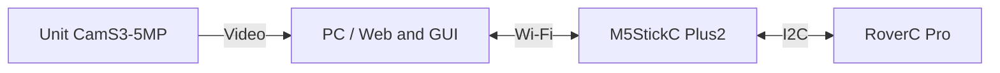

# M5Stack RoverC Pro Remote

**Drive a Rover and operate its gripper and camera over Wi-Fi.**

[日本語版](README.ja.md)

Supports forward, backward, sideways and diagonal movement, rotation, gripper control, live video, and Web recording. The interface supports Japanese and English, and the desktop GUI also supports USB gamepads.

## What you need

| Equipment | Purpose |
|---|---|
| [M5StickC Plus2](https://shop.m5stack.com/products/m5stickc-plus2-esp32-mini-iot-development-kit) + [RoverC Pro](https://shop.m5stack.com/products/roverc-prow-o-m5stickc) | Controller and robot base. The gripper is included with the base. |
| PC, USB data cable, and 2.4 GHz Wi-Fi | Setup, flashing, and control. Connect the PC and devices to the same LAN. |
| [Unit CamS3-5MP](https://shop.m5stack.com/products/unit-cams3-wi-fi-camera-5mp) | Optional video. Also requires Grove2USB-C, a cable, and a 5 V power supply. |
| USB gamepad | Optional. Mouse controls also work. |

The target controller is the Plus2. Replacement with an M5StickS3 has not been validated.

## Initial setup

Use Python 3.11 or newer. On Windows, run `setup.ps1`. On macOS / Linux, create a virtual environment in `rover-python` and install dependencies from `requirements.txt`.

1. Connect and power the Rover and camera. Turn on the Rover's **base power switch** as well.
2. Set Wi-Fi credentials and a shared API token in each device's `secrets.h`, then flash the firmware through the correct USB port. Preserve existing settings and signature keys.
3. Set the Rover URL and matching token in `rover-python/.env`, then check the connection. For initial movement checks, raise the wheels and clear the area around the gripper.

## Launch

Use these commands after initial configuration and firmware flashing. Run only one control interface at a time.

| OS | Standalone Web | GUI |
|---|---|---|
| Windows (project root) | `start_rover_web.cmd` | `rover-python/start_rover_gui.cmd` |
| macOS / Linux (inside `rover-python`) | `.venv/bin/python web_bridge_server.py --web` | `.venv/bin/python app.py` |

On macOS / Linux, create the virtual environment on that PC and install `requirements.txt`; do not reuse a Windows `.venv`. Select Wi-Fi manually through the OS. Validation has used Windows; macOS / Linux remain untested.

For Web controls, open `http://127.0.0.1:8765/` and **click Connect robot to arm**. The GUI automatically discovers, connects to, and arms the Rover after launch.

## Basic controls

- **Web driving:** Hold a direction button to move; release it to stop. **Stop** disconnects.
- **Gripper:** Click **Release** to open, or hold **Hold to grab** to close gradually. Releasing the button stops further closing.
- **Camera:** Set `http://<camera-ip>:81/stream` in **Camera settings**.
- **Recording:** Use Record ON / OFF to record and save to `rover-python/recordings/`. Wait for saving to finish before closing the tab.
- **Stop:** Use the on-screen Stop button or M5StickC Button A. Confirm the Rover has stopped before exiting.

On Windows, use `start_rover_home.cmd` / `start_rover_hotspot.cmd` to switch between Home and Hotspot. Both devices need the Wi-Fi settings, and the network profiles must be saved in Windows.

## Related files

- [ARCHITECTURE.md](ARCHITECTURE.md): Structure, communication, and stop handling.
- `docs/TASKS.md`: Local task tracking (excluded from Git).
- [Camera README](camera-firmware/README.md): Hardware revisions and build settings.
- `setup.ps1` / `scripts/`: Windows setup, builds, and validation.
- `rover-python/preflight.py`: Configuration checks. Add `--probe` to read device status.

Blackbox integration and P-256 signing while stopped are also available. Driving or signing alone does not trigger payment.
