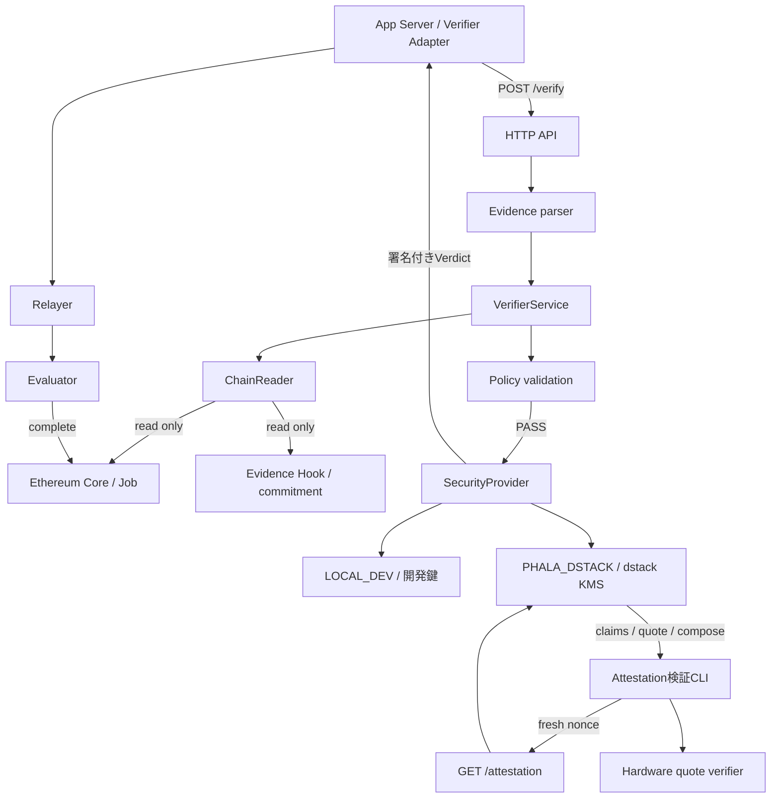

# Verifiable Blackbox — Phala Network Architecture

作成日: 2026-09-26

## 1. 目的

Phala Verifierは、EvidenceとEthereum上のJobを照合し、検証に合格した場合だけEIP-712形式のVerdictへ署名するサービス。Phala CloudのTEEで検証処理と署名を実行し、呼び出し側へVerdictと実行環境を確認するためのAttestationを提供する。

中心となる流れは「Evidence受付 → Chain照会 → Policy判定 → Verdict署名」。アプリのServerがVerdictを受け取り、RelayerからEvaluatorへ提出する。支払いとReceiptの発行はContractが担当する。

### 機能範囲

| 機能 | 責務 |
|---|---|
| Evidence受付 | schema、整数範囲、文字列長、hash形式の検査 |
| Chain照会 | Job、Provider、Evaluator、Hook、commitment、時刻の取得 |
| Policy判定 | Jobの提出状態、期限、機体ID、Challenge、Sequence、Checkpoint、commitmentの照合 |
| Verdict署名 | 合格結果をJob・Provider・commitment・有効期限へ結び付けて署名 |
| dstack連携 | KMSからの署名鍵導出、quoteと実行環境情報の取得 |
| Attestation検証 | fresh nonce、claims、hardware quote、期待する実行構成の照合 |

Evidenceの内容とオンチェーン記録の整合性を検証対象とする。利用者の承認署名はアプリServerで検証し、署名済み承認文書のhashをEvidenceの`imageHash`へ格納する。Verifierはその文書や画像の本体を受け取らない。

実移動、荷物運搬、映像の意味の自動判定、Device署名、ENS公開鍵の照合は対象外。機体操作と送金の権限も持たない。

## 2. 全体構成



### コンポーネント

| ファイル | 責務 |
|---|---|
| `src/index.ts` | 設定・鍵・サービスの初期化、起動、終了処理 |
| `src/config.ts` | 環境変数の型・範囲・モード別の必須項目を検査 |
| `src/types.ts` | Evidence、Verdict、JobSnapshot、VerifierModeの型 |
| `src/contracts.ts` | 読取ABI、EIP-712型、schema識別子、定数 |
| `src/evidence.ts` | 入力parse、Wire変換、ABI encoding、commitment計算 |
| `src/chain.ts` | RPC経由の読取。署名やTransaction送信は行わない |
| `src/policy.ts` | Evidence・JobSnapshot・設定を受ける副作用のない判定 |
| `src/verify.ts` | parse、Chain照会、判定、期限計算、署名を順に実行 |
| `src/security.ts` | 開発鍵／KMS鍵の選択、Verdict署名、Attestation取得 |
| `src/server.ts` | HTTP、本文サイズ制限、API応答、requestId |
| `src/errors.ts` | 入力不正・Evidence不正・サービス障害の分類 |

`ChainReader`と`SecurityProvider`はinterfaceで分離する。単体試験ではChain応答や署名処理を差し替え、RPCやTEEなしで判定を確認できるようにする。

## 3. 技術構成とディレクトリ

Node.js、TypeScript、viem、Zod、dstack TypeScript SDKを使用する。HTTPはNode.jsの標準API、試験はVitest、ContainerはDocker Composeを使用する。依存関係の利用版はクリーンインストールを確認してlockfileへ固定する。

```text
PhalaNetwork/
├── ARCHITECTURE.md
├── TASKS.md
├── README.md
├── package.json / package-lock.json
├── tsconfig.json / tsconfig.build.json
├── .env.example / .gitignore / .dockerignore
├── src/
│   ├── index.ts / config.ts / types.ts / contracts.ts
│   ├── evidence.ts / chain.ts / policy.ts / verify.ts
│   └── security.ts / server.ts / errors.ts
├── test/
│   ├── fixtures/demo-evidence-v1.json
│   └── Evidence・Policy・署名・API・Attestationの試験
├── scripts/
│   ├── run-local-e2e.ps1 / e2e-local.mjs
│   ├── dstack-smoke.mjs
│   ├── check-phala-env.mjs
│   └── verify-attestation.mjs
├── Dockerfile
├── docker-compose.yml
└── docker-compose.phala.yml
```

サービスはJobやVerdictのDBを持たず、リクエストごとにChainを照会する。アプリの決済進捗保存とContractの二重決済防止を組み合わせる。同じEvidenceへの再要求では、Jobが提出状態である間は別nonceのVerdictが発行され得る。Verifierのnonceだけで二重支払いを防ぐ設計にはしない。

## 4. Evidenceと検証Policy

### 入力形式

`POST /verify`は`{"evidence": {...}}`を受け取る。

| フィールド | 型・制約 |
|---|---|
| `jobId` | 正のuint256。Wireは10進文字列 |
| `scenario` | `success`または`tampered`。Demo用Challengeの生成に使用 |
| `robotId` | 1〜128文字 |
| `challenge` | 1〜256文字 |
| `capturedAt` | uint64のUnix秒。Wireは10進文字列 |
| `imageHash` | bytes32。承認フローでは署名済み承認文書のhash |
| `checkpoint` | 1〜128文字 |
| `sequence` | uint256。Wireは10進文字列 |

整数の数値入力を受ける場合は非負のsafe integerだけを許可する。Evidence内の未知のフィールドと必須項目欠落を拒否する。

commitmentは次のABI encodingのKeccak-256とする。JSON文字列のhashやpacked encodingは使用しない。

```text
abi.encode(
  string  schema = "DEMO_EVIDENCE_V1",
  uint256 jobId,
  string  robotId,
  string  challenge,
  uint64  capturedAt,
  bytes32 imageHash,
  string  checkpoint,
  uint256 sequence
)
```

`scenario`は直接このencodingに含めず、`challenge-${scenario}-${jobId}`の照合に使う。`tampered`という値だけで拒否するのではなく、実際のcommitmentやPolicyの不一致を判定する。

### 判定順序

1. 入力をparseする。
2. 接続Chainを確認し、CoreのJob、Hookのcommitment、block timestampを取得する。読取値は同じblock番号へ揃える。
3. Job IDが一致し、Jobが`Submitted`（status `2`）であることを確認する。
4. JobのEvaluatorとHookが設定値に一致することを確認する。VerdictのProviderはJobから取得する。
5. `robotId`、Challenge、Sequence、CheckpointをPolicyと照合する。
6. Evidenceの時刻が許容する未来ずれ・経過時間の範囲内で、Evidence時刻と現在のblock時刻がJob期限より前であることを確認する。
7. 計算したcommitmentがHookの非ゼロcommitmentに一致することを確認する。
8. 有効期限を計算し、合格した場合だけVerdictへ署名する。

初期Policyは`robotId=rover-demo-001`、`checkpoint=checkpoint-a`、`sequence=1`、Evidence最大経過時間600秒、未来ずれ60秒とする。Sequenceは期待値との一致を確認するもので、連続する機体ログの全履歴を追跡する仕組みではない。

## 5. Verdictと決済の境界

EIP-712 domainは`name=VerifiableBlackboxDemo`、`version=1`、設定された`chainId`と`verifyingContract=Evaluator address`を使用する。primary typeは`DemoVerdictV1`。

| フィールド | Solidity型 | 内容 |
|---|---|---|
| `jobId` | uint256 | 対象Job |
| `provider` | address | Chainから取得した報酬受取先 |
| `evidenceCommitment` | bytes32 | 検証したEvidenceのcommitment |
| `outcome` | uint8 | 合格は`1` |
| `issuedAt` | uint64 | 照会したblockのtimestamp |
| `validUntil` | uint64 | `min(issuedAt + TTL, job.expiredAt - 1)` |
| `nonce` | bytes32 | 暗号学的乱数32 bytes |

TTLは初期値300秒、最大900秒とする。`validUntil <= issuedAt`なら署名しない。Wire応答の整数は10進文字列、`outcome`のみ数値`1`とする。

アプリAdapterは入力との一致、Provider、期限、signer、EIP-712署名、Chain状態を再確認する。Evaluatorも署名・期限・commitment・再使用を検証する。HTTP成功やVerdict受領を支払い完了として扱わず、確定TransactionとReceiptで判断する。

## 6. API

| Method / path | 入力 | 応答 |
|---|---|---|
| `GET /health` | なし | `ok, service, verifier`。mode、signer、keySource、attested、simulated |
| `POST /verify` | `evidence` | `ok, verdict, signature, verifier` |
| `GET /attestation` | queryの`nonce` | `ok, mode, signerAddress, keySource, attested, simulated`、TEEではclaims・quote等 |

`verifier`は`mode, attested, simulated, signerAddress, attestationPath`を返す。`attestationPath`は利用可能な場合`/attestation`、LOCAL_DEVでは`null`とする。`/health`はサービスの状態確認であり、各Jobの検証成功やhardware quoteの検証成功を意味しない。

本文は`application/json`、最大16,384 bytes。実際に受信したbytes数でも上限を検査する。JSON応答は`Cache-Control: no-store`とする。

| HTTP | error.code | 用途 | retryable |
|---|---|---|---|
| 400 | `INVALID_REQUEST` | JSON不正、schema不正、上限超過、nonce形式不正 | false |
| 422 | `INVALID_EVIDENCE` | Job・期限・Policy・commitment不一致 | false |
| 503 | `SERVICE_ERROR` | RPC、KMS、quote取得等の障害 | true |
| 404 | `INVALID_REQUEST` | 対応しないpath／method | false |

失敗応答は`{ok:false,error:{code,reason,retryable},requestId}`とし、Verdictと署名を含めない。サービス障害をEvidence不正と区別する。

## 7. 署名鍵とAttestation

| 実行環境 | mode | keySource | attested / simulated |
|---|---|---|---|
| Local | `LOCAL_DEV` | `ENVIRONMENT` | false / false |
| dstack simulator | `PHALA_DSTACK` | `DSTACK_KMS` | false / true |
| Phala Cloud | `PHALA_DSTACK` | `DSTACK_KMS` | true / false（サービスの申告値） |

LOCAL_DEVでは開発用`VERDICT_SIGNING_KEY`を使用する。Phalaではdstack KMSからsecp256k1鍵を導出し、APIやログへ秘密鍵を出力しない。導出pathは`verifiable-blackbox/verdict/secp256k1/v1`、purposeは`verifiable-blackbox-verdict`とする。app identityと導出条件を揃えた再起動でsignerが一致することを確認する。

KMS初期化失敗時は起動を中止する。開発鍵への自動fallbackは行わない。Phala環境には開発鍵やsimulator設定を持ち込まない。

### Quoteの取得

呼び出し側は毎回ランダムなnonceを生成する。nonceは128文字以下の英数字と`._~-`を許可する。APIはnonceなしの情報照会も受け付けるが、freshnessを確認する検証ではnonceを必須とする。

claimsは`schema=VBB_ATTESTATION_V1`、`signerAddress`、`chainId`、`evaluatorAddress`、`evidencePolicy=DEMO_EVIDENCE_V1`、`composeHash`、`appId`、`instanceId`、`nonce`を含む。定義した順序でJSON serializationし、そのSHA-256を`reportData`としてquoteへ結び付ける。quoteとともにevent log、RTMR、measurement、app composeを提供する。

### 呼び出し側での検証

1. nonceが今回発行した値と一致することを確認する。
2. claimsのsigner・Chain・Evaluator・Policy識別子を期待値と照合する。
3. claimsのSHA-256と返却されたreportDataを照合する。
4. hardware quoteをquote verifierで検証する。検証先と信頼する結果の条件を実装時に固定する。
5. 検証済みquoteのreportDataがclaims digestを含み、残りの32 bytesがゼロであることを確認する。
6. app composeのSHA-256、claimsのcomposeHash、別途指定した期待Compose hashを照合する。
7. 検証済みquoteのmeasurementと期待する実行構成の結び付きを確認する。TDXでは利用するdstack仕様に沿って`mr_config_id`も照合する。

期待Compose hashは検証対象endpointの応答から採用せず、配置した構成から取得する。`attested=true`は独立したquote検証の代わりにならない。simulatorは署名やclaimsの試験に使い、hardware quote検証成功とは表示しない。Attestationは実行環境の証拠であり、物理作業やRPC応答の真実性を単独で保証しない。

## 8. 設定・配置・アプリ接続

必須設定は`RPC_URL`、`CHAIN_ID`、`ERC8183_ADDRESS`、`EVIDENCE_HOOK_ADDRESS`、`EVALUATOR_ADDRESS`。Policy、TTL、本文上限、port、Verifier modeを設定可能にする。起動時に範囲・address形式・モード別の条件を検査し、設定不正は項目名だけを返す。

ローカル開発ではWebが3000、Verifierが3100、Anvilが8545を使う。隔離した承認試験ではVerifier 3107、Anvil 8547を使えるようにする。Container内部は3000で待ち受け、Local Dockerではhostのloopbackの3100へ公開する。直接Nodeを起動するLocal環境もloopbackに限定する。

アプリは[app_Verifiable_Blackbox](../app_Verifiable_Blackbox/ARCHITECTURE.md)と接続する。VerifierからContract／試験スクリプトを参照する場合は`../app_Verifiable_Blackbox`を使い、`APP_PROJECT_ROOT`で上書き可能にする。アプリのrunnerへ渡す`PHALA_PROJECT_ROOT`は、この`PhalaNetwork`フォルダの絶対パスを指定する。接続先は`PHALA_VERIFIER_URL`で渡す。

Dockerはmulti-stage build、non-root、read-only filesystem、capabilities削除、必要最小限のtmpfs、healthcheckを使う。Phala用Composeではimage digestを固定し、dstack socketをmountする。外部endpointはHTTPSを使う。RPC資格情報・クラウド認証情報は環境設定として渡し、イメージやGitへ含めない。

配置は「設定検査 → image build → digest固定 → CVM作成 → health → signer取得 → Evaluatorのtrusted signerとの照合 → Attestation検証 → E2E」の順で進める。signer取得用の初期配置後にEvaluator addressを確定する場合は、最終設定で再配置してsignerとAttestationを再確認する。CVMのリソース・停止・削除は明示操作とし、通常の試験コマンドへ含めない。

開発の変更履歴はGitのログで管理する。実行ログはrequestId、method、path、status、duration、error codeに限定し、Evidence本文・秘密鍵・認証情報を含めない。

## 9. 実装計画

[TASKS.md](TASKS.md)に開発環境、Evidence、Policy、署名、HTTP API、dstack、Attestation検証、アプリ統合のタスクと完了条件を定義する。
