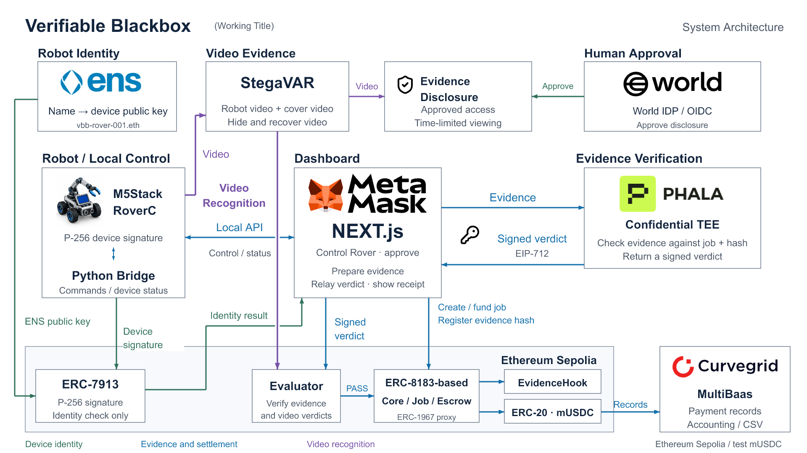

# Verifiable Blackbox

**ロボットの仕事を、検収して支払える証拠に変える。**

[English](README.md) | 日本語

| | |
|---|---|
| **Demo video** | 公開後に追加 |
| **Live app** | 公開後に追加 |
| **Architecture** | [システム構成と各コンポーネントの役割](https://github.com/Jun0908/Verifiable_Blackbox/blob/main/app_Verifiable_Blackbox/docs/ARCHITECTURE.md) |
| **Source code** | [GitHub](https://github.com/Jun0908/Verifiable_Blackbox) |



## Problem

**500万台のロボットが工場で働いている。その仕事に対して、誰が、何を根拠に支払うのか。**

IFRが2026年9月に公表した「World Robotics 2026」によると、2025年の世界の産業用ロボット稼働台数は**500万台**に達した。同年の新規導入は**60万台超、前年比11%増**。ロボットによる作業は、すでに大規模な経済活動になっている。[IFR：World Robotics 2026](https://ifr.org/ifr-press-releases/news/five-million-robots-now-operate-in-factories-globally)

AIを備えたロボットの利用も広がりつつある。Deloitteの2026年版調査では、回答企業の**58%がPhysical AIを少なくとも限定的に利用**し、2年以内に**80%へ達する見込み**としている。これは2025年8〜9月に24か国のビジネス・ITリーダー3,235人を対象に実施された調査であり、Physical AIにはロボット以外の物理システムも含まれる。[Deloitte：State of AI in the Enterprise 2026](https://www.deloitte.com/us/en/about/press-room/state-of-ai-report-2026.html)

しかし、普及とともに、企業がその仕事を安心して受け入れるための課題が見えてくる。

Capgeminiが2026年1〜2月に、16か国・15業種の幹部1,678人を対象に実施した調査では、次の課題が報告されている。

| Physical AIの導入・運用に関する課題 | 回答割合 |
|---|---:|
| 試験導入から大規模展開へ進むことが大きな課題 | **76%** |
| 信頼性の不足が、安心して導入する妨げになっている | **71%** |
| 複数のロボットシステムの統合・連携が難しい | **66%** |
| サイバーセキュリティリスクが重大な障壁 | **53%** |

主に年商10億ドル超の企業を対象とした調査。[Capgemini：Physical AI、p.101・調査方法p.105](https://www.capgemini.com/wp-content/uploads/2026/04/Final-Web-Version-Report-Physical-AI.pdf#page=101)

Verifiable Blackboxが取り組むのは、こうした信頼の課題のうち、**企業間でロボットの仕事を購入するときの検収と支払い**だ。

倉庫が外部のロボット事業者に搬送を依頼する。施設が清掃や巡回点検を委託する。発注者が確認したいのは、機体が動いたという通知だけではない。

**どの依頼について、どの証拠を確認し、誰が受け入れ、その結果いくら支払ったのか。**

操作ログ、作業映像、承認、請求、送金が別々のシステムに分かれていれば、それらを突き合わせる作業が残る。仕事の件数が増えるほど、一件ずつの確認は負担になる。

証拠の共有にも問題がある。工場や倉庫の映像には、設備、商品、施設の配置、従業員などが映り込む。作業を確認するために、現場の情報まで広く開示することは避けたい。

**必要なのは、仕事の証拠・検収条件・支払いを結びつけ、必要な情報を必要な相手へ提示できる仕組みだ。**

## Solution

Verifiable Blackboxは、ロボットの仕事をJobとして扱い、**証拠・利用者の承認・検証結果・支払いを一件ごとに結びつけるアプリケーション**です。

発注者は、受取先・報酬・期限を持つJobを作成します。アプリケーションは操作記録や承認をそのJobに結びつけ、Evidenceを提出します。Phala上の検証サービスがEvidenceとオンチェーンのJobを照合し、署名付き判定を返します。Ethereum上のEvaluatorが判定を確認すると、エスクローから報酬が支払われ、根拠を追跡できるReceiptが残ります。

```text
仕事を依頼する
    ↓
操作記録・証拠・承認をJobに結びつける
    ↓
PhalaがEvidenceとオンチェーンのJobを照合する
    ↓
Ethereum上で署名付き判定を確認し、支払う
    ↓
仕事・証拠・支払いを台帳から追跡する
```

今回の実証機は、小型のM5Stack Roverです。想定する利用場面は、外部事業者のロボットによる搬送・清掃・巡回点検です。

機種をまたいで共通化するのは、Job、機体識別、証拠への参照、検収結果、支払い記録です。作業を受け入れるための条件は用途ごとに定義します。荷物の受け渡しと清掃品質では、必要なセンサーや判定方法が異なるためです。

現在のMVPでは、証拠と決済の接続に加え、ENSによる機体署名の確認、映像の埋め込み・復元、支払台帳を実装しています。機密映像の閲覧権限を含めた統合は、全体構想に位置づけています。

## Demo

デモでは、一件の仕事が支払いの根拠になるまでを追います。

1. **Jobを作成する。** 受取先、報酬、期限を設定し、テスト用トークンのmUSDCをエスクローへ預けます。
2. **Roverを操作する。** ブラウザから操作し、操作記録、停止状態、カメラ映像を確認します。
3. **支払い条件を確認する。** 利用者の署名付き承認とセッションの記録を照合します。動画を用いる経路では、今回の録画の動作判定も扱います。
4. **Evidenceから決済へ進む。** Phalaの署名付き判定とEthereum上の検査を経て、報酬とReceiptを確認します。
5. **支払いの根拠をたどる。** 台帳からJob、Evidence、検証Receipt、トークン移転を照合します。

Sepoliaでは、合成Evidenceを用いたJobでPhalaから判定を受け取り、**100 mUSDCの支払い**が完了しています。

| Job 1の記録 | トランザクション |
|---|---|
| Job作成 | [作成トランザクション](https://sepolia.etherscan.io/tx/0xc1900726f694e8669ac014fe1d3eb4a62960368016541f22adedc16bb0b7ea4f) |
| Evidence提出 | [提出トランザクション](https://sepolia.etherscan.io/tx/0x7d8b0243ba3dd401544d4a7978e00b22bc23e74772e71cc0f18e8f2bbe6741ed) |
| 決済 | [100 mUSDCの決済トランザクション](https://sepolia.etherscan.io/tx/0x7eaaba65800fe2f03259b63d7bc49afc132e4b2f8cb5d6579f03b19c08050c1a) |

*この取引はテスト用Evidenceによる決済経路の実行記録です。実機の作業完了を証明する取引とは区別しています。*

## How it works

### Ethereum — 提出した証拠に対応する判定で支払う

各依頼は、ERC-8183を基にした[Core](https://github.com/Jun0908/Verifiable_Blackbox/blob/main/app_Verifiable_Blackbox/packages/contracts/src/HackathonAgenticCommerce.sol)のJobになります。デモでは、テスト用ERC-20のmUSDCを使用します。

[DemoEvidenceHook.sol](https://github.com/Jun0908/Verifiable_Blackbox/blob/main/app_Verifiable_Blackbox/packages/contracts/src/DemoEvidenceHook.sol)は、Evidence提出時にその内容を識別するハッシュをJobへ記録します。空のハッシュや同じJobへの重複記録は拒否します。

[MockTeeEvaluator.sol](https://github.com/Jun0908/Verifiable_Blackbox/blob/main/app_Verifiable_Blackbox/packages/contracts/src/MockTeeEvaluator.sol)は、EIP-712署名付き判定のJob ID、受取先、Evidenceのハッシュ、有効期限、署名者を確認します。Evidenceが一致しなければ`EvidenceMismatch`、署名者が違えば`InvalidSigner`、使用済み判定なら`VerdictAlreadyUsed`で処理を拒否します。

条件を満たすとCoreの完了処理を呼び、支払いとともにReceiptを発行します。**判定は、提出済みの証拠と支払い対象の仕事に一致する必要があります。**

Sepoliaのデプロイ先：
[Core](https://sepolia.etherscan.io/address/0xdbf3647280CBd9e4A89D3e0c4b6bea9E6D5677B9) · [Evidence Hook](https://sepolia.etherscan.io/address/0xD26930e003f6bc1Fb087d05E0FC18a82a15F7c66) · [Evaluator](https://sepolia.etherscan.io/address/0xC2262b084A1a3dFD9cd2c6D03489B3c9ecB7d30c)

### Phala — EvidenceとJobの整合性を確認する

Phalaの検証サービスは、Evidenceを受け取るとチェーンから対象Jobの状態を読み出します。[policy.ts](https://github.com/Jun0908/Verifiable_Blackbox/blob/main/PhalaNetwork/src/policy.ts)で、Jobの状態、Evaluator、Hook、想定するRobot ID、Challenge、Sequence、時刻、Evidenceのハッシュを照合します。

条件を満たすと、[verify.ts](https://github.com/Jun0908/Verifiable_Blackbox/blob/main/PhalaNetwork/src/verify.ts)がJob ID・受取先・Evidenceのハッシュ・有効期限・nonceを含む判定を生成し、署名します。Phalaモードでは[dstackとの連携](https://github.com/Jun0908/Verifiable_Blackbox/blob/main/PhalaNetwork/src/dstack-security.ts)を利用します。

Phalaは記録とJobの整合性を確認し、動画の動作判定はアプリ側が担当します。TEEの判定だけで、荷物の到着や清掃品質まで保証する構成ではありません。オンチェーンのEvaluatorは設定された署名者を確認し、ハードウェアのAttestationは[別の処理](https://github.com/Jun0908/Verifiable_Blackbox/blob/main/PhalaNetwork/src/attestation-verifier.ts)で確認します。

### Roverとアプリ — 承認・操作・録画を同じ仕事に結びつける

実機にはM5StickC Plus2とRoverC Pro、カメラにはUnit CamS3-5MPを使用します。[Python Bridge](https://github.com/Jun0908/Verifiable_Blackbox/tree/main/M5stack_RoverC)が機体との通信を担当し、Next.jsのアプリケーションがJobと操作セッションを結びつけます。

[payment-gate.ts](https://github.com/Jun0908/Verifiable_Blackbox/blob/main/app_Verifiable_Blackbox/apps/web/lib/server/rover-session/payment-gate.ts)は、利用者の署名、期限、操作記録、セッションと解析結果の対応を確認します。動画判定を使う場合は`MOVING`を要求し、動画判定を省略する場合も、その条件に対する明示的な承認を必要とします。

[payment.ts](https://github.com/Jun0908/Verifiable_Blackbox/blob/main/app_Verifiable_Blackbox/apps/web/lib/server/rover-session/payment.ts)は、それらをまとめた記録のハッシュをEvidenceに含め、提出・Phala検証・決済へ接続します。動画判定と撮影経路にはアプリサーバーへの信頼が残ります。

### ENSとERC-7913 — 名前から機体の署名を確認する

機体には`m5stack-rover-001.eth`というENS名を登録し、`vbb.device.p256`のtext recordにP-256公開鍵を設定しています。

[ens.mjs](https://github.com/Jun0908/Verifiable_Blackbox/blob/main/app_Verifiable_Blackbox/parts/device-signature/ens.mjs)がSepoliaのENSから公開鍵を読み出し、[DeviceSignatureVerifier.sol](https://github.com/Jun0908/Verifiable_Blackbox/blob/main/app_Verifiable_Blackbox/parts/device-signature/contracts/DeviceSignatureVerifier.sol)によるERC-7913形式の署名確認に利用します。

確認者は、表示名だけに頼らず、**ENS上の登録鍵と署名の対応を調べられます。** 現在は独立した機体確認機能として実装し、決済条件には組み込んでいません。

### Curvegrid — 支払いを、請求根拠まで追える台帳にする

支払台帳は、Curvegrid MultiBaasから実際のSepolia取引のReceiptとイベントを取得します。[fetch.ts](https://github.com/Jun0908/Verifiable_Blackbox/blob/main/app_Verifiable_Blackbox/apps/web/lib/server/curvegrid/fetch.ts)がチェーン、取引の成功状態、ブロックとの対応を確認し、Job・Evidence・検証Receipt・報酬支払い・ERC-20移転を照合する台帳処理へ渡します。

金額の一覧から、**どの仕事に対する、どの判定を根拠とした支払いか**をたどれることが、この台帳の役割です。

[月次集計](https://github.com/Jun0908/Verifiable_Blackbox/blob/main/app_Verifiable_Blackbox/apps/web/lib/server/curvegrid/monthly.ts)では、仕事を取引先別にまとめ、CSVとして経理へ渡す利用場面を示します。実取引の台帳と月次サンプルは分けて表示します。

### StegaVAR — 現場映像の埋め込みと復元を扱う

[StegaVARサービス](https://github.com/Jun0908/Verifiable_Blackbox/tree/main/app_Verifiable_Blackbox/services/stegavar)は、Python・PyTorchとLF-VSNを使い、Rover映像のカバー画像への埋め込みと復元を実装しています。画面では、元映像、埋め込み結果、復元映像を比較できます。

別の処理として、[今回の録画を解析する実装](https://github.com/Jun0908/Verifiable_Blackbox/blob/main/app_Verifiable_Blackbox/services/stegavar/scripts/job_recording.py)が、動作の有無をアプリ側の支払い条件へ渡します。

映像の埋め込みと閲覧権限の制御は別の機能です。現在の公開サンプルは機密性を保証するものではありません。全体構想では、Worldによる本人性確認と業務上の閲覧権限を組み合わせ、必要な相手への証拠開示につなげることを想定しています。

## 技術構成

| 領域 | 使用技術 |
|---|---|
| フロントエンド・API | Next.js、React、TypeScript |
| ウォレット・チェーン接続 | Privy、viem |
| スマートコントラクト | Solidity、Foundry、ERC-8183を基にしたCore・Hook・Evaluator、EIP-712 |
| 機体識別 | ENS、P-256署名、ERC-7913 |
| Evidence検証 | Phala Cloud、dstack |
| 支払台帳 | Curvegrid MultiBaas |
| 映像処理 | Python、PyTorch、StegaVAR、LF-VSN |
| ハードウェア | M5StickC Plus2、RoverC Pro、Unit CamS3-5MP、ESP32、PlatformIO |

## Repository

| コンポーネント | 役割 |
|---|---|
| [M5stack_RoverC](https://github.com/Jun0908/Verifiable_Blackbox/tree/main/M5stack_RoverC) | 機体制御、カメラ、録画、Python Bridge、機体署名 |
| [PhalaNetwork](https://github.com/Jun0908/Verifiable_Blackbox/tree/main/PhalaNetwork) | Evidence検証、署名付き判定、Attestation |
| [app_Verifiable_Blackbox](https://github.com/Jun0908/Verifiable_Blackbox/tree/main/app_Verifiable_Blackbox) | Job管理、操作画面、承認、決済、ENS確認、台帳、映像処理 |
