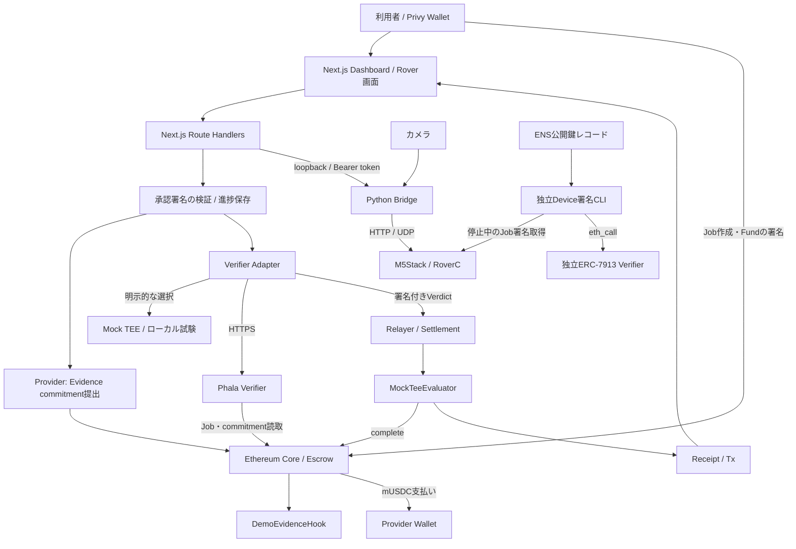

# Verifiable Blackbox — Architecture

作成日: 2026-09-26

## 1. プロダクトの目的

Verifiable Blackboxは、ロボットの仕事に関する記録を検証し、Ethereum上のEscrowから報酬を支払うアプリケーション。

中心となる体験は「仕事を作成 → Roverを操作 → 利用者が署名して検証・支払いを実行 → 領収書を確認」。Dashboard、実機操作、Evidence検証、決済を一つの導線につなぐ。

### 機能範囲

| 項目 | 設計する機能 |
|---|---|
| Dashboard | Privy Login、Job作成、進捗、履歴、領収書、日英切替 |
| Rover | `/rover`での自由操作／Job操作、停止、カメラ、グリッパー。Python Bridgeを介して接続 |
| 決済 | 利用者の署名付き承認文書 → Evidence → Phala → Escrow支払い |
| Device署名 | 停止中のM5によるJob識別情報のP-256署名、独立ERC-7913検証、CLI／レポート |
| ENS | 公開鍵レコードの読取と署名照合、領収書への登録情報表示 |
| 外部デモ | World／StegaVAR／Curvegridは独立したアプリケーションとして扱う |

PhalaはDemoEvidenceのデータとChain上のJobとの整合性を検証する。支払いには利用者の署名付き承認を必要とする。実移動・荷物運搬・映像の意味の自動判定は対象外とする。

Device署名はJob識別情報への署名として独立検証し、支払い条件には含めない。署名鍵はM5のNVSへ保存する。Secure Elementによる鍵保護は将来の拡張とする。

## 2. 全体構成



`MockTeeEvaluator` はtrusted signerのVerdictを検証するContract。Mock signerと実Phala signerのどちらを使う場合も、検証元は設定・応答・署名・Attestationの状態で識別する。

### 各境界の責務

| 境界 | 担当すること | 担当しないこと |
|---|---|---|
| Browser | Login、Client署名、Job操作、進捗表示、操作入力 | Provider／Relayer鍵の保管、支払成功の独自判定 |
| Next.js server | 入力・承認署名検証、Chain照会、Evidence提出、Verifier接続、決済、永続化 | 走行指令を物理作業の証明に変換 |
| Python Bridge | 機体認証、session／sequence、停止、Telemetry、JPEG中継 | Job完了判定、支払い |
| PhalaNetwork | 検証policyによるEvidence照合、EIP-712署名、Attestation提供 | 実機の操作、利用者の承認署名検証、送金 |
| Ethereum | Job・預かり金、commitment、Verdict検証、支払い・Receipt | カメラの画像認識、物理移動の測定 |
| Device署名部品 | 登録鍵／ENS鍵とJob署名の照合、結果レポート | Mainの承認・Phala・決済条件の置換 |

## 3. 技術構成とディレクトリ

npm workspacesでWebとContractを管理する。WebはNext.js App Router、Contractの開発・試験はFoundryを使用する。

```text
app_Verifiable_Blackbox/
├── ARCHITECTURE.md
├── TASKS.md
├── README.md                         # セットアップ・動く範囲・制約
├── .env.example / .gitignore
├── package.json / package-lock.json
├── foundry.toml
├── apps/web/
│   ├── app/                          # /、/rover、api/demo/*
│   ├── components/                   # dashboard、progress、receipt、rover、language
│   ├── lib/
│   │   ├── contracts.ts              # ABI・Evidence・Verdict・commitment
│   │   ├── job-flow.ts / job-history.ts
│   │   ├── demo-review.ts            # 承認文書と型
│   │   └── server/                   # config、provider、verifier、settlement、review
│   └── .demo-reviews/                # 実行時生成、Git対象外
├── packages/contracts/
│   ├── src/                         # Core拡張、Hook、Evaluator、mUSDC
│   ├── vendor/erc8183/               # 参照実装の固定snapshot・出典
│   ├── script/
│   └── test/
├── parts/device-signature/           # 独立した署名検証CLI・Contract・tests
├── scripts/                         # 起動・設定確認・各層の試験
├── deployments/                     # 公開可能な接続情報、秘密鍵なし
├── docs/                            # 起動・Demo・復旧・データ仕様
└── docs/build-log/                   # 各段階の成果・確認方法・残った制約
```

DashboardはJob作成、進捗、履歴、領収書、サンプル決済を責務ごとに分ける。Serverの進捗はファイルへ保存し、外部DBを必要としない構成にする。

主な技術はNext.js、React、TypeScript、viem、Privy。Solidityは`0.8.28`、EVMは`cancun`を使用する。T01で依存関係の組み合わせとクリーンインストールを確認し、利用する版とlockfileを固定する。

## 4. 主要フローと状態

### Job操作から支払いまで

1. ClientがPrivyでLoginし、対象Chainを確認する。
2. `createAndFundDemo`で100 mUSDCのJobを作成する。Job IDは確定したTransactionの`JobCreated`イベントから取得する。これはテスト用Tokenを使うDemo専用処理である。
3. `/rover`へ同じJobを引き継ぐ。Jobなしの自由操作は別経路として扱う。
4. 利用者が接続し、長押しで操作する。終了時は停止確認後にDashboardへ戻る。ブラウザの「操作終了」はUI進捗であり、検証結果ではない。
5. ServerがChainからClient、Provider、金額、期限等を読み、承認文書を準備する。利用者が「検証して支払う」を押してWalletで署名する。
6. ServerがClient署名・期限・対象Jobと現在のChain状態の一致を検証する。
7. 署名済み文書のhashを`DemoEvidenceV1.imageHash`へ入れる。Providerが同じEvidenceのcommitmentを提出する。
8. VerifierがEvidenceとオンチェーン情報を照合する。Adapterも返却値とtrusted signer、EIP-712署名を確認する。
9. RelayerがEvaluatorの`settle`を呼ぶ。EvaluatorがVerdictを検証し、CoreがProviderへ支払い、Receiptを発行する。
10. 確定Tx・Receipt・commitment・検証元を表示する。エラー時は保存済み進捗とChainを確認して再開する。

### 混同しない状態

| 状態の種類 | 値・保存先 | 判定の根拠 |
|---|---|---|
| Job | `Open / Funded / Submitted / Completed / Rejected / Expired` | ChainのCore |
| 決済処理 | `review → authorized → submitting → submitted → paying → paid` | Serverのreview記録＋Chain照合 |
| Rover操作 | 未接続、接続済み、操作中、停止確認、切断、異常 | Bridge session／Telemetry／停止応答 |
| Browser履歴 | 選択中Job、作成Tx、操作終了の表示 | localStorage。Wallet・Chain・Coreで分離 |
| 機体署名 | 未照合／成功／失敗、対象chain・core・job、取得時刻 | 独立検証結果。支払い状態とは別 |

Server記録は`.demo-reviews/<chainId>-<core>/<jobId>.json`へ保存し、排他lockと一時ファイルからのrenameを使う。Tx hashを保存した後の再試行は同じTxを照会する。`submitting`／`paying`でhash不明のまま中断した場合や異常終了でlockが残った場合は、Chain照合による復旧を必要とし、自動で新しいTxを送らない。

## 5. データとContract

| 形式 | フィールド・規則 |
|---|---|
| `DemoEvidenceV1` | `jobId, scenario, robotId, challenge, capturedAt, imageHash, checkpoint, sequence`。ABI encodingしたデータのKeccak-256をcommitmentとし、Web・Phala・Contractで順番と型を統一する |
| Wire形式 | 整数は10進文字列で送る。数値入力を受けるparserでは非負のsafe integerだけを許可する |
| Challenge | Demoでは`challenge-${scenario}-${jobId}`を使う |
| `DemoVerdictV1` | `jobId, provider, evidenceCommitment, outcome, issuedAt, validUntil, nonce`。EIP-712 domain・型・Evaluator addressを一致させる |
| 承認context | `chainId, core, evaluator, token, jobId, client, provider, budget, expiresAt, nonce`。`reviewMessage`で署名対象の文面を生成する |
| Device Job署名 | `SHA-256(abi.encode(schemaHash, chainId, core, jobId))`。`schemaHash = SHA-256(UTF-8("DeviceJobSignatureV1"))`、P-256、low-S、64-byte公開鍵と署名 |

承認フローでは`imageHash`フィールドに署名済み承認文書のhashを格納する。画面では検証対象を「承認文書」と表示する。機体署名は、Evidenceとは別のレコードとして対象Job・公開鍵・署名・照合結果を保持する。

Contractの役割は次のとおり。

- `HackathonAgenticCommerce`: 固定ERC-8183参照実装の拡張。Job／EscrowとDemo用一括作成・Fund。
- `DemoEvidenceHook`: 提出されたEvidence commitmentをJobへ結び付ける。
- `MockTeeEvaluator`: trusted signerのVerdict検証、期限・再使用等の制御、Core完了、Receipt。
- `MockUSDC`: 小数点6桁のテスト用Token。100 mUSDCは`100_000_000` base units。
- `DeviceSignatureVerifier`: 独立したP-256／ERC-7913確認。Job管理・送金の機能を持たない。

ERC-8183参照実装はvendor snapshotとして出典とrevisionを固定する。仕様更新は影響範囲を確認してから取り込む。

## 6. 画面・API

画面は`/`にJob作成・進捗・履歴・領収書・別枠の支払いシミュレーション、`/rover`に自由操作／Job操作・カメラ・グリッパーを置く。英語を初期表示にし、日本語へ切り替えられるようにする。サンプルと実機由来の表示を区別する。

APIはNext.jsのRoute Handlersで実装する。T04とT05でrequest／responseとエラー形式を定義する。

| API | 責務 |
|---|---|
| `/api/demo/config` | 秘密を含まないChain・Contract・Verifierの表示設定 |
| `/api/demo/rpc` | 許可したRPCの中継。上流の資格情報をBrowserへ渡さない |
| `/api/demo/faucet` | Demo用mUSDCの準備 |
| `/api/demo/provider` | サンプルEvidenceの提出 |
| `/api/demo/verify`、`/settle` | サンプル検証・決済の各段階 |
| `/api/demo/attestation` | Serverがfresh nonceを発行しPhalaへ問い合わせ |
| `/api/demo/rover/review` | GET:進捗、POST:`prepare`／`verify-and-pay` |
| `/api/demo/rover/complete` | GET:Funded Job情報。POST:409 `PHYSICAL_MOVEMENT_NOT_VERIFIED` |
| `/api/demo/rover/control` | GET:状態。POST:`activate/drive/release/stop/gripper` |
| `/api/demo/rover/camera` | GET:設定／JPEG、POST:ON/OFF／接続先設定 |

## 7. 起動と外部接続

ローカルAnvilとMock、Phala LOCAL_DEV、実Phala／Sepolia、実機の順で接続を確認する。`MOCK_TEE`／`PHALA`は明示選択とし、Phala障害時にMockへ切り替えない。LOCAL_DEVやsimulatorの表示には実TEEと区別できるラベルを付ける。

Webは`127.0.0.1:3000`、Bridgeは`127.0.0.1:8765`を使う。ポート競合時はエラーを表示して起動を中止する。実機接続・カメラ受信はローカルPCで行う。

外部コンポーネントの配置は環境変数で指定する。ローカル開発時の既定値は次のとおり。

| 対象 | アプリrootからの既定相対パス |
|---|---|
| Rover Python | `../../M5stack_RoverC/rover-python` |
| Phala local service | `../../PhalaNetwork` |

launcherは`ROVER_PYTHON_ROOT`、ローカル試験用`PHALA_PROJECT_ROOT`を設定として受け取る。絶対パスをコードへ固定せず、存在確認・Python環境確認を行う。E2E runnerは対象のContract・Web・保存先を明示して起動する。

秘密鍵、Privy公開設定、RPC、Phala URL、deployment情報を役割ごとに分け、テンプレートにはダミー値だけを書く。Provider／Relayer秘密鍵、Bridge token、認証付きRPC URLはServer専用にする。実Phala接続時はchainId・Core・Hook・Evaluator・trusted signerの組を照合する。

## 8. ドキュメントと公開範囲

公開対象はソース・設計・進捗・再現可能なデモとする。鍵を持つDemo APIと実機操作サーバーをインターネットへ公開する構成は含めない。公開プレビューが必要なら、署名鍵と機体接続を持たないsample／read-only表示を別途設計する。

各タスクで「追加した機能・実行方法・確認結果・残った制約」を`docs/build-log/`へ残す。画面だけの段階、Mock、LOCAL_DEV、実Phala、実機署名の各段階を明記する。

公開対象はソース、テスト、匿名化したfixture、設定テンプレート、依存lockfile、確認済みの公開deployment情報。`.env*`の実値、`.demo-reviews/`、`parts/device-signature/local/`、録画原本、認証token、ログ、`.tools/`、`node_modules/`、`.next/`、Foundry生成物を持ち込まない。サードパーティのlicense・出典は保持する。

## 9. 実装計画

[TASKS.md](TASKS.md)に、開発環境から画面・Contract・Phala・実機接続・公開準備までのタスクと完了条件を定義する。
