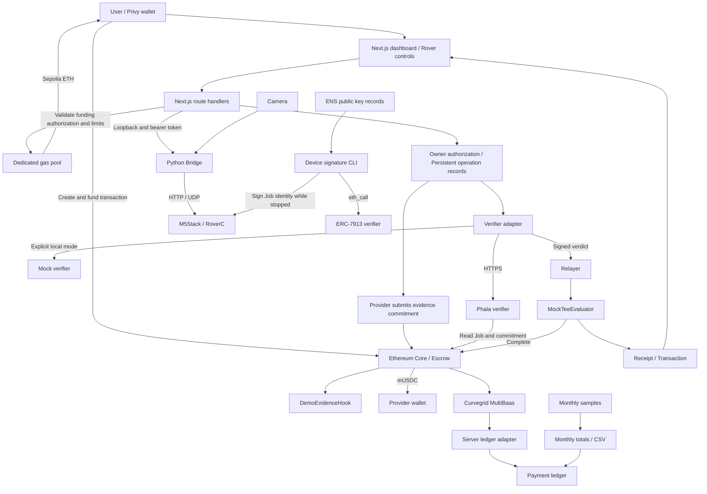
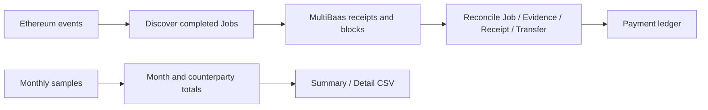
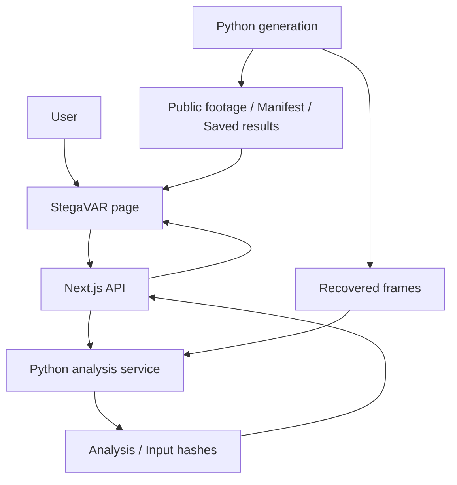
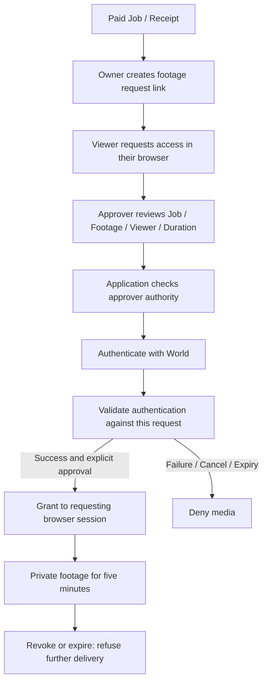

# Verifiable Blackbox — Architecture

Date: 2026-09-26 · [Japanese architecture](ARCHITECTURE.md)

Verifiable Blackbox connects robot operation records, evidence verification, Ethereum escrow payments, and controlled footage disclosure. See [README](../README.md) for startup instructions and [TASKS.md](TASKS.md) for implementation and acceptance criteria.

Validation includes local end-to-end tests, a live Phala connection, Sepolia settlement using fixture evidence, and the Sepolia gas funding API. The hardware Bridge and camera connection have been restored, and the operator reports that the Demo works. A recorded, supervised run covering hardware operation, Privy authentication, live Phala, and Sepolia settlement remains a separate acceptance check.

`npm run demo:sepolia` starts the Sepolia web application and the hardware Python Bridge. Phala requires its own running service and configuration. `demo:rover` uses a public Anvil test wallet, a mock verifier, and a simulated Bridge. `demo:rover-phala` uses the separate Phala project's LOCAL_DEV environment. Without external services, `dev:web` displays sample screens. The wallet provider lives in the shared layout so navigation preserves login state.

Each fresh local chain uses its own review storage. The server default is `.demo-reviews/`, with a server-only `DEMO_REVIEW_DIR` override. A server reconnecting to the same chain reuses its storage and reconciles saved Jobs with creation transactions and chain state.

The web attestation API checks fresh nonces and claims, and returns `quoteVerified=false`: it does not independently perform Intel quote cryptographic verification. An independent verifier in the Phala project has recorded successful hardware quote, compose measurement, and claims binding checks. Device signature reports distinguish fixtures, saved signatures, and newly fetched API results.

## 1. Product purpose

The main flow is **create a Job → operate the Rover → verify the record in Step 3 → pay and view the receipt**. Recorded footage is opened after payment. Section 11 defines the Forward-button payment policy and its authentication requirements.

| Area | Capability |
|---|---|
| Dashboard | Privy login, Job creation, progress, history, receipts, English/Japanese switching |
| Gas funding | Sepolia balance checks and owner-authorized ETH funding from a dedicated pool |
| Rover | Free controls and Job controls at `/rover`, stopping, camera, gripper, Python Bridge connection |
| Settlement | Job authorization and evidence → Phala verification → escrow payment |
| Device signatures | P-256 signatures of Job identity from a stopped M5 device; independent ERC-7913 verification, CLI, and reports |
| ENS | Public-key record lookup, signature verification, registration details on receipts |
| Ledger | MultiBaas payment records, evidence reconciliation, monthly samples, CSV export at `/ledger` |
| StegaVAR | Video comparison, synchronized recovered footage, CPU analysis at `/stegavar`; see Section 10 |
| Rover reward | A recorded Forward press permits payment once; video analysis is supplementary and can be skipped through a hidden setting; see Section 11 |
| World disclosure | An authorized approver authenticates with World to grant a requesting viewer five minutes of access; see Section 12 |

Phala checks the consistency of `DemoEvidence` with the on-chain Job and commitment. The application establishes the user's authority. Phala does not observe physical movement, cargo delivery, or the meaning of footage. The Rover payment policy depends on the Forward press record; it does not require a positive video classification.

Device signatures independently authenticate Job identity and do not gate payment. Keys are stored in M5 NVS. Secure Element protection is an extension.

## 2. System architecture



Ledger reads happen after settlement. A retrieval failure does not interrupt payment. `MockTeeEvaluator` verifies verdicts from the configured trusted signer. Configuration, responses, signatures, and attestation status identify whether the signer is a mock or a Phala verifier.

| Boundary | Responsibility | Scope limit |
|---|---|---|
| Browser | Login, client signatures, controls, progress and receipts | No Provider/Relayer keys; cannot declare a payment successful by itself |
| Next.js server | Authentication, input validation, chain reads, gas funding, evidence submission, verification, settlement, persistence | Commands are operation records, not proof of physical work |
| Python Bridge | Device authentication, sessions, sequence checks, stop handling, telemetry, JPEG relay | No escrow settlement |
| Phala | Evidence policy checks, EIP-712 verdict signatures, attestation | No robot control or client payment authorization |
| Ethereum | Jobs, escrow, commitments, verdict checks, payment and receipts | No camera inference or movement measurement |
| Device signature module | Key/ENS matching, Job signatures, reports | Independent of payment policy |
| Ledger adapter | MultiBaas reads, reconciliation, snapshots, aggregation, CSV | No transfers or automatic accounting entries |

## 3. Technology and directories

The repository uses npm workspaces, Next.js App Router, React, TypeScript, viem, and Privy. Contracts use Solidity `0.8.28`, the `cancun` EVM target, and Foundry. Dependency versions and lockfiles are pinned and checked through clean installation.

```text
app_Verifiable_Blackbox/
├── README.md
├── .env.example / .gitignore
├── package.json / package-lock.json / foundry.toml
├── apps/web/
│   ├── app/                         # Pages and route handlers
│   ├── components/                  # Dashboard, controls, receipts, language
│   ├── lib/
│   │   ├── contracts.ts             # ABI, evidence, verdict, commitment
│   │   ├── job-flow.ts / job-history.ts
│   │   ├── demo-review.ts / gas-funding.ts
│   │   └── server/                  # Provider, verifier, settlement, persistence
│   ├── .demo-reviews/               # Private runtime records
│   ├── .demo-gas/                   # Private funding ledger
│   └── .ledger/                     # Payment snapshots and discovery cache
├── packages/contracts/
│   ├── src/ / script/ / test/
│   └── vendor/erc8183/              # Pinned reference implementation
├── parts/device-signature/          # Independent CLI, verifier, tests
├── services/stegavar/               # Python generation and inference
├── services/world-idp/              # Footage disclosure service
├── scripts/                        # Launchers, checks, tests
├── deployments/                    # Public connection metadata
└── docs/
    ├── ARCHITECTURE.md / ARCHITECTURE.en.md
    ├── TASKS.md
    ├── evidence/
    └── internal/                   # Private operations documentation
```

Dashboard components separate Job creation, progress, history, receipts, and sample settlement. Server progress is persisted to files; an external database is not required.

## 4. Main flow and state

### From Job creation to payment

1. The client logs in with Privy and checks the chain and gas balance. On Sepolia, an owner-signed funding request can replenish ETH from the dedicated pool without an on-chain request transaction from the client.
2. `createAndFundDemo` creates and funds a 100 mUSDC Job. Its ID comes from `JobCreated` in the confirmed transaction. This is a demo function using test tokens.
3. The same Job is carried into `/rover`. Free operation without a Job has its own path.
4. The server verifies that the logged-in wallet owns the Job and prepares a control session. Once connected, all directions, gripper, speed, and camera controls are available. No extra operation signature is required.
5. A momentary Forward press saves a completion record. Releasing the button stops motion. Video analysis runs independently.
6. “End controls & return to Step 3” confirms stopping and navigates to `/#step-3`. “Verify & pay” initiates or resumes payment.
7. The server verifies ownership, Job expiry, the matching record, and chain state. It prevents duplicate payments.
8. A hash of the payment bundle is placed in `DemoEvidenceV1.imageHash`; the Provider submits the evidence commitment.
9. The verifier checks evidence against the on-chain Job. The adapter checks the returned fields, trusted signer, and EIP-712 signature.
10. The Relayer calls `settle`; the Evaluator verifies the verdict, completes the Job through Core, and issues a receipt. The UI displays the confirmed transaction, receipt, commitment, and verification source.

### State domains

| Domain | Values / Storage | Source of truth |
|---|---|---|
| Job | `Open / Funded / Submitted / Completed / Rejected / Expired` | Core on-chain state |
| Settlement | `review → authorized → submitting → submitted → paying → paid` | Server progress reconciled with chain state |
| Rover | Disconnected, connected, operating, stop confirmed, fault | Bridge session, telemetry, stop response |
| Browser history | Selected Job, creation transaction, navigation state | localStorage scoped by wallet, chain, and Core |
| Device signature | Unchecked, verified, failed; target and acquisition time | Independent verification report |

Review records use `.demo-reviews/<chainId>-<core>/<jobId>.json`, exclusive locks, and atomic rename. Once a transaction hash is stored, retries query the same transaction. An interrupted send with an unknown hash or a remaining lock requires reconciliation before another transaction is sent.

### Sepolia gas funding

The gas pool uses a key separate from the Deployer, Provider, and Relayer. The signed request binds the receiving wallet, chain ID, Core, origin, and UTC date. The server verifies ownership and balance. Limits are one funding operation per wallet per UTC day and 0.05 ETH per day across the pool. The target balance is derived from gas prices, normally 0.003 ETH; a target above 0.01 ETH is refused.

The pool ledger is `.demo-gas/<chainId>-<poolAddress>/ledger.json`. Funding is serialized with a lock. Signed transactions are saved before broadcast and reconciled with receipts on retries. This API funds ETH; `createAndFundDemo` prepares mUSDC.

## 5. Data and contracts

| Structure | Fields / Rules |
|---|---|
| `DemoEvidenceV1` | `jobId, scenario, robotId, challenge, capturedAt, imageHash, checkpoint, sequence`; commitment is Keccak-256 of ABI encoding, with identical ordering and types across Web, Phala, and contracts |
| Wire integers | Decimal strings; numeric parsers accept only nonnegative safe integers |
| Challenge | `challenge-${scenario}-${jobId}` |
| `DemoVerdictV1` | `jobId, provider, evidenceCommitment, outcome, issuedAt, validUntil, nonce`; matching EIP-712 domain, types, and Evaluator address |
| Review context | `chainId, core, evaluator, token, jobId, client, provider, budget, expiresAt, nonce`; `reviewMessage` constructs the signed text |
| Device Job signature | `SHA-256(abi.encode(schemaHash, chainId, core, jobId))`, where `schemaHash = SHA-256(UTF-8("DeviceJobSignatureV1"))`; P-256, low-S, 64-byte public key and signature |

The signed-review path stores the hash of the approved document in `imageHash`. The Rover path in Section 11 stores the hash of its payment bundle in that field. Record types and application validation distinguish these paths while preserving the Evidence ABI. Device signatures are kept separately with the target Job, public key, signature, and result.

| Contract | Role |
|---|---|
| `HackathonAgenticCommerce` | ERC-8183 extension for Jobs, escrow, and demo create-and-fund |
| `DemoEvidenceHook` | Binds submitted evidence commitments to Jobs |
| `MockTeeEvaluator` | Trusted signer verification, expiry and replay checks, Core completion, receipts |
| `MockUSDC` | Test token with six decimals; 100 mUSDC is `100_000_000` base units |
| `DeviceSignatureVerifier` | Independent P-256 / ERC-7913 verification; no Job management or payments |

The ERC-8183 vendor snapshot retains its source and revision. Specification changes require impact review before integration.

## 6. Screens and APIs

`/` contains Job creation, progress, history, receipts, and a separate payment simulation. `/rover` contains free and Job controls, camera, and gripper. `/ledger` separates actual payments from monthly sample aggregation. `/stegavar` presents public video comparisons. English is the default; the shared header offers Japanese. Sample and hardware-derived results are labeled separately.

Implementations are in [API route handlers](../apps/web/app/api/).

| Endpoint | Responsibility |
|---|---|
| `/api/demo/config` | Public chain, contract, and verifier configuration without secrets |
| `/api/demo/rpc` | Restricted RPC relay; upstream credentials stay on the server |
| `/api/demo/faucet` | Balance and eligibility checks; owner-authorized Sepolia ETH funding; local Anvil funding |
| `/api/demo/provider` | Sample evidence submission |
| `/api/demo/verify`, `/api/demo/settle` | Sample verification and settlement stages |
| `/api/demo/attestation` | Fresh nonce generation and Phala request |
| `/api/demo/rover/review` | Progress, review preparation, signed-review verification and payment |
| `/api/demo/rover/session/direct` | Privy owner verification and session preparation/restoration |
| `/api/demo/rover/complete` | Job/payment status; start or resume settlement using the saved Forward press |
| `/api/demo/rover/control` | State, activation, drive, release, stop, gripper |
| `/api/demo/rover/camera` | Configuration, JPEG, camera ON/OFF, connection settings |
| `/api/demo/world/status` | Disclosure service configuration and connectivity checks |
| `/api/demo/world/disclosure` | Owner-authenticated registration of Job footage and creation of a request link |

## 7. Startup and external connections

Connection checks progress from local Anvil and mocks through Phala LOCAL_DEV to live Phala, Sepolia, and hardware. `MOCK_TEE` and `PHALA` are explicitly selected; a Phala outage does not switch to mock verification. LOCAL_DEV and simulator results carry distinct labels.

Web binds to `127.0.0.1:3000`, and the hardware Bridge to `127.0.0.1:8765`. A port conflict aborts startup. Hardware and camera access run on the local PC.

`npm run demo:sepolia` uses the Rover Python environment's saved connection settings. It verifies Bridge readiness and shares a newly generated bearer token with the web server. Shutdown stops child processes owned by the launcher. Startup does not arm the Rover: the user connects it from the controls. `--no-rover` omits the Bridge. A configured local World service starts alongside the application; `--no-world` omits that service. Its HTTPS tunnel is managed separately.

| External component | Default relative location |
|---|---|
| Rover Python | `../../M5stack_RoverC/rover-python` |
| Phala local service | `../../PhalaNetwork` |

`ROVER_PYTHON_ROOT` and `PHALA_PROJECT_ROOT` override these paths. Launchers check paths and Python environments. Tests explicitly select contracts, web ports, and storage directories.

Keys, public Privy configuration, RPC, Phala URLs, and deployment metadata are separated by role. Templates contain placeholders. Provider, Relayer, gas pool keys, Bridge tokens, and authenticated RPC URLs remain server-only. The launcher does not pass Ethereum keys or RPC credentials into the Bridge. Live Phala configuration checks chain ID, Core, Hook, Evaluator, and trusted signer together.

For presentation, prebuild with `node scripts/start-sepolia-web.mjs --build`, then run `node scripts/start-sepolia-web.mjs`. The `.next-demo` build avoids compilation during interaction. Use `--dev` for development. Rebuild after changing code or `NEXT_PUBLIC_*` settings.

## 8. Documentation and publication scope

Published material includes source, design, reproducible demos, tests, anonymized fixtures, configuration templates, dependency lockfiles, and verified public deployment metadata. Private-key-bearing APIs and hardware control servers run locally. A hosted preview must use sample/read-only behavior without signing keys or hardware access.

Keep real `.env*` values, `.demo-reviews/`, `.demo-gas/`, `.ledger/`, `docs/internal/`, `parts/device-signature/local/`, raw private recordings, tokens, logs, `.tools/`, `node_modules/`, Next.js build output, and Foundry output out of published source. Retain third-party licenses and attribution.

## 9. Payment ledger and monthly aggregation

The ledger associates payments with their Jobs, evidence, receipts, and token transfers. Monthly samples demonstrate counterparty aggregation, drill-down, and accounting CSV export.

| Tab | Capability |
|---|---|
| Payments | MultiBaas payment records, reconciliation, details, manual refresh |
| Monthly demo | Sample totals by month and counterparty, detail rows, summary/detail CSV |



### Retrieval and reconciliation

- Chain, Core, Hook, Evaluator, and token addresses are configured independently of the active payment screen. Refresh discovers completed Jobs from the configured deployment block, including newly completed Jobs.
- RPC supplies transaction discovery; displayed payment records are retrieved and checked through MultiBaas transaction receipts and canonical block responses. Discovery retains pending Job context and scans additional blocks on refresh. A changed cached block hash triggers rediscovery.
- Snapshot selection records the retrieved Jobs, transactions, and chain cutoff. Limits are 100 Jobs and 400 distinct transactions. An explicitly supplied selection can still be used in tests.
- The amount comes from `PaymentReleased.amount` and must match the token `Transfer` in the same successful transaction. Deposits, minting, and fee transfers are not counted as payment revenue.
- `JobCreated`, `EvidenceCommitted`, and `DemoWorkReceiptIssued` establish Job identity, payee, evidence hash, emitter, and event order. Canonical blocks and confirmations are checked; the default confirmation requirement is 12.
- Jobs are keyed by `chainId + coreAddress + jobId`; events by `chainId + transactionHash + logIndex`. Refreshing does not duplicate payments.

Payment states are **matched**, **confirming**, **incomplete**, and **mismatch**. Total and matched amounts are separate. Event reconciliation does not prove physical work.

### Persistence, aggregation, and CSV

Server snapshots survive restart and retrieval failures. The UI identifies cached data and offers manual refresh. Configuration fingerprints isolate contracts, deployment range, MultiBaas endpoint, and confirmation settings. Updates use a file lock and atomic rename. Credentials are never included in snapshots or fingerprints.

Retrieval states distinguish unconfigured, loading, live, empty, failed, and cached. A failure never turns sample data into a successful live result. Refreshes have a four-second cooldown. Remove an abandoned lock only after its owning process has stopped.

Monthly samples are separate from real payments: 120 entries, three fictional companies, and 12.00 mUSDC total. Calculations use integer base units; periods use Asia/Tokyo. Paid Jobs are not reintroduced as unpaid amounts. English and Japanese names and descriptions follow the selected language.

Summary and detail CSVs match the selected month, currency, count, and amount. Filenames and each row identify `source=sample`. Quotes and newlines are escaped, and spreadsheet formula prefixes are neutralized.

- Summary: `source, period, counterpartyId, counterpartyName, asset, decimals, usageCount, amountMinor, amountDisplay`
- Detail: `source, period, usageId, occurredAt, counterpartyId, counterpartyName, description, asset, decimals, amountMinor, amountDisplay, evidenceRef`

CSV is supporting accounting detail; exporting it does not finalize bookkeeping.

### Placement and APIs

```text
apps/web/
├── app/ledger/page.tsx
├── app/api/ledger/
│   ├── route.ts                 # GET payment records and retrieval state
│   ├── refresh/route.ts         # POST refresh
│   ├── monthly/route.ts         # GET monthly sample aggregation
│   └── export/route.ts          # GET CSV
├── components/ledger/
├── lib/ledger/                  # Types, reconciliation, aggregation, CSV
├── lib/server/curvegrid/        # SDK, discovery, configuration, snapshots
└── .ledger/                     # Private runtime data
```

`monthly` accepts `period=YYYY-MM`; `export` additionally accepts `kind=summary|details`. Inputs are validated, CSVs are attachments, and API responses use no-store. `MULTIBAAS_URL`, `MULTIBAAS_API_KEY`, and the SDK stay server-side. Refresh requires the same origin and local access. See [`.env.ledger.example`](../.env.ledger.example).

The ledger handles reads and aggregation. Monthly batch transfers, a new settlement contract, and automatic journal posting are outside its scope. Ledger failures do not block Job creation, controls, Phala verification, or payment.

## 10. StegaVAR

### Purpose and features

`/stegavar` demonstrates embedding Rover footage into cover footage, recovering it, and inspecting analysis. It supports moving/stationary cases, three covers, cover/embedded/difference views, recovered video, synchronized playback and seeking, saved results, Python reanalysis, hashes, methods, and attribution.

Six combinations covering 960 frames, Python reanalysis, playback, failure behavior, language switching, and a 390px viewport have been checked. Start with `npm run demo:stegavar`; see the [service README](../services/stegavar/README.md) for generation and setup.

Reveal displays footage recovered in advance. Reanalysis uses those recovered frames. Automatic embedding and recovery immediately after capture require a separate design. Live Job recording is defined in Section 11; access-controlled disclosure is defined in Section 12.

### Components

| Component | Responsibility |
|---|---|
| `components/stegavar/` | Case selection, comparisons, playback, results |
| `app/api/stegavar/` | Input validation, Python connection, timeouts, safe errors |
| `services/stegavar/` inference | Frame validation, motion measurement, classification |
| Python generation scripts | Embedding, recovery, display assets, manifest generation |
| Shared assets and manifest | Public examples, frame hashes, saved results, attribution |



The browser calls same-origin Next.js APIs. Python binds to loopback; remote deployment needs separately designed transport and authentication. Python/Web share the manifest and recovered frames. Only required public cases are published. Virtual environments, logs, intermediate files, and archives are excluded. Model acquisition, versions, and hashes are pinned.

### APIs and data

`GET /api/stegavar/health` returns Python availability, analysis activity, and model load state. Video browsing remains available while Python is offline. `STEGAVAR_URL` defaults to `http://127.0.0.1:4178`; `STEGAVAR_TIMEOUT_MS` controls the wait limit, initially 20 seconds. `/api/stegavar/assets/[...path]` serves the shared catalog, public frames, and attribution with SHA-256 checks.

`POST /api/stegavar/analyze` accepts allowlisted `case` and `scene` IDs, never arbitrary paths or URLs. Responses include IDs, method/version, execution ID, time/duration, video/frame hashes, the result, and whether it was newly computed. Only one analysis runs at a time: busy is 409, unavailable is 503, and timeout is 504. HTTP timeout does not imply that Python has stopped processing.

The manifest records case, cover scene, frame count, FPS, asset locations, method, and hashes. Assets include cover, embedded and difference views, recovered frames, saved results, and licenses. Analysis uses designated frames, not thumbnails or a presentation MP4. Responses must match the selected case and manifest hash; a delayed response cannot overwrite a different case.

### CPU processing and failure behavior

Embedding, recovery, and X-CLIP classification run on CPU, initially with four PyTorch threads. Frame-difference motion measurement and X-CLIP classification remain separately labeled. Models load on demand and are reused. GPU support depends on measured processing needs.

Unavailability, busy state, timeout, and analysis errors are visible while playback and saved results remain usable. Failed requests are retried explicitly by the user. Shared header, language, and wallet providers are reused; viewing/reanalysis requires no wallet signature and does not initiate payment.

Public sample hashes are never substituted into payment evidence. Public footage and frames are publicly accessible; embedding and the Reveal button are not access control. Protected Job footage uses the private disclosure path in Section 12.

## 11. Rover rewards from a Forward press record

### Controls and payment policy

Job creation funds 100 mUSDC and explains that a recorded Forward press permits one payment. Controls include forward/reverse, left/right, rotation, stop, gripper, camera, and speed. A momentary press saves the work record. There is no minimum hold duration, condition review, operation signature, or separate recording-start step.

The flow is **Step 1: Create Job → Step 2: Operate Rover → Step 3: Verify record → Step 4: Payment result**. Ending controls confirms stopping and returns to `/#step-3` without waiting for recording finalization, inference, or settlement. Step 3's “Verify & pay” performs settlement.

Directions operate while held and stop on release. A delayed drive request arriving after release is refused. Controls remain usable during and after payment. Disconnect and page exit also request stopping.

| Forward press for this Job | Video result | Reward |
|---|---|---|
| Recorded | Moving, still, inconclusive, or not run | Pay once |
| Not recorded | Any | Do not pay |

The press is a server-received input record, distinct from physical movement. Short tabletop actions, insufficient footage, inference failure, and incomplete stop responses do not become payment conditions. Ownership, target identity, expiry, record integrity, and duplicate-payment prevention remain enforced.

### Login and operation authority

The server verifies Privy access and identity tokens using public JWKS: ES256 signature, issuer, audience, expiry, and matching identity. Signed Ethereum wallet data must match the on-chain client. Enable **Return user data in an identity token** in Privy Dashboard. No additional app secret or `personal_sign` is required before controls.

`session/direct` prepares/restores a Job-scoped session with a random control token after ownership checks. Preparation does not connect, drive, or pay. `rover/control` handles connection and manual commands. `recordOnly` records without taking control of movement. The `press` action on `session/start` stores `buttonAuthorization.pressedAt`. Step 3 can pay before video finalization. The policy is `forward-button-v1`; new Job descriptions are `vbb://rover/forward-button-v1`.

The control token is bound to Job and session ID and checked with the same-origin request. Reopening the screen revalidates Privy ownership. Authentication bypass is restricted to explicit local mode, loopback RPC, actual chain ID 31337, and the fixed public Anvil wallet.

### Raw footage and analysis

The Bridge normally saves Raw MJPEG and JPEG frames. The server sends the recording to StegaVAR for CPU frame-difference analysis: `MOVING / STILL / INCONCLUSIVE`. Results retain Job, session ID, recording SHA-256, and policy hash. A Forward press is never used as the answer to video classification.

Playback, analysis, and World disclosure are grouped under **View job video** after payment. Video components and frames load when opened. The live operation camera remains available in Step 2.

Holding the settings icon reveals **Skip video recognition**, initially OFF. Skipping records `INCONCLUSIVE / SKIPPED` without calling analysis. Unavailable footage or inference records `INCONCLUSIVE / UNAVAILABLE` with a reason. Camera configuration failure does not block session preparation or Forward input.

### Evidence, Phala, and settlement

`RoverPaymentBundle` contains fixed Job conditions, owner verification, press time, operation-record hashes, and available supplementary video results. Analysis and payment run independently. Results not available at submission are recorded as pending/unavailable; later results can update the display but never rewrite the submitted bundle or commitment.

Its hash enters `DemoEvidenceV1.imageHash`, followed by Provider submission, Phala evidence/chain checks, Evaluator settlement, and receipt retrieval. The UI does not claim Phala observed movement.

Payment is locked and persisted per Job with transaction hashes and receipts. Reload/retry reconciles the same transaction and chain state. Unknown broadcast outcomes do not cause another transfer. Sample settlement endpoints reject Rover Jobs.

The overview loads the same operation session. Without a press it offers controls; with a saved press it permits settlement via `rover/complete`. Opening a page does not send money. Navigation preserves the selected Job, including after payment.

### Main files and checks

- `components/rover-job-controls.tsx`, `rover-control.tsx`: controls, camera, speed, hidden setting, press recording, Step 3 return.
- `components/rover-payment-status.tsx`, `rover-video-result.tsx`: Step 3 settlement and footage after payment.
- `lib/server/rover-session/owner.ts`, `direct.ts`: Privy ownership and session preparation.
- `rover/control`, `session/start`, `session/status`: commands, press recording, recording status.
- `session/analyze`, `session/frame`: three-way Raw-video analysis and private frame viewing.
- `rover/complete`: payment and reconciliation.
- Rover Python `rover/job_runner.py` and `web_bridge.py`: recording, manual commands, release/disconnect stopping.

Isolated tests use a simulated Bridge, real StegaVAR, and Anvil to check short presses, no press, early release, video results, skip behavior, and payment retry. A supervised hardware/Privy/Phala/Sepolia acceptance run remains separately tracked in T32.

## 12. World footage disclosure

### Purpose and flow

An authorized approver reviews the Job, footage, requesting viewer, and five-minute duration, then authenticates with World to approve disclosure. The owner retains the application's authenticated path to their own recording. World outages do not stop controls, inference, Phala, or payment.

Use a Job with an actual saved recording. If none exists, display that fact and do not create a disclosure request or substitute a sample.



Robot rewards and permission to disclose detailed footage are independently controlled. World authentication does not certify movement or settlement.

### Service integration

`services/world-idp` reuses the request, approver, OIDC, viewer-bound delivery, denial, revocation, and expiry components from `StegaVAR/world-idp`. It runs as a separate service. Install with `npm ci --prefix services/world-idp`; startup and operator instructions are in its [README](../services/world-idp/README.md).

An authenticated owner calls `POST /api/demo/world/disclosure`. The server registers the Job recording and returns a request link. A third party opens it in their own browser and creates a request, then provides the approval link to the approver. The invitation alone does not grant media access.

Internal registration is authenticated; the browser cannot supply arbitrary paths or footage URLs. World credentials and the approver code remain server-only. The HTTPS entry point forwards only to the disclosure service, not Rover APIs. The video screen checks internal service readiness, owner configuration, shared credentials, and the public HTTPS endpoint before link creation. Portal callback configuration and successful World authentication still require a separate check.

### Binding Jobs, footage, and grants

Registered data includes chain ID, Core, Job ID, operation session ID, owner, approver scope, Raw recording SHA-256, asset ID and hash, internal capture reference, and optional receipt/payment references. A changed recording requires a new asset and request. Any derived format would retain both original and derived hashes.

The app verifies Privy ownership, retrieves the session's Raw MJPEG from the authenticated Bridge, and checks SHA-256. The service validates the recording and each JPEG frame, stores them in private memory, and plays frames using capture timing. `WORLD_INTERNAL_TOKEN` protects internal registration; `WORLD_APPROVER_OWNERS` scopes the approver code. Restart invalidates registered footage and authorization state.

A grant binds request ID, Job, asset/hash, requesting browser session, verified approver identity, grant time, expiry, and status. Another browser knowing the URL does not receive the footage. A receipt association is displayed separately from proof that a recording hash is included in the on-chain commitment. Submitted bundles are not modified to insert footage afterward.

### Authority and World authentication

The application verifies approver authority independently of World identity. The demo uses an operator code scoped to configured Job owners. A World subject is not interpreted as a wallet address.

Approval explicitly identifies footage, requester, and five minutes of viewing. The backend verifies the OIDC signature, issuer, audience, expiry, state, nonce, PKCE, authentication freshness, and requested authentication conditions. Replayed callbacks and substitution of another request are refused. An unverified browser success message cannot create a grant.

### Delivery, expiry, and revocation

Private media and Range requests check grant status, asset, viewer session, and expiry. Media responses use no-store. Unapproved, denied, canceled, expired, revoked, and unrelated sessions are refused. The same controls cover frames, thumbnails, downloads, and static paths; public StegaVAR samples remain separate.

Revocation and expiry remove footage from the screen and prevent subsequent delivery. They cannot retrieve already downloaded data or prevent screen recording. Service restart invalidates requests, in-flight authentication, and grants.

### Official integration and verification scope

Official Sandbox configuration and discovery connectivity have been checked. A complete official authentication-to-footage run still requires the operator's Portal configuration and authentication. Local OIDC and browser tests do not establish official World success.

The [World event guidance](https://ethglobal.com/events/tokyo2026/prizes/world), checked on September 26, 2026, describes World ID for Agents using simulated proofs without requiring the Sandbox app. Check the [official event environment documentation](https://sandbox.auth.world.org/docs) and issued Client settings. Portal callback must exactly match `BASE_URL/auth/world/callback`. An expired temporary HTTPS tunnel requires updating both service configuration and the Portal callback.

The official event's simulated identity, local `rehearsal`, and production human verification are distinctly labeled. Official connection failure never falls back to rehearsal. Acceptance covers successful approval and cancellation that leaves footage protected. Integration feedback should summarize time spent, connection issues, and improvements required by the event submission.

## 13. Implementation plan

[TASKS.md](TASKS.md) defines implementation and acceptance criteria for the development environment, UI, contracts, Phala, hardware connections, ledger, StegaVAR, Rover rewards, and World disclosure.
