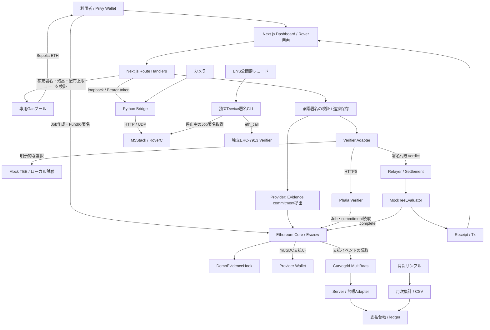
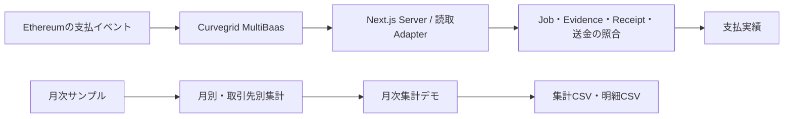
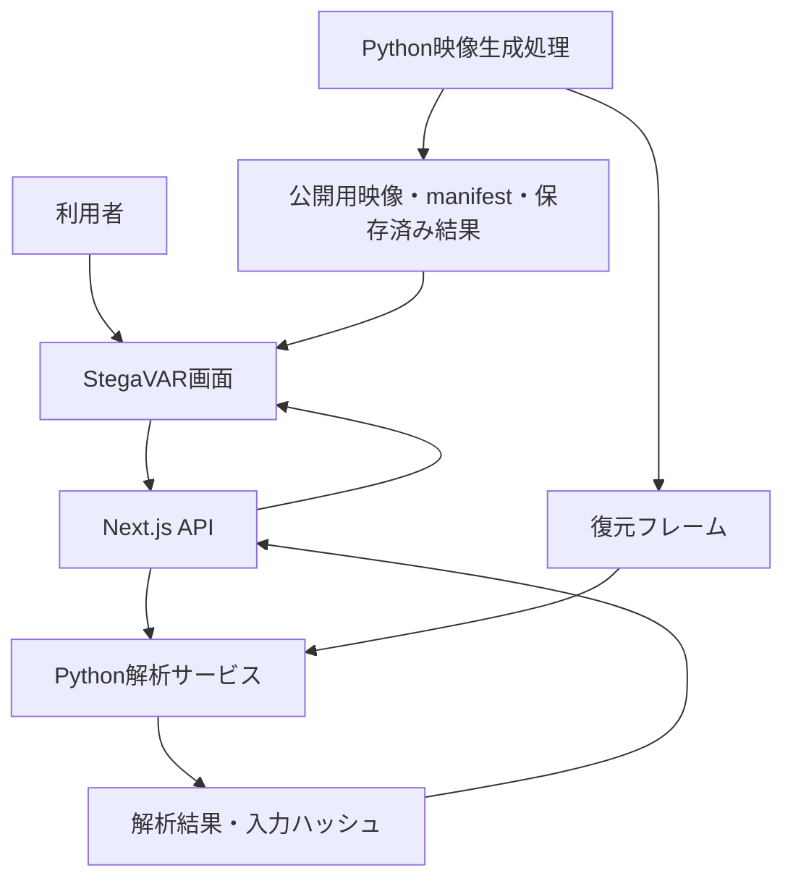
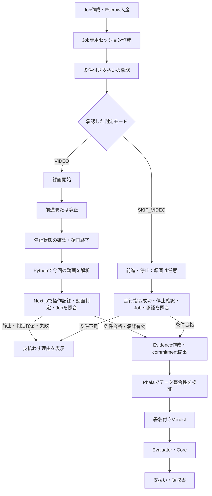

# Verifiable Blackbox — Architecture

作成日: 2026-09-26

実装状況: ローカル通し試験、実Phala接続、模擬EvidenceによるSepolia決済、Sepolia Gas補充APIを確認済み。実機Bridge・カメラの接続復帰を確認し、その後、利用者から動作報告を受けている。実機操作・Privy承認・Sepolia決済を一連で完了した検証記録はまだない。タスクの確認範囲は [TASKS.md](TASKS.md)、起動方法は [README](../README.md) を参照。

`npm run demo:sepolia` はSepolia用Webと実機Python Bridge・カメラを起動する。実Phalaの起動・接続設定は別途必要で、接続先はrootの`.env`とRover Python環境で設定する。`demo:rover` は公開Anvil Wallet・Mock Verifier・模擬Bridgeで動く。`demo:rover-phala` は別プロジェクトのPhala LOCAL_DEVを使う。外部サービスを設定しない `dev:web` はサンプル画面を表示する。Wallet Providerは共通layoutに置き、画面移動中のログインを保持する。

ローカルChainは起動ごとに新しくなるため、承認記録は起動ごとの保存先を使う。通常Serverの保存先は `.demo-reviews/`、上書きはServer専用の `DEMO_REVIEW_DIR`。同じChainにServerだけを再接続する場合は既存の保存先を使用する。過去のJobは作成TxとChain状態を照合する。

WebのAttestation APIではfresh nonceとclaimsを照合するが、Intel quoteの独立した暗号検証は含まない。APIは `quoteVerified=false` を返す。Phala側の独立Verifierではhardware quote・compose measurement・claims bindingの検証成功を記録済みであり、その結果とWeb APIの照合範囲を区別する。Device署名のHTMLはfixture／保存済み署名／今回のAPI取得を区別し、Webの未照合状態を自動で変更しない。

## 1. プロダクトの目的

Verifiable Blackboxは、ロボットの仕事に関する記録を検証し、Ethereum上のEscrowから報酬を支払うアプリケーション。

中心となる体験は「仕事を作成 → Roverを操作 → 利用者が署名して検証・支払いを実行 → 領収書を確認」。Dashboard、実機操作、Evidence検証、決済を一つの導線につなぐ。

### 機能範囲

| 項目 | 機能 |
|---|---|
| Dashboard | Privy Login、Job作成、進捗、履歴、領収書、日英切替 |
| Gas補充 | SepoliaのClient残高確認、所有者署名に基づく専用プールからのETH補充 |
| Rover | `/rover`での自由操作／Job操作、停止、カメラ、グリッパー。Python Bridgeを介して接続 |
| 決済 | 利用者の署名付き承認文書 → Evidence → Phala → Escrow支払い |
| Device署名 | 停止中のM5によるJob識別情報のP-256署名、独立ERC-7913検証、CLI／レポート |
| ENS | 公開鍵レコードの読取と署名照合、領収書への登録情報表示 |
| 支払台帳・月次集計 | `/ledger`でMultiBaasの支払実績、根拠照合、月次サンプル集計、CSV出力を扱う |
| StegaVAR | `/stegavar`で映像比較・復元映像の同期再生・CPU再解析を提供する。Python処理は別サービスとする。詳細は第10節 |
| 動画判定による報酬支払い | 動画認識を標準とし、発表者用の隠し設定でスキップ可能。承認した判定モードの条件を満たすとPhala検証・支払いへ進む。第11節・T25〜T33で実装する |
| 外部デモ | Worldによる認証・開示は独立したアプリケーションとして扱う |

PhalaはDemoEvidenceのデータとChain上のJobとの整合性を検証する。支払いには利用者の署名付き承認を必要とする。現在の決済経路に動画判定は含まれない。第11節では、走行指令・停止の記録に加え、承認した判定モードに応じて動画判定をアプリ側の条件にする。Phalaによる実移動・荷物運搬・映像の意味の判定は対象外とする。

Device署名はJob識別情報への署名として独立検証し、支払い条件には含めない。署名鍵はM5のNVSへ保存する。Secure Elementによる鍵保護は将来の拡張とする。

## 2. 全体構成



台帳は支払い処理の後にイベントを読み取り、取得障害を決済フローへ波及させない。

`MockTeeEvaluator` はtrusted signerのVerdictを検証するContract。Mock signerと実Phala signerのどちらを使う場合も、検証元は設定・応答・署名・Attestationの状態で識別する。

### 各境界の責務

| 境界 | 担当すること | 担当しないこと |
|---|---|---|
| Browser | Login、Client署名、Job操作、進捗表示、操作入力 | Provider／Relayer鍵の保管、支払成功の独自判定 |
| Next.js server | 入力・承認署名検証、Chain照会、Gas補充、Evidence提出、Verifier接続、決済、永続化 | 走行指令を物理作業の証明に変換 |
| Python Bridge | 機体認証、session／sequence、停止、Telemetry、JPEG中継 | Job完了判定、支払い |
| PhalaNetwork | 検証policyによるEvidence照合、EIP-712署名、Attestation提供 | 実機の操作、利用者の承認署名検証、送金 |
| Ethereum | Job・預かり金、commitment、Verdict検証、支払い・Receipt | カメラの画像認識、物理移動の測定 |
| Device署名部品 | 登録鍵／ENS鍵とJob署名の照合、結果レポート | Mainの承認・Phala・決済条件の置換 |
| 台帳Adapter | MultiBaas読取、イベント照合、snapshot保存、月次集計、CSV | 送金、月次一括決済、仕訳の確定 |

## 3. 技術構成とディレクトリ

npm workspacesでWebとContractを管理する。WebはNext.js App Router、Contractの開発・試験はFoundryを使用する。

```text
app_Verifiable_Blackbox/
├── README.md                         # セットアップ・動く範囲・制約
├── .env.example / .gitignore
├── package.json / package-lock.json
├── foundry.toml
├── apps/web/
│   ├── app/                          # /、/rover、api/demo/*
│   ├── components/                   # dashboard、progress、receipt、rover、language
│   ├── lib/
│   │   ├── contracts.ts              # ABI・Evidence・Verdict・commitment
│   │   ├── job-flow.ts / job-history.ts
│   │   ├── demo-review.ts            # 承認文書と型
│   │   ├── gas-funding.ts            # Gas補充署名文書と型
│   │   └── server/                   # config、provider、verifier、settlement、review、gas-faucet
│   ├── .demo-reviews/                # 実行時生成、Git対象外
│   └── .demo-gas/                    # Gas補充台帳、実行時生成、Git対象外
├── packages/contracts/
│   ├── src/                         # Core拡張、Hook、Evaluator、mUSDC
│   ├── vendor/erc8183/               # 参照実装の固定snapshot・出典
│   ├── script/
│   └── test/
├── parts/device-signature/           # 独立した署名検証CLI・Contract・tests
├── scripts/                         # 起動・設定確認・各層の試験
├── deployments/                     # 公開可能な接続情報、秘密鍵なし
└── docs/                            # 公開向け設計・依存関係
    ├── ARCHITECTURE.md
    ├── DEPENDENCIES.md
    ├── evidence/                    # Demoのスクリーンショット
    ├── internal/                    # 起動・Demo・復旧・検証記録・API仕様
    └── TASKS.md                     # 実装タスクと完了条件
```

DashboardはJob作成、進捗、履歴、領収書、サンプル決済を責務ごとに分ける。Serverの進捗はファイルへ保存し、外部DBを必要としない構成にする。

主な技術はNext.js、React、TypeScript、viem、Privy。Solidityは`0.8.28`、EVMは`cancun`を使用する。T01で依存関係の組み合わせとクリーンインストールを確認し、利用する版とlockfileを固定する。

## 4. 主要フローと状態

### Job操作から支払いまで

1. ClientがPrivyでLoginし、対象ChainとGas残高を確認する。Sepoliaで不足する場合はGas不要の補充要求メッセージに署名し、専用プールからのETH着金を確認する。Job作成前の確認に加え、画面の補充ボタンからも実行できる。
2. `createAndFundDemo`で100 mUSDCのJobを作成する。Job IDは確定したTransactionの`JobCreated`イベントから取得する。これはテスト用Tokenを使うDemo専用処理である。
3. `/rover`へ同じJobを引き継ぐ。Jobなしの自由操作は別経路として扱う。
4. 利用者が接続し、長押しで操作する。終了時は停止確認後にDashboardへ戻る。ブラウザの「操作終了」はUI進捗であり、検証結果ではない。
5. ServerがChainからClient、Provider、金額、期限等を読み、承認文書を準備する。利用者が「検証して支払う」を押してWalletで署名する。
6. ServerがClient署名・期限・対象Jobと現在のChain状態の一致を検証する。
7. 署名済み文書のhashを`DemoEvidenceV1.imageHash`へ入れる。Providerが同じEvidenceのcommitmentを提出する。
8. VerifierがEvidenceとオンチェーン情報を照合する。Adapterも返却値とtrusted signer、EIP-712署名を確認する。
9. RelayerがEvaluatorの`settle`を呼ぶ。EvaluatorがVerdictを検証し、CoreがProviderへ支払い、Receiptを発行する。
10. 確定Tx・Receipt・commitment・検証元を表示する。エラー時は保存済み進捗とChainを確認して再開する。

### 混同しない状態

| 状態の種類 | 値・保存先 | 判定の根拠 |
|---|---|---|
| Job | `Open / Funded / Submitted / Completed / Rejected / Expired` | ChainのCore |
| 決済処理 | `review → authorized → submitting → submitted → paying → paid` | Serverのreview記録＋Chain照合 |
| Rover操作 | 未接続、接続済み、操作中、停止確認、切断、異常 | Bridge session／Telemetry／停止応答 |
| Browser履歴 | 選択中Job、作成Tx、操作終了の表示 | localStorage。Wallet・Chain・Coreで分離 |
| 機体署名 | 未照合／成功／失敗、対象chain・core・job、取得時刻 | 独立検証結果。支払い状態とは別 |

Server記録は`.demo-reviews/<chainId>-<core>/<jobId>.json`へ保存し、排他lockと一時ファイルからのrenameを使う。Tx hashを保存した後の再試行は同じTxを照会する。`submitting`／`paying`でhash不明のまま中断した場合や異常終了でlockが残った場合は、Chain照合による復旧を必要とし、自動で新しいTxを送らない。

### Sepolia Gas補充

専用GasプールはDeployer・Provider・Relayerと鍵を分離する。補充要求の署名は受取Wallet、chainId、Core、origin、UTC日付に結び付ける。Serverが所有者署名と残高を検証し、WalletごとにUTC日次1回、プール全体で日次0.05 ETHまで補充する。補充目標残高はGas料金に応じて計算し、通常は0.003 ETH、0.01 ETHを超える目標額は拒否する。

補充台帳は`.demo-gas/<chainId>-<poolAddress>/ledger.json`に保存する。排他lockで送金を直列化し、署名済みTransactionを送信前に保存する。再試行時は同じTransactionのReceiptを確認する。復旧時には保存したTransactionとChainのReceiptを照合する。mUSDCは`createAndFundDemo`で準備され、Gas補充APIはETHを扱う。

## 5. データとContract

| 形式 | フィールド・規則 |
|---|---|
| `DemoEvidenceV1` | `jobId, scenario, robotId, challenge, capturedAt, imageHash, checkpoint, sequence`。ABI encodingしたデータのKeccak-256をcommitmentとし、Web・Phala・Contractで順番と型を統一する |
| Wire形式 | 整数は10進文字列で送る。数値入力を受けるparserでは非負のsafe integerだけを許可する |
| Challenge | Demoでは`challenge-${scenario}-${jobId}`を使う |
| `DemoVerdictV1` | `jobId, provider, evidenceCommitment, outcome, issuedAt, validUntil, nonce`。EIP-712 domain・型・Evaluator addressを一致させる |
| 承認context | `chainId, core, evaluator, token, jobId, client, provider, budget, expiresAt, nonce`。`reviewMessage`で署名対象の文面を生成する |
| Device Job署名 | `SHA-256(abi.encode(schemaHash, chainId, core, jobId))`。`schemaHash = SHA-256(UTF-8("DeviceJobSignatureV1"))`、P-256、low-S、64-byte公開鍵と署名 |

承認フローでは`imageHash`フィールドに署名済み承認文書のhashを格納する。画面では検証対象を「承認文書」と表示する。機体署名は、Evidenceとは別のレコードとして対象Job・公開鍵・署名・照合結果を保持する。

第11節の動画判定経路では、同じ`imageHash`欄に操作記録・録画・解析結果・条件付き承認を含むBundleのhashを格納する。ABIとPhalaのEvidence形式は維持し、Web側のレコード種別と検証処理で両経路を区別する。

Contractの役割は次のとおり。

- `HackathonAgenticCommerce`: 固定ERC-8183参照実装の拡張。Job／EscrowとDemo用一括作成・Fund。
- `DemoEvidenceHook`: 提出されたEvidence commitmentをJobへ結び付ける。
- `MockTeeEvaluator`: trusted signerのVerdict検証、期限・再使用等の制御、Core完了、Receipt。
- `MockUSDC`: 小数点6桁のテスト用Token。100 mUSDCは`100_000_000` base units。
- `DeviceSignatureVerifier`: 独立したP-256／ERC-7913確認。Job管理・送金の機能を持たない。

ERC-8183参照実装はvendor snapshotとして出典とrevisionを固定する。仕様更新は影響範囲を確認してから取り込む。

## 6. 画面・API

画面は`/`にJob作成・進捗・履歴・領収書・別枠の支払いシミュレーション、`/rover`に自由操作／Job操作・カメラ・グリッパーを置く。英語を初期表示にし、日本語へ切り替えられるようにする。サンプルと実機由来の表示を区別する。

`/ledger`とナビゲーションの「台帳 / Ledger」を提供する。共通Header・日英切替を使い、支払実績と月次集計デモをタブで切り替える。

APIはNext.jsのRoute Handlersで実装している。各実装は [API Route Handlers](../apps/web/app/api/) を参照。

| API | 責務 |
|---|---|
| `/api/demo/config` | 秘密を含まないChain・Contract・Verifierの表示設定 |
| `/api/demo/rpc` | 許可したRPCの中継。上流の資格情報をBrowserへ渡さない |
| `/api/demo/faucet` | GET: Sepolia Gas残高・補充可否。POST: 所有者署名を検証してSepolia ETHを補充。ローカルAnvilのETH補充にも対応 |
| `/api/demo/provider` | サンプルEvidenceの提出 |
| `/api/demo/verify`、`/settle` | サンプル検証・決済の各段階 |
| `/api/demo/attestation` | Serverがfresh nonceを発行しPhalaへ問い合わせ |
| `/api/demo/rover/review` | GET:進捗、POST:`prepare`／`verify-and-pay` |
| `/api/demo/rover/complete` | GET:Funded Job情報。POST:現在は409 `PHYSICAL_MOVEMENT_NOT_VERIFIED`。第11節・T30でServerのセッション照合を必須とする条件付き受付へ変更する |
| `/api/demo/rover/control` | GET:状態。POST:`activate/drive/release/stop/gripper` |
| `/api/demo/rover/camera` | GET:設定／JPEG、POST:ON/OFF／接続先設定 |

## 7. 起動と外部接続

ローカルAnvilとMock、Phala LOCAL_DEV、実Phala／Sepolia、実機の順で接続を確認する。`MOCK_TEE`／`PHALA`は明示選択とし、Phala障害時にMockへ切り替えない。LOCAL_DEVやsimulatorの表示には実TEEと区別できるラベルを付ける。

Webは`127.0.0.1:3000`、Bridgeは`127.0.0.1:8765`を使う。ポート競合時はエラーを表示して起動を中止する。実機接続・カメラ受信はローカルPCで行う。

`npm run demo:sepolia` は既存Rover Python環境の保存済み接続設定を使い、実機Bridgeの待機状態を確認してからWebを起動する。起動ごとに生成するBearer tokenを両者で共有し、終了時は起動した子プロセスも停止する。起動だけでは機体をARMせず、画面での接続操作を待つ。`npm run demo:sepolia -- --no-rover` はWebのみを起動する。

外部コンポーネントの配置は環境変数で指定する。ローカル開発時の既定値は次のとおり。

| 対象 | アプリrootからの既定相対パス |
|---|---|
| Rover Python | `../../M5stack_RoverC/rover-python` |
| Phala local service | `../../PhalaNetwork` |

launcherは`ROVER_PYTHON_ROOT`、ローカル試験用`PHALA_PROJECT_ROOT`を設定として受け取る。絶対パスをコードへ固定せず、存在確認・Python環境確認を行う。E2E runnerは対象のContract・Web・保存先を明示して起動する。

秘密鍵、Privy公開設定、RPC、Phala URL、deployment情報を役割ごとに分け、テンプレートにはダミー値だけを書く。Provider／Relayer／Gasプール秘密鍵、Bridge token、認証付きRPC URLはServer専用にする。Sepolia launcherはEthereum秘密鍵とRPC資格情報をPython Bridgeへ渡さない。実Phala接続時はchainId・Core・Hook・Evaluator・trusted signerの組を照合する。

## 8. ドキュメントと公開範囲

公開対象はソース・設計・再現可能なデモとする。鍵を持つDemo APIと実機操作サーバーをインターネットへ公開する構成は含めない。公開プレビューが必要なら、署名鍵と機体接続を持たないsample／read-only表示を別途設計する。


公開対象はソース、テスト、匿名化したfixture、設定テンプレート、依存lockfile、確認済みの公開deployment情報。`.env*`の実値、`.demo-reviews/`、`.demo-gas/`、`.ledger/`、`docs/internal/`、`parts/device-signature/local/`、録画原本、認証token、ログ、`.tools/`、`node_modules/`、`.next/`、Foundry生成物を持ち込まない。サードパーティのlicense・出典は保持する。

## 9. 支払台帳・月次集計

ロボットの仕事に対する支払いをCurvegrid MultiBaasから取得し、Job・Evidence・Receipt・送金を結び付けて表示する。月次集計では、取引先別の合計から明細と根拠を確認し、経理向けCSVを出力する。

### 画面

| タブ | 機能 |
|---|---|
| 支払実績 | MultiBaasから取得した支払い一覧、根拠の照合結果、詳細、手動更新 |
| 月次集計デモ | サンプル明細の月別・取引先別集計、内訳、集計CSV・明細CSV |



### データ取得と照合

- 対象のChain・Core・Hook・Evaluator・Tokenと、Jobごとの関連Transactionを設定する。履歴の契約構成は、現在の決済設定と区別して管理する。
- 初期範囲は選択した最大10 Job・関連40取引。MultiBaasのtransaction receipt・block APIから取得する。取得対象・取得時刻・ブロック範囲はAPI応答とsnapshotで保持し、画面では支払実績と照合状態を表示する。
- このDemoの対象は`apps/web/lib/ledger/selection.json`に指定したJob 1・3取引。日本時間2026年9月26日を含み、9月27日00:00以降の取引を拒否する。対象を自動追加しない。
- 支払額は`PaymentReleased.amount`を使い、同じ成功取引のToken `Transfer`と照合する。入金・mint・手数料のTransferは支払額へ加算しない。
- `JobCreated`、`EvidenceCommitted`、`DemoWorkReceiptIssued`を結び付け、Job・受取先・Evidence hash・イベント発行元・発注から支払いの順序・正規ブロック・確認数を検査する。確認数の初期値は12とする。
- Jobは`chainId + coreAddress + jobId`、イベントは`chainId + transactionHash + logIndex`で識別し、再取得による重複を防ぐ。

支払いの状態は「照合済み」「確認待ち」「根拠不足」「不一致」に分ける。支払い総額と照合済み金額を区別し、根拠不足の支払いを照合済みとして集計しない。イベント照合は物理作業の自動証明とは区別する。

### 保存・集計・CSV

実取得結果はServer側にsnapshotとして保存する。再起動後や取得失敗時には、保存済み結果であることと手動更新の案内を表示する。保存時刻はsnapshotで保持する。契約設定・取得対象・MultiBaas接続先が異なるsnapshotは利用しない。更新時は同時実行を抑制し、一時ファイルからのrenameで保存する。

取得状態は「未設定」「取得中」「取得成功」「対象0件」「取得失敗」「保存済み結果表示」を区別する。失敗時にサンプルへ自動切替して成功表示しない。

月次サンプルは実支払いと分離する。金額は最小単位の整数で計算し、対象月はAsia/Tokyoで区切る。初期サンプルは120件・3社・合計12.00 mUSDCとする。実支払いとサンプルの金額を一つの総額へ混ぜず、支払済みJobを未払いとして再計上しない。

CSVは集計用と明細用を用意し、対象月・通貨・件数・金額を画面と一致させる。サンプルであることをファイル名と各行の`source=sample`に含める。引用符・改行をescapeし、数式として解釈される文字列を処理する。

- 集計CSV: `source, period, counterpartyId, counterpartyName, asset, decimals, usageCount, amountMinor, amountDisplay`
- 明細CSV: `source, period, usageId, occurredAt, counterpartyId, counterpartyName, description, asset, decimals, amountMinor, amountDisplay, evidenceRef`

CSVは経理へ渡す補助明細とし、出力だけで記帳完了とは扱わない。

### 配置とAPI

```text
apps/web/
├── app/ledger/page.tsx
├── app/api/ledger/
│   ├── route.ts                 # GET: 支払実績と取得状態
│   ├── refresh/route.ts         # POST: MultiBaas再取得
│   ├── monthly/route.ts         # GET: 月次サンプル集計
│   └── export/route.ts          # GET: CSV
├── components/ledger/           # タブ・一覧・詳細・集計
├── lib/ledger/                  # データ型・照合・集計・CSV
├── lib/server/curvegrid/        # SDK・設定・取得・snapshot
└── .ledger/                     # 実行時保存、Git対象外
```

`monthly`は`period=YYYY-MM`、`export`は`period`と`kind=summary|details`を受け取る。対象月と出力種別を検査し、CSVをattachmentとして返す。API応答はno-storeとする。

`MULTIBAAS_URL`と`MULTIBAAS_API_KEY`はServer専用にする。更新要求は同一Originから受け付け、同時実行と短時間の連続取得を抑制する。SDKはServer側で利用し、資格情報をBrowser・CSV・snapshotへ出力しない。

接続設定のテンプレートは [`.env.ledger.example`](../.env.ledger.example)。rootの`.env`へ設定し、Webを再起動する。snapshotは設定のfingerprintごとに`.ledger/`へ保存し、APIキーそのものをfingerprintへ含めない。更新間隔は4秒以上とし、ファイルlockで同時更新を抑制する。lockが残った場合は更新プロセスを停止してから対象の`.lock`だけを除去する。

実接続の確認ではSepolia Job 1の100.00 mUSDC支払いをMultiBaasから取得し、Job・Evidence・Receipt・Token送金を照合した。月次サンプル120件・3社・12.00 mUSDC、CSV、日英表示、390px幅の表示を確認した。台帳の照合結果は機体の作業完了を証明するものではない。

台帳は読取と集計を担当する。月次一括送金、新しい精算Contract、仕訳の自動確定は対象外とする。取得障害がJob作成・Rover操作・Phala検証・決済を妨げない構成にする。

## 10. StegaVAR

### 目的

Roverの映像をカバー映像へ埋め込み、復元映像と解析結果を確認する。`/stegavar`に映像比較・再生・解析をまとめ、共通メニューと日英切替から利用できるようにする。

動作・静止の2ケースと3種類のカバーを配置し、6組・960フレームの整合性、実Python再解析、同期再生・シーク、障害時の閲覧、日英・390px幅表示を確認した。起動コマンドは`npm run demo:stegavar`。構築・生成手順は [サービスREADME](../services/stegavar/README.md) を参照。

### 機能

- Roverが動いているケースと停止しているケースを選択する。
- カバー映像、埋込み後の映像、差分を切り替える。
- 復元映像を表示し、再生・停止・シークで比較する。
- 保存済みの解析結果を表示する。
- 復元映像をPythonサービスで再解析し、結果を更新する。
- 使用したデータ、解析方法、ハッシュ、出典を確認する。

Revealは事前に復元した映像を表示する操作とする。再解析は復元済みのフレームを入力に実行する。

録画直後の自動埋込み・復元とWorld認証による開示は別途設計する。今回の録画を解析して支払いへ接続する経路は第11節に定義する。

### 構成

```text
app_Verifiable_Blackbox/
├─ apps/web/
│  ├─ app/
│  │  ├─ stegavar/page.tsx
│  │  └─ api/stegavar/
│  │     ├─ health/route.ts
│  │     └─ analyze/route.ts
│  ├─ components/stegavar/
│  ├─ lib/stegavar/
│  └─ public/stegavar/
│     └─ 公開用の映像データ・manifest・保存済み解析結果
├─ services/stegavar/
│  ├─ scripts/
│  ├─ config/
│  ├─ checkpoints/
│  ├─ third_party/
│  ├─ requirements.txt
│  └─ .venv/
└─ scripts/
   └─ StegaVARを含む起動処理
```

Python環境・モデル・生成物は用途ごとに管理する。`.venv`と実行ログはGit管理から除外する。モデルの取得方法、バージョン、ハッシュを固定する。

必要な公開用ケースだけを配置し、中間生成物とアーカイブは含めない。PythonとWebは同じmanifest・復元フレームを参照し、重複コピーを避ける。



### 役割分担

| 構成 | 責務 |
|---|---|
| StegaVAR画面 | ケース選択、映像比較、再生、解析結果表示 |
| Next.js API | 入力検証、Pythonへの接続、タイムアウト、エラーの整形 |
| Python解析サービス | 復元フレームの検証、動きの計測、映像分類 |
| Python映像生成処理 | 埋込み、復元、表示用データとmanifestの生成 |

ブラウザは同一オリジンのNext.js APIを呼び出す。Pythonの接続先はサーバー側の環境変数で管理する。

ローカルではPythonをloopbackにバインドする。別ホストへ配置する場合は、接続認証と通信経路を追加設計する。

### API

#### GET /api/stegavar/health

Pythonの稼働状態、解析中かどうか、モデルのロード状態を返す。Pythonへ接続できない場合も映像画面は利用できる。

Python解析サービスの既定接続先は`http://127.0.0.1:4178`。`STEGAVAR_URL`で接続先、`STEGAVAR_TIMEOUT_MS`で待機上限を設定する。`/api/stegavar/assets/[...path]`は共有データ保存先のcatalog・公開フレーム・出典を配信し、フレームのSHA-256を照合する。

#### POST /api/stegavar/analyze

入力は以下とする。

- `case`：解析対象のケースID
- `scene`：カバー映像のID

IDは許可された一覧と照合する。任意のファイルパスやURLは受け付けない。

解析結果は以下を含む共通形式へ整形する。

- ケースID・シーンID
- 解析方式とそのバージョン
- 実行ID・解析日時・処理時間
- 入力映像と復元フレームのハッシュ
- 解析結果
- 今回実行した解析であることを示す情報

同時解析は1件に制限する。解析中の追加要求は409、未起動・接続不可は503、待機時間超過は504として画面に伝える。

待機上限は設定可能にし、初期値は20秒とする。HTTPの待機終了とPython処理の終了は区別する。

### 映像・解析データ

manifestにはケース、シーン、フレーム数、fps、表示データの参照先、解析方式、ハッシュを保持する。

公開用データは以下を揃える。

- カバー映像
- 埋込み後の映像
- 差分表示用データ
- 復元フレーム
- manifest
- 保存済み解析結果
- 出典・ライセンス情報

解析には指定された復元フレームを使用する。サムネイルや確認用MP4を解析入力へ置き換えない。

保存済み結果と今回の解析結果は明確に区別する。ケース切替後に到着した応答は、別ケースの表示へ反映しない。応答のケースIDと入力ハッシュをmanifestと照合する。

### CPUでの処理

映像の埋込み・復元とX-CLIPの分類はCPUで実行する。PyTorchのスレッド数は4を初期設定とする。

Roverの動きは復元フレームの差分から計測する。動きの計測とX-CLIPによる分類は、画面上でも区別する。

モデルは必要になった時点でロードし、解析サービス内で再利用する。GPU対応は、録画後の処理時間や処理量を測定してから検討する。

### 障害時の動作

Pythonが未起動、解析中、タイムアウト、解析失敗の場合は、理由を表示し、映像再生と保存済み結果の閲覧を継続する。

失敗した要求を自動で繰り返さない。利用者が状態を確認して再試行できるようにする。

### アプリとの関係

共通ヘッダー、日英切替、Wallet Providerを利用する。StegaVARの閲覧や再解析にWallet署名は要求しない。

`/stegavar`のサンプル閲覧・再解析結果は映像の参考情報として扱い、この画面の操作から支払いを実行しない。第11節の支払い経路は、今回のJobの録画と操作記録を対象にする。

このサンプル閲覧機能はDemoEvidence、Phalaの判定、Escrowの支払い条件を変更しない。サンプルの映像ハッシュを支払い用Evidenceへ流用しない。今回の録画を含むBundleの扱いは第11節に従う。

### 映像の公開範囲

publicへ配置した映像と復元フレームは公開データとして扱う。埋込みやRevealボタンによってアクセス制限が成立するとは扱わない。

World認証による開示を追加する場合は、保護対象の映像をpublicから分離し、認証・権限・有効期限を確認して配信する。

## 11. 動画判定によるRoverの報酬支払い

本節はT25〜T33で追加する設計とする。Phalaのコード・検証policy・接続設定とContractは変更しない。支払いAPIはT30の対象モードの条件付き受付と拒否試験が揃った経路から有効化し、準備できていないモードは409を維持する。

T26ではセッション準備・条件付き承認・所有者署名による状態取得と発表者用の隠し設定を実装した。T27では承認後の開始ボタンから前進・静止を実行し、Bridgeの操作記録・録画・停止確認をCAPTUREDまで保存する。動画解析・条件付き決済はT28以降で接続する。新規Rover Jobのdescriptionは`vbb://rover/session-v1`とし、保存データがなくてもセッション検査が必要なJobと判別する。Provider提出・承認・検証・決済の入口は、この種別または保存済みRoverセッションを検出すると専用の決済経路を要求する。

### 目的と担当範囲

動画認識を標準とし、「Roverが前進し、今回の動画で動作を確認できた場合は支払う」「Roverが静止している場合は支払わない」を実演する。発表者用の隠し設定から動画認識をスキップでき、その場合は利用者承認とBridgeの走行指令成功・停止確認で支払いへ進む。カメラや解析サービスの不調でも走行・支払いを実演できる構成にする。Job作成時の入金と報酬の払い出しは区別し、不合格時の報酬はEscrowに残す。返金は既存Contractの条件に従う。

### 判定モードと発表者用の隠し設定

| 項目 | `VIDEO`（初期値） | `SKIP_VIDEO` |
|---|---|---|
| 選択方法 | 通常の開始操作 | 設定アイコンの長押しで開く発表者用設定 |
| 設定項目 | 動画認識を使用 | 「動画認識をスキップ」をON |
| 走行指令の成功・停止確認・利用者承認 | 必須 | 必須 |
| 今回の録画・MOVING判定 | 必須 | 不要。録画は取得できれば保存 |
| カメラ未接続・録画失敗・解析サービス停止 | 支払いを停止 | 走行・支払いを継続可能 |
| 解析状態 | 実際の判定結果 | `SKIPPED` |

通常画面にはモード選択を表示しない。隠し設定は認証済みのJob所有者だけが使用できる。非表示の操作とは別に、Serverで所有者と署名を検証する。チェックの初期値はOFFで、対象セッションだけに適用し、次のセッションではOFFに戻す。設定は開始時の署名に含め、開始後は変更しない。

承認内容、実行詳細、証拠パッケージにはスキップした事実を残す。動画認識の成功や映像による動作確認とは表示しない。VIDEOで解析に失敗した場合は、隠し設定からSKIP_VIDEOを選び、新しいセッションと承認で再実行できる。自動でモードを切り替えない。

| 構成 | 役割 |
|---|---|
| Rover／Python Bridge | 前進・停止の指令送信と応答・状態の記録 |
| 録画処理 | 今回のJobの操作前後を含む映像の取得 |
| Python動画解析 | 今回の映像から動作・静止・判定保留を返す |
| Next.js | 操作記録、Job、録画、解析結果、利用者承認の照合と支払い可否の制御 |
| Phala | 現在のEvidence形式とオンチェーンのJob・commitmentの照合、Verdict署名 |
| Evaluator／Core | 現在の署名・期限・Job・二重支払い検査、Escrowからの支払い |

「走行指令を送った→停止した」はアプリ／Python Bridgeが記録する。Phalaへ渡すのはその記録などを含むBundleのハッシュであり、Phalaがボタン押下・操作履歴の内容・動画を直接検証する構成ではない。

### 全体の流れ



### デモ画面と操作記録

「前進デモ」と「静止デモ」を選択できるようにする。VIDEOでは両方を同じ撮影・解析条件で実施する。前進デモは設定時間だけ前進指令を送り、停止する。静止デモは前進指令を送らず同じ時間だけ待機する。VIDEOでは操作前後を録画する。操作モードを解析の正解ラベルとして渡さない。

走行時間は設定可能にし、初期候補は3秒とする。速度と走行区域に合わせて調整する。両モードで走行指令の成功記録と停止確認を必要とし、VIDEOでは動画判定も必要とする。SKIP_VIDEOでは録画開始や解析サービスの起動を待たずに操作する。静止デモは両モードで支払い不可とする。

BridgeはsessionId、指令連番、方向・出力設定、送信時刻・結果、停止要求、停止確認の根拠を記録する。停止確認は停止指令への応答と出力ゼロ等の機体状態によるものとし、物理速度の実測とは表示しない。ブラウザの「ボタンを押した」という自己申告では記録を作らない。

画面には対象Job、録画・操作・解析・検証・支払いの進捗、今回の動画、判定理由、成功時のTransactionとReceiptを表示する。現在の解析が認定するのは映像内の動作であり、前進方向、正確な距離、荷物運搬の完了までは認定しない。

### セッションと条件付き承認

ServerがランダムなsessionIdとnonceを発行し、chainId・Core・jobId・Client・Provider・予算・操作モード・判定モード（VIDEO／SKIP_VIDEO）・走行時間・カメラ設定・policyHash・有効期限を固定する。操作モード（前進／静止）と判定モードを区別する。policyHashは各判定モードの支払い条件を識別し、SKIP_VIDEOでは動画解析用設定の準備を要求しない。nonceはWeb側のBundleに含め、Phalaの既存challengeフィールドの形式は変更しない。

利用者は開始時に、このセッションの判定モードに応じた条件で支払うことへWalletで署名する。署名対象にJob、受取先、予算、sessionId、nonce、判定モード、policyHash、実行条件のハッシュ、有効期限を含める。SKIP_VIDEOでは動画認識を使用せず操作記録で支払う条件を承認文面に記す。条件変更や撮り直しには新しいセッションと承認を必要とする。

承認と合格条件が揃った場合は、追加の完了ボタン操作なしでPhala検証・支払いへ進む。承認を別のJobやセッションへ使い回さない。

### 録画

VIDEOではServer管理の撮影処理で録画開始と開始前の静止区間を確認してから操作する。停止後の映像も取得して録画を終了する。カメラ切断、必要フレームの不足は動画判定の失敗として保存し、支払いを停止する。SKIP_VIDEOでは録画を任意とし、録画失敗・不足を記録しても走行・支払いを妨げない。停止未確認は両モードで支払いを停止する。

録画を今回のsessionIdと結び付け、Server管理の非公開領域へ保管する。任意のファイルパスや別セッションの動画を支払い用録画として登録するAPIは用意しない。生の録画、解析用フレーム、操作記録、実行ログはGit管理から除外する。閲覧はJob所有者を確認するAPI経由とする。

T27のBridgeは`M5stack_RoverC/rover-python/.rover-sessions/<sessionId>/`へ`run.json`、JPEGフレーム、`recording.mjpeg`を保存する。保存先はServer専用の`ROVER_JOB_RECORDING_DIR`で指定できる。VIDEOでは操作前後それぞれ0.6秒を取得し、各区間と操作中に最低3フレームを要求する。フレームは約10fpsで受信時刻の重複を除外して取得し、録画・フレーム列のSHA-256を保存する。準備時のカメラ接続先を署名条件とpolicyHashへ含め、開始時とBridgeの占有取得時に照合する。録画用スレッドと制御処理を分け、SKIP_VIDEOではカメラがなくても開始できる。

### 動画解析

StegaVARのRover動作計測を共通処理として再利用する。支払いデモは今回の録画からフレームを抽出して解析し、入力元を`job-recording`と明示する。第10節の復元映像の解析と入力元を区別する。録画直後の埋込み・復元は今回の決済経路の必須処理にはしない。

VIDEOの解析はCPUで実行し、以下を返す。SKIP_VIDEOでは解析サービスを呼び出さず、Serverが解析状態をSKIPPEDとして保存する。存在しない録画・フレームのハッシュや計測値は作らない。

- jobId・sessionId・実行ID・解析日時
- 録画ファイルと解析フレーム列のハッシュ
- policyHash・フレーム数・観測時間
- 動作の計測値
- `MOVING`／`STILL`／`INCONCLUSIVE`

固定画角・固定ROIを基本とし、実機の取り付け方・解像度・照明でしきい値を検証する。カメラ自体が動く場合は現在の固定カメラ用policyをそのまま採用しない。静止時の誤検出を抑えられることを、VIDEOの支払い接続前に確認する。動画認識の調整はSKIP_VIDEOの開発・動作確認を妨げない。

保存済みのデモ映像や成功結果を今回のJobへ流用しない。解析エラーやタイムアウトを成功結果へ置き換えない。

### 支払い前の検査

Next.jsは承認済みの判定モードに従い、以下を確認する。

1. 対象Jobと利用者の条件付き承認が有効である。
2. セッションが対象Jobと固定した実行条件へ結び付いている。
3. 非ゼロの走行指令の送信成功記録があり、停止状態を確認できている。
4. VIDEOでは録画が今回のセッションで取得され、観測区間・フレーム数が十分である。
5. VIDEOではServerが解析サービスから取得した結果がMOVINGである。SKIP_VIDEOでは解析状態がSKIPPEDである。
6. 操作記録・policyのハッシュが一致する。VIDEOでは録画・解析フレームのハッシュも一致する。SKIP_VIDEOで添付する録画もセッションとの対応とハッシュを確認するが、録画・解析フレームの添付は必須にしない。
7. 承認が有効期限内であり、VIDEOでは解析結果も有効期限内である。
8. Jobとセッションが未決済である。

ブラウザから送られたMOVINGやpaymentAllowedを信用しない。判定モードもServerに保存した署名済み条件から取得する。静止デモは両モードで支払い不可とする。VIDEOでは指令があっても動画が静止なら支払わない。SKIP_VIDEOでは映像の動き、録画の有無、解析サービスの稼働を支払い条件にしない。走行指令の成功記録がなければ両モードで支払わない。

VIDEOの不合格・判定保留・録画欠落・解析失敗ではEvidenceを提出しない。両モードで未承認・停止未確認・必須記録の欠落・添付証拠のハッシュ不一致を拒否する。支払いAPIだけでなく、アプリ内のProvider提出・検証・決済・手動承認の各入口をモード別の共通検査へ接続する。

### Evidence BundleとPhala

Web側に`VideoPaymentBundleV1`を定義し、条件付き承認文書と署名、Job・sessionId・nonce、判定モード、操作記録のハッシュ、policyHash、解析状態を含める。VIDEOでは録画・解析フレームのハッシュとServerが確認した解析結果を必須とする。SKIP_VIDEOでは解析状態をSKIPPEDとし、録画は任意、解析結果・解析フレームのハッシュはnullとする。録画がない場合はそのハッシュもnullとし、取得状態・失敗理由を記録する。モード別の必須項目をServerで検査する。

シリアライズ方式を固定してBundleのハッシュを計算し、既存`DemoEvidenceV1.imageHash`へ格納する。画面では「証拠パッケージのハッシュ」と表示する。PhalaのEvidence形式・challenge・checkpoint・sequenceの規則は維持する。

PhalaはBundle本体を解析せず、Evidence全体のcommitmentとオンチェーン登録値を照合する。操作記録の真偽と動画の合否はNext.js側で確認する。ハッシュ一致は、物理動作そのものをPhalaが観測したことを意味しない。

Job作成時にセッション検査を必須とするWeb側の種別を保存し、セッションには署名済みの判定モードを保存する。種別・判定モード・セッションの保存データが失われた場合は支払いを停止する。SKIP_VIDEOは開始前に明示して承認する経路とし、欠落データや解析エラーを理由に自動選択しない。

### 配置とAPI

```text
apps/web/
├─ app/api/demo/rover/
│  ├─ session/route.ts          # 所有者署名で準備・条件付き承認を保存
│  ├─ session/start/route.ts    # 承認確認・録画・操作開始
│  ├─ session/status/route.ts   # 進捗・判定・決済状態
│  └─ complete/route.ts        # 条件付き決済開始・再開
├─ lib/server/rover-session/   # 記録・Bundle・共通の支払い条件
└─ .rover-sessions/            # 非公開・Git対象外の実行時データ
services/stegavar/scripts/     # 今回の録画用の抽出・解析処理
```

Bridgeの操作記録・撮影処理はRover Python側へ追加する。既存の緊急停止・通信断時の停止を維持し、解析待ちで制御処理をブロックしない。

`session`は対象Jobの所有者と状態を確認して実行条件を準備する。`start`は署名を検証して開始し、同じ要求の再送で再走行しない。`status`と録画閲覧も所有者を確認する。変更要求には同一Origin等の既存API保護を適用する。

T26の`session` POSTは`prepare`と`authorize`を受け付ける。prepareはJob・判定モード・操作条件・要求ID・発行時刻に対する所有者署名を確認し、authorizeはServer発行のsessionId・nonceを含む条件付き承認の署名を保存する。`session/status`はPOSTで所有者のアクセス署名を受け取り、保存済みの状態を返す。アクセス署名は5分、条件付き承認は最大15分かJob期限の早い方まで有効。同じprepare要求の再送は同じセッションを返し、使用済み承認は再消費しない。状態は`ROVER_SESSION_DIR`または`apps/web/.rover-sessions/`にJob単位で排他・atomic保存する。

T27の`session/start` POSTはjobId・sessionId・条件付き承認署名と`start`／`stop`を受け付ける。開始前にSTARTINGを保存し、Bridgeの`/jobs/start`へ固定した条件を送る。Bridgeは同じsessionIdの再送に保存済み状態を返し、再走行しない。`session/status`は条件付き承認署名による進捗取得にも対応する。ブラウザが閉じてもBridgeの作業スレッドが停止まで進め、Webが戻った際に`/jobs/status`から記録を取得する。Bridge再起動で中断された記録はERRORとする。緊急停止は`/jobs/stop`へ接続する。T27のCAPTUREDは操作・録画記録の取得完了であり、動画認識や支払いの成功を示さない。

`complete`はjobId・sessionIdだけを受け取り、Server保存済みデータを検査する。任意のEvidenceや解析成功値を入力して支払う方式にしない。合格時は処理開始・進捗・決済済み結果を返し、条件不足時は409と理由を返す。認証・承認が不正な要求は拒否する。

### 状態管理と復旧

VIDEOでは`PREPARED → AUTHORIZED → RECORDING → OPERATING → ANALYZING → ELIGIBLE → SUBMITTING → VERIFYING → PAYING → PAID`、SKIP_VIDEOでは`PREPARED → AUTHORIZED → OPERATING → ELIGIBLE → SUBMITTING → VERIFYING → PAYING → PAID`をServerへ永続化する。任意録画の状態は操作・決済の進捗と分けて保持する。支払い条件の失敗は`BLOCKED`または`ERROR`として理由を保存する。操作記録・停止確認の結果はセッション内に保持する。

Job単位で排他制御し、並行して操作・決済しない。Roverと使用するカメラにもセッション単位の占有を設け、別Jobや自由操作の混入を防ぐ。緊急停止は占有中も使用可能とする。停止確認と撮影終了後に機器の占有を解放する。処理継続はブラウザの長時間HTTP接続に依存させない。送信済みTransactionはReceiptを確認し、結果が不明なまま再送しない。

解析や決済の再試行でRoverを再走行させない。制御サービスの異常・再起動時は停止機構を働かせ、操作完了・停止確認が保存されていないセッションを成功へ復帰させない。VIDEOの録画中断は支払いを停止する。SKIP_VIDEOの任意録画の障害は、保存済みの走行指令成功・停止確認に基づく決済再開を妨げない。撮り直しや判定モード変更による再実行は新しいセッションと承認で行う。

### 検証の境界

アプリServerと撮影経路を信頼するデモとする。PhalaとContractは動画解析の正しさを直接検証しない。動画判定はアプリ側の条件であり、すべてのオンチェーン利用者に強制されるルールとは説明しない。

実機ではVIDEOの前進・静止に加え、照明変化、カメラの揺れ、録画切断を確認する。VIDEOで指令があっても静止動画なら支払われない条件は、ローカル試験でも独立に確認する。SKIP_VIDEOではカメラ未接続・解析サービス停止でも走行・支払いが完了することを確認する。この経路は操作記録に基づく支払いであり、物理動作を映像で認定するものとは表示しない。新しい外部カメラ・センサー・機体署名方式の追加は必須にしない。

## 12. 実装計画

[TASKS.md](TASKS.md)に、開発環境から画面・Contract・Phala・実機接続・台帳統合・StegaVAR統合・動画判定による支払いまでのタスクと完了条件を定義する。
