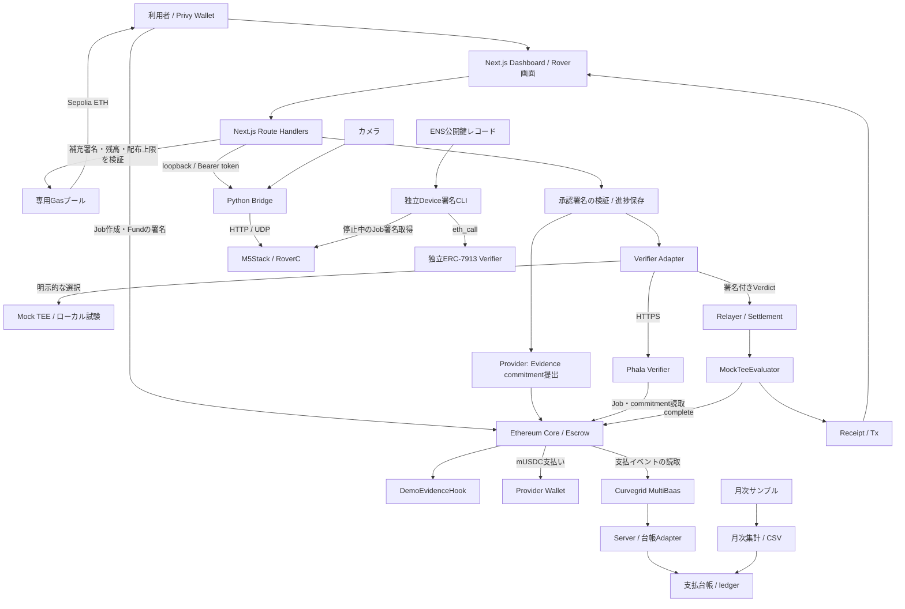
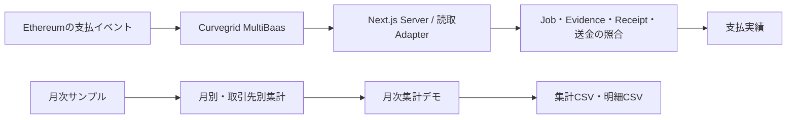
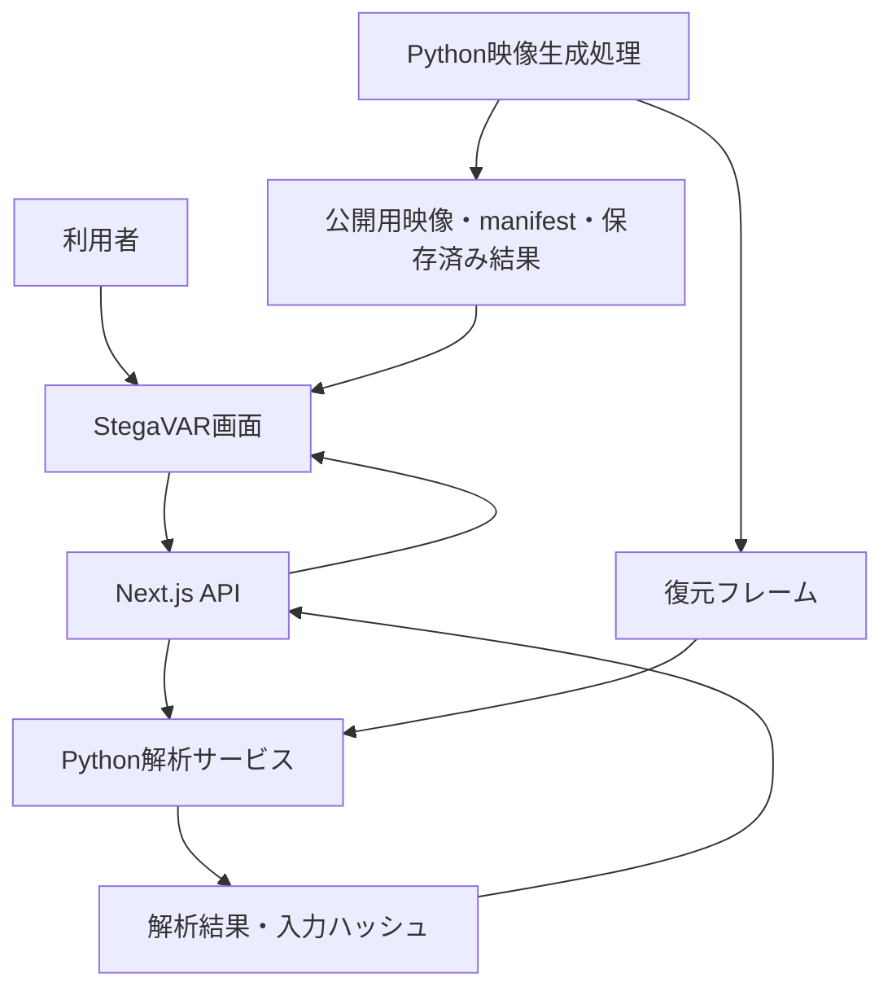
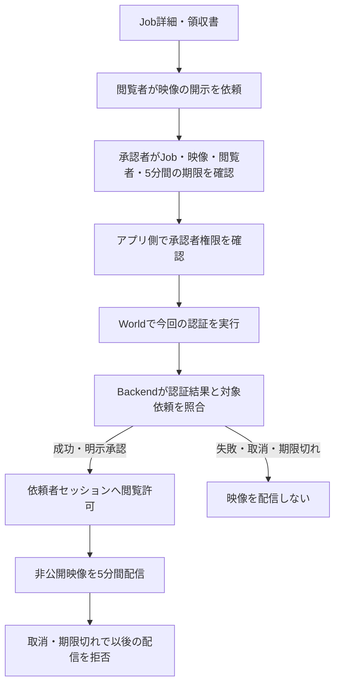

# Verifiable Blackbox — Architecture

作成日: 2026-09-26

実装状況: ローカル通し試験、実Phala接続、模擬EvidenceによるSepolia決済、Sepolia Gas補充APIを確認済み。実機Bridge・カメラの接続復帰を確認し、その後、利用者から動作報告を受けている。実機操作・Privy承認・Sepolia決済を一連で完了した検証記録はまだない。タスクの確認範囲は [TASKS.md](TASKS.md)、起動方法は [README](../README.md) を参照。

`npm run demo:sepolia` はSepolia用Webと実機Python Bridge・カメラを起動する。実Phalaの起動・接続設定は別途必要で、接続先はrootの`.env`とRover Python環境で設定する。`demo:rover` は公開Anvil Wallet・Mock Verifier・模擬Bridgeで動く。`demo:rover-phala` は別プロジェクトのPhala LOCAL_DEVを使う。外部サービスを設定しない `dev:web` はサンプル画面を表示する。Wallet Providerは共通layoutに置き、画面移動中のログインを保持する。

ローカルChainは起動ごとに新しくなるため、承認記録は起動ごとの保存先を使う。通常Serverの保存先は `.demo-reviews/`、上書きはServer専用の `DEMO_REVIEW_DIR`。同じChainにServerだけを再接続する場合は既存の保存先を使用する。過去のJobは作成TxとChain状態を照合する。

WebのAttestation APIではfresh nonceとclaimsを照合するが、Intel quoteの独立した暗号検証は含まない。APIは `quoteVerified=false` を返す。Phala側の独立Verifierではhardware quote・compose measurement・claims bindingの検証成功を記録済みであり、その結果とWeb APIの照合範囲を区別する。Device署名のHTMLはfixture／保存済み署名／今回のAPI取得を区別し、Webの未照合状態を自動で変更しない。

## 1. プロダクトの目的

Verifiable Blackboxは、ロボットの仕事に関する記録を検証し、Ethereum上のEscrowから報酬を支払うアプリケーション。

中心となる体験は「仕事を作成 → Roverを操作 → 利用者が署名して検証・支払いを実行 → 領収書を確認」。Dashboard、実機操作、Evidence検証、決済を一つの導線につなぐ。

### 機能範囲

| 項目 | 機能 |
|---|---|
| Dashboard | Privy Login、Job作成、進捗、履歴、領収書、日英切替 |
| Gas補充 | SepoliaのClient残高確認、所有者署名に基づく専用プールからのETH補充 |
| Rover | `/rover`での自由操作／Job操作、停止、カメラ、グリッパー。Python Bridgeを介して接続 |
| 決済 | 利用者の署名付き承認文書 → Evidence → Phala → Escrow支払い |
| Device署名 | 停止中のM5によるJob識別情報のP-256署名、独立ERC-7913検証、CLI／レポート |
| ENS | 公開鍵レコードの読取と署名照合、領収書への登録情報表示 |
| 支払台帳・月次集計 | `/ledger`でMultiBaasの支払実績、根拠照合、月次サンプル集計、CSV出力を扱う |
| StegaVAR | `/stegavar`で映像比較・復元映像の同期再生・CPU再解析を提供する。Python処理は別サービスとする。詳細は第10節 |
| 動画判定による報酬支払い | 前ボタンの押下記録でPhala検証・支払いへ進む。動画認識は参考表示とし、隠し設定でスキップ可能。第11節・T25〜T32を参照 |
| Worldによる映像開示 | 独立した開示サービスを再利用し、Job詳細・領収書から開示を依頼する。権限を持つ承認者のWorld認証後、依頼者へ5分間配信する。第12節・T34〜T38で追加する |

PhalaはDemoEvidenceのデータとChain上のJobとの整合性を検証する。支払いには利用者の署名付き承認を必要とする。現在の決済経路に動画判定は含まれない。第11節では、走行指令・停止の記録に加え、承認した判定モードに応じて動画判定をアプリ側の条件にする。Phalaによる実移動・荷物運搬・映像の意味の判定は対象外とする。

Device署名はJob識別情報への署名として独立検証し、支払い条件には含めない。署名鍵はM5のNVSへ保存する。Secure Elementによる鍵保護は将来の拡張とする。

## 2. 全体構成



台帳は支払い処理の後にイベントを読み取り、取得障害を決済フローへ波及させない。

`MockTeeEvaluator` はtrusted signerのVerdictを検証するContract。Mock signerと実Phala signerのどちらを使う場合も、検証元は設定・応答・署名・Attestationの状態で識別する。

### 各境界の責務

| 境界 | 担当すること | 担当しないこと |
|---|---|---|
| Browser | Login、Client署名、Job操作、進捗表示、操作入力 | Provider／Relayer鍵の保管、支払成功の独自判定 |
| Next.js server | 入力・承認署名検証、Chain照会、Gas補充、Evidence提出、Verifier接続、決済、永続化 | 走行指令を物理作業の証明に変換 |
| Python Bridge | 機体認証、session／sequence、停止、Telemetry、JPEG中継 | Job完了判定、支払い |
| PhalaNetwork | 検証policyによるEvidence照合、EIP-712署名、Attestation提供 | 実機の操作、利用者の承認署名検証、送金 |
| Ethereum | Job・預かり金、commitment、Verdict検証、支払い・Receipt | カメラの画像認識、物理移動の測定 |
| Device署名部品 | 登録鍵／ENS鍵とJob署名の照合、結果レポート | Mainの承認・Phala・決済条件の置換 |
| 台帳Adapter | MultiBaas読取、イベント照合、snapshot保存、月次集計、CSV | 送金、月次一括決済、仕訳の確定 |

## 3. 技術構成とディレクトリ

npm workspacesでWebとContractを管理する。WebはNext.js App Router、Contractの開発・試験はFoundryを使用する。

```text
app_Verifiable_Blackbox/
├── README.md                         # セットアップ・動く範囲・制約
├── .env.example / .gitignore
├── package.json / package-lock.json
├── foundry.toml
├── apps/web/
│   ├── app/                          # /、/rover、api/demo/*
│   ├── components/                   # dashboard、progress、receipt、rover、language
│   ├── lib/
│   │   ├── contracts.ts              # ABI・Evidence・Verdict・commitment
│   │   ├── job-flow.ts / job-history.ts
│   │   ├── demo-review.ts            # 承認文書と型
│   │   ├── gas-funding.ts            # Gas補充署名文書と型
│   │   └── server/                   # config、provider、verifier、settlement、review、gas-faucet
│   ├── .demo-reviews/                # 実行時生成、Git対象外
│   └── .demo-gas/                    # Gas補充台帳、実行時生成、Git対象外
├── packages/contracts/
│   ├── src/                         # Core拡張、Hook、Evaluator、mUSDC
│   ├── vendor/erc8183/               # 参照実装の固定snapshot・出典
│   ├── script/
│   └── test/
├── parts/device-signature/           # 独立した署名検証CLI・Contract・tests
├── scripts/                         # 起動・設定確認・各層の試験
├── deployments/                     # 公開可能な接続情報、秘密鍵なし
└── docs/                            # 公開向け設計・依存関係
    ├── ARCHITECTURE.md
    ├── DEPENDENCIES.md
    ├── evidence/                    # Demoのスクリーンショット
    ├── internal/                    # 起動・Demo・復旧・検証記録・API仕様
    └── TASKS.md                     # 実装タスクと完了条件
```

DashboardはJob作成、進捗、履歴、領収書、サンプル決済を責務ごとに分ける。Serverの進捗はファイルへ保存し、外部DBを必要としない構成にする。

主な技術はNext.js、React、TypeScript、viem、Privy。Solidityは`0.8.28`、EVMは`cancun`を使用する。T01で依存関係の組み合わせとクリーンインストールを確認し、利用する版とlockfileを固定する。

## 4. 主要フローと状態

### Job操作から支払いまで

1. ClientがPrivyでLoginし、対象ChainとGas残高を確認する。Sepoliaで不足する場合はGas不要の補充要求メッセージに署名し、専用プールからのETH着金を確認する。Job作成前の確認に加え、画面の補充ボタンからも実行できる。
2. `createAndFundDemo`で100 mUSDCのJobを作成する。Job IDは確定したTransactionの`JobCreated`イベントから取得する。これはテスト用Tokenを使うDemo専用処理である。
3. `/rover`へ同じJobを引き継ぐ。Jobなしの自由操作は別経路として扱う。
4. PrivyログインからJob所有者をServerで確認し、前ボタンを表示する。接続後に全方向・アーム・カメラを操作できる。前ボタンの一瞬の押下でJob完了・支払いへ進み、離すと停止する。操作前の追加署名は要求しない。
5. Serverが今回のJobの押下を記録する。短い押下でも支払いへ進む。動画判定は参考結果として独立して取得する。
6. Serverが所有者・Job期限・対象記録とChain状態の一致を確認し、二重払いを防ぐ。
7. 押下記録を含むBundleのhashを`DemoEvidenceV1.imageHash`へ入れる。Providerが同じEvidenceのcommitmentを提出する。
8. VerifierがEvidenceとオンチェーン情報を照合する。Adapterも返却値とtrusted signer、EIP-712署名を確認する。
9. RelayerがEvaluatorの`settle`を呼ぶ。EvaluatorがVerdictを検証し、CoreがProviderへ支払い、Receiptを発行する。
10. 確定Tx・Receipt・commitment・検証元を表示する。エラー時は保存済み進捗とChainを確認して再開する。

### 混同しない状態

| 状態の種類 | 値・保存先 | 判定の根拠 |
|---|---|---|
| Job | `Open / Funded / Submitted / Completed / Rejected / Expired` | ChainのCore |
| 決済処理 | `review → authorized → submitting → submitted → paying → paid` | Serverのreview記録＋Chain照合 |
| Rover操作 | 未接続、接続済み、操作中、停止確認、切断、異常 | Bridge session／Telemetry／停止応答 |
| Browser履歴 | 選択中Job、作成Tx、操作終了の表示 | localStorage。Wallet・Chain・Coreで分離 |
| 機体署名 | 未照合／成功／失敗、対象chain・core・job、取得時刻 | 独立検証結果。支払い状態とは別 |

Server記録は`.demo-reviews/<chainId>-<core>/<jobId>.json`へ保存し、排他lockと一時ファイルからのrenameを使う。Tx hashを保存した後の再試行は同じTxを照会する。`submitting`／`paying`でhash不明のまま中断した場合や異常終了でlockが残った場合は、Chain照合による復旧を必要とし、自動で新しいTxを送らない。

### Sepolia Gas補充

専用GasプールはDeployer・Provider・Relayerと鍵を分離する。補充要求の署名は受取Wallet、chainId、Core、origin、UTC日付に結び付ける。Serverが所有者署名と残高を検証し、WalletごとにUTC日次1回、プール全体で日次0.05 ETHまで補充する。補充目標残高はGas料金に応じて計算し、通常は0.003 ETH、0.01 ETHを超える目標額は拒否する。

補充台帳は`.demo-gas/<chainId>-<poolAddress>/ledger.json`に保存する。排他lockで送金を直列化し、署名済みTransactionを送信前に保存する。再試行時は同じTransactionのReceiptを確認する。復旧時には保存したTransactionとChainのReceiptを照合する。mUSDCは`createAndFundDemo`で準備され、Gas補充APIはETHを扱う。

## 5. データとContract

| 形式 | フィールド・規則 |
|---|---|
| `DemoEvidenceV1` | `jobId, scenario, robotId, challenge, capturedAt, imageHash, checkpoint, sequence`。ABI encodingしたデータのKeccak-256をcommitmentとし、Web・Phala・Contractで順番と型を統一する |
| Wire形式 | 整数は10進文字列で送る。数値入力を受けるparserでは非負のsafe integerだけを許可する |
| Challenge | Demoでは`challenge-${scenario}-${jobId}`を使う |
| `DemoVerdictV1` | `jobId, provider, evidenceCommitment, outcome, issuedAt, validUntil, nonce`。EIP-712 domain・型・Evaluator addressを一致させる |
| 承認context | `chainId, core, evaluator, token, jobId, client, provider, budget, expiresAt, nonce`。`reviewMessage`で署名対象の文面を生成する |
| Device Job署名 | `SHA-256(abi.encode(schemaHash, chainId, core, jobId))`。`schemaHash = SHA-256(UTF-8("DeviceJobSignatureV1"))`、P-256、low-S、64-byte公開鍵と署名 |

承認フローでは`imageHash`フィールドに署名済み承認文書のhashを格納する。画面では検証対象を「承認文書」と表示する。機体署名は、Evidenceとは別のレコードとして対象Job・公開鍵・署名・照合結果を保持する。

第11節の動画判定経路では、同じ`imageHash`欄に操作記録・録画・解析結果・条件付き承認を含むBundleのhashを格納する。ABIとPhalaのEvidence形式は維持し、Web側のレコード種別と検証処理で両経路を区別する。

Contractの役割は次のとおり。

- `HackathonAgenticCommerce`: 固定ERC-8183参照実装の拡張。Job／EscrowとDemo用一括作成・Fund。
- `DemoEvidenceHook`: 提出されたEvidence commitmentをJobへ結び付ける。
- `MockTeeEvaluator`: trusted signerのVerdict検証、期限・再使用等の制御、Core完了、Receipt。
- `MockUSDC`: 小数点6桁のテスト用Token。100 mUSDCは`100_000_000` base units。
- `DeviceSignatureVerifier`: 独立したP-256／ERC-7913確認。Job管理・送金の機能を持たない。

ERC-8183参照実装はvendor snapshotとして出典とrevisionを固定する。仕様更新は影響範囲を確認してから取り込む。

## 6. 画面・API

画面は`/`にJob作成・進捗・履歴・領収書・別枠の支払いシミュレーション、`/rover`に自由操作／Job操作・カメラ・グリッパーを置く。英語を初期表示にし、日本語へ切り替えられるようにする。サンプルと実機由来の表示を区別する。

`/ledger`とナビゲーションの「台帳 / Ledger」を提供する。共通Header・日英切替を使い、支払実績と月次集計デモをタブで切り替える。

APIはNext.jsのRoute Handlersで実装している。各実装は [API Route Handlers](../apps/web/app/api/) を参照。

| API | 責務 |
|---|---|
| `/api/demo/config` | 秘密を含まないChain・Contract・Verifierの表示設定 |
| `/api/demo/rpc` | 許可したRPCの中継。上流の資格情報をBrowserへ渡さない |
| `/api/demo/faucet` | GET: Sepolia Gas残高・補充可否。POST: 所有者署名を検証してSepolia ETHを補充。ローカルAnvilのETH補充にも対応 |
| `/api/demo/provider` | サンプルEvidenceの提出 |
| `/api/demo/verify`、`/settle` | サンプル検証・決済の各段階 |
| `/api/demo/attestation` | Serverがfresh nonceを発行しPhalaへ問い合わせ |
| `/api/demo/rover/review` | GET:進捗、POST:`prepare`／`verify-and-pay` |
| `/api/demo/rover/session/direct` | PrivyログインとJob所有者を照合し、操作前の署名なしでセッションを準備・復元する |
| `/api/demo/rover/complete` | GET:Funded・Submitted・Completed Job情報。POST:操作用tokenと保存済み押下記録を照合し、決済を開始・再開する |
| `/api/demo/rover/control` | GET:状態。POST:`activate/drive/release/stop/gripper` |
| `/api/demo/rover/camera` | GET:設定／JPEG、POST:ON/OFF／接続先設定 |

## 7. 起動と外部接続

ローカルAnvilとMock、Phala LOCAL_DEV、実Phala／Sepolia、実機の順で接続を確認する。`MOCK_TEE`／`PHALA`は明示選択とし、Phala障害時にMockへ切り替えない。LOCAL_DEVやsimulatorの表示には実TEEと区別できるラベルを付ける。

Webは`127.0.0.1:3000`、Bridgeは`127.0.0.1:8765`を使う。ポート競合時はエラーを表示して起動を中止する。実機接続・カメラ受信はローカルPCで行う。

`npm run demo:sepolia` は既存Rover Python環境の保存済み接続設定を使い、実機Bridgeの待機状態を確認してからWebを起動する。起動ごとに生成するBearer tokenを両者で共有し、終了時は起動した子プロセスも停止する。起動だけでは機体をARMせず、画面での接続操作を待つ。`npm run demo:sepolia -- --no-rover` はWebのみを起動する。

外部コンポーネントの配置は環境変数で指定する。ローカル開発時の既定値は次のとおり。

| 対象 | アプリrootからの既定相対パス |
|---|---|
| Rover Python | `../../M5stack_RoverC/rover-python` |
| Phala local service | `../../PhalaNetwork` |

launcherは`ROVER_PYTHON_ROOT`、ローカル試験用`PHALA_PROJECT_ROOT`を設定として受け取る。絶対パスをコードへ固定せず、存在確認・Python環境確認を行う。E2E runnerは対象のContract・Web・保存先を明示して起動する。

秘密鍵、Privy公開設定、RPC、Phala URL、deployment情報を役割ごとに分け、テンプレートにはダミー値だけを書く。Provider／Relayer／Gasプール秘密鍵、Bridge token、認証付きRPC URLはServer専用にする。Sepolia launcherはEthereum秘密鍵とRPC資格情報をPython Bridgeへ渡さない。実Phala接続時はchainId・Core・Hook・Evaluator・trusted signerの組を照合する。

## 8. ドキュメントと公開範囲

公開対象はソース・設計・再現可能なデモとする。鍵を持つDemo APIと実機操作サーバーをインターネットへ公開する構成は含めない。公開プレビューが必要なら、署名鍵と機体接続を持たないsample／read-only表示を別途設計する。


公開対象はソース、テスト、匿名化したfixture、設定テンプレート、依存lockfile、確認済みの公開deployment情報。`.env*`の実値、`.demo-reviews/`、`.demo-gas/`、`.ledger/`、`docs/internal/`、`parts/device-signature/local/`、録画原本、認証token、ログ、`.tools/`、`node_modules/`、`.next/`、Foundry生成物を持ち込まない。サードパーティのlicense・出典は保持する。

## 9. 支払台帳・月次集計

ロボットの仕事に対する支払いをCurvegrid MultiBaasから取得し、Job・Evidence・Receipt・送金を結び付けて表示する。月次集計では、取引先別の合計から明細と根拠を確認し、経理向けCSVを出力する。

### 画面

| タブ | 機能 |
|---|---|
| 支払実績 | MultiBaasから取得した支払い一覧、根拠の照合結果、詳細、手動更新 |
| 月次集計デモ | サンプル明細の月別・取引先別集計、内訳、集計CSV・明細CSV |



### データ取得と照合

- 対象のChain・Core・Hook・Evaluator・Tokenと、Jobごとの関連Transactionを設定する。履歴の契約構成は、現在の決済設定と区別して管理する。
- 初期範囲は選択した最大10 Job・関連40取引。MultiBaasのtransaction receipt・block APIから取得する。取得対象・取得時刻・ブロック範囲はAPI応答とsnapshotで保持し、画面では支払実績と照合状態を表示する。
- このDemoの対象は`apps/web/lib/ledger/selection.json`に指定したJob 1・3取引。日本時間2026年9月26日を含み、9月27日00:00以降の取引を拒否する。対象を自動追加しない。
- 支払額は`PaymentReleased.amount`を使い、同じ成功取引のToken `Transfer`と照合する。入金・mint・手数料のTransferは支払額へ加算しない。
- `JobCreated`、`EvidenceCommitted`、`DemoWorkReceiptIssued`を結び付け、Job・受取先・Evidence hash・イベント発行元・発注から支払いの順序・正規ブロック・確認数を検査する。確認数の初期値は12とする。
- Jobは`chainId + coreAddress + jobId`、イベントは`chainId + transactionHash + logIndex`で識別し、再取得による重複を防ぐ。

支払いの状態は「照合済み」「確認待ち」「根拠不足」「不一致」に分ける。支払い総額と照合済み金額を区別し、根拠不足の支払いを照合済みとして集計しない。イベント照合は物理作業の自動証明とは区別する。

### 保存・集計・CSV

実取得結果はServer側にsnapshotとして保存する。再起動後や取得失敗時には、保存済み結果であることと手動更新の案内を表示する。保存時刻はsnapshotで保持する。契約設定・取得対象・MultiBaas接続先が異なるsnapshotは利用しない。更新時は同時実行を抑制し、一時ファイルからのrenameで保存する。

取得状態は「未設定」「取得中」「取得成功」「対象0件」「取得失敗」「保存済み結果表示」を区別する。失敗時にサンプルへ自動切替して成功表示しない。

月次サンプルは実支払いと分離する。金額は最小単位の整数で計算し、対象月はAsia/Tokyoで区切る。初期サンプルは120件・3社・合計12.00 mUSDCとする。実支払いとサンプルの金額を一つの総額へ混ぜず、支払済みJobを未払いとして再計上しない。

CSVは集計用と明細用を用意し、対象月・通貨・件数・金額を画面と一致させる。サンプルであることをファイル名と各行の`source=sample`に含める。引用符・改行をescapeし、数式として解釈される文字列を処理する。

- 集計CSV: `source, period, counterpartyId, counterpartyName, asset, decimals, usageCount, amountMinor, amountDisplay`
- 明細CSV: `source, period, usageId, occurredAt, counterpartyId, counterpartyName, description, asset, decimals, amountMinor, amountDisplay, evidenceRef`

CSVは経理へ渡す補助明細とし、出力だけで記帳完了とは扱わない。

### 配置とAPI

```text
apps/web/
├── app/ledger/page.tsx
├── app/api/ledger/
│   ├── route.ts                 # GET: 支払実績と取得状態
│   ├── refresh/route.ts         # POST: MultiBaas再取得
│   ├── monthly/route.ts         # GET: 月次サンプル集計
│   └── export/route.ts          # GET: CSV
├── components/ledger/           # タブ・一覧・詳細・集計
├── lib/ledger/                  # データ型・照合・集計・CSV
├── lib/server/curvegrid/        # SDK・設定・取得・snapshot
└── .ledger/                     # 実行時保存、Git対象外
```

`monthly`は`period=YYYY-MM`、`export`は`period`と`kind=summary|details`を受け取る。対象月と出力種別を検査し、CSVをattachmentとして返す。API応答はno-storeとする。

`MULTIBAAS_URL`と`MULTIBAAS_API_KEY`はServer専用にする。更新要求は同一Originから受け付け、同時実行と短時間の連続取得を抑制する。SDKはServer側で利用し、資格情報をBrowser・CSV・snapshotへ出力しない。

接続設定のテンプレートは [`.env.ledger.example`](../.env.ledger.example)。rootの`.env`へ設定し、Webを再起動する。snapshotは設定のfingerprintごとに`.ledger/`へ保存し、APIキーそのものをfingerprintへ含めない。更新間隔は4秒以上とし、ファイルlockで同時更新を抑制する。lockが残った場合は更新プロセスを停止してから対象の`.lock`だけを除去する。

実接続の確認ではSepolia Job 1の100.00 mUSDC支払いをMultiBaasから取得し、Job・Evidence・Receipt・Token送金を照合した。月次サンプル120件・3社・12.00 mUSDC、CSV、日英表示、390px幅の表示を確認した。台帳の照合結果は機体の作業完了を証明するものではない。

台帳は読取と集計を担当する。月次一括送金、新しい精算Contract、仕訳の自動確定は対象外とする。取得障害がJob作成・Rover操作・Phala検証・決済を妨げない構成にする。

## 10. StegaVAR

### 目的

Roverの映像をカバー映像へ埋め込み、復元映像と解析結果を確認する。`/stegavar`に映像比較・再生・解析をまとめ、共通メニューと日英切替から利用できるようにする。

動作・静止の2ケースと3種類のカバーを配置し、6組・960フレームの整合性、実Python再解析、同期再生・シーク、障害時の閲覧、日英・390px幅表示を確認した。起動コマンドは`npm run demo:stegavar`。構築・生成手順は [サービスREADME](../services/stegavar/README.md) を参照。

### 機能

- Roverが動いているケースと停止しているケースを選択する。
- カバー映像、埋込み後の映像、差分を切り替える。
- 復元映像を表示し、再生・停止・シークで比較する。
- 保存済みの解析結果を表示する。
- 復元映像をPythonサービスで再解析し、結果を更新する。
- 使用したデータ、解析方法、ハッシュ、出典を確認する。

Revealは事前に復元した映像を表示する操作とする。再解析は復元済みのフレームを入力に実行する。

録画直後の自動埋込み・復元は別途設計する。今回の録画と操作記録・支払いの関係は第11節、World認証による第三者への開示は第12節に定義する。

### 構成

```text
app_Verifiable_Blackbox/
├─ apps/web/
│  ├─ app/
│  │  ├─ stegavar/page.tsx
│  │  └─ api/stegavar/
│  │     ├─ health/route.ts
│  │     └─ analyze/route.ts
│  ├─ components/stegavar/
│  ├─ lib/stegavar/
│  └─ public/stegavar/
│     └─ 公開用の映像データ・manifest・保存済み解析結果
├─ services/stegavar/
│  ├─ scripts/
│  ├─ config/
│  ├─ checkpoints/
│  ├─ third_party/
│  ├─ requirements.txt
│  └─ .venv/
└─ scripts/
   └─ StegaVARを含む起動処理
```

Python環境・モデル・生成物は用途ごとに管理する。`.venv`と実行ログはGit管理から除外する。モデルの取得方法、バージョン、ハッシュを固定する。

必要な公開用ケースだけを配置し、中間生成物とアーカイブは含めない。PythonとWebは同じmanifest・復元フレームを参照し、重複コピーを避ける。



### 役割分担

| 構成 | 責務 |
|---|---|
| StegaVAR画面 | ケース選択、映像比較、再生、解析結果表示 |
| Next.js API | 入力検証、Pythonへの接続、タイムアウト、エラーの整形 |
| Python解析サービス | 復元フレームの検証、動きの計測、映像分類 |
| Python映像生成処理 | 埋込み、復元、表示用データとmanifestの生成 |

ブラウザは同一オリジンのNext.js APIを呼び出す。Pythonの接続先はサーバー側の環境変数で管理する。

ローカルではPythonをloopbackにバインドする。別ホストへ配置する場合は、接続認証と通信経路を追加設計する。

### API

#### GET /api/stegavar/health

Pythonの稼働状態、解析中かどうか、モデルのロード状態を返す。Pythonへ接続できない場合も映像画面は利用できる。

Python解析サービスの既定接続先は`http://127.0.0.1:4178`。`STEGAVAR_URL`で接続先、`STEGAVAR_TIMEOUT_MS`で待機上限を設定する。`/api/stegavar/assets/[...path]`は共有データ保存先のcatalog・公開フレーム・出典を配信し、フレームのSHA-256を照合する。

#### POST /api/stegavar/analyze

入力は以下とする。

- `case`：解析対象のケースID
- `scene`：カバー映像のID

IDは許可された一覧と照合する。任意のファイルパスやURLは受け付けない。

解析結果は以下を含む共通形式へ整形する。

- ケースID・シーンID
- 解析方式とそのバージョン
- 実行ID・解析日時・処理時間
- 入力映像と復元フレームのハッシュ
- 解析結果
- 今回実行した解析であることを示す情報

同時解析は1件に制限する。解析中の追加要求は409、未起動・接続不可は503、待機時間超過は504として画面に伝える。

待機上限は設定可能にし、初期値は20秒とする。HTTPの待機終了とPython処理の終了は区別する。

### 映像・解析データ

manifestにはケース、シーン、フレーム数、fps、表示データの参照先、解析方式、ハッシュを保持する。

公開用データは以下を揃える。

- カバー映像
- 埋込み後の映像
- 差分表示用データ
- 復元フレーム
- manifest
- 保存済み解析結果
- 出典・ライセンス情報

解析には指定された復元フレームを使用する。サムネイルや確認用MP4を解析入力へ置き換えない。

保存済み結果と今回の解析結果は明確に区別する。ケース切替後に到着した応答は、別ケースの表示へ反映しない。応答のケースIDと入力ハッシュをmanifestと照合する。

### CPUでの処理

映像の埋込み・復元とX-CLIPの分類はCPUで実行する。PyTorchのスレッド数は4を初期設定とする。

Roverの動きは復元フレームの差分から計測する。動きの計測とX-CLIPによる分類は、画面上でも区別する。

モデルは必要になった時点でロードし、解析サービス内で再利用する。GPU対応は、録画後の処理時間や処理量を測定してから検討する。

### 障害時の動作

Pythonが未起動、解析中、タイムアウト、解析失敗の場合は、理由を表示し、映像再生と保存済み結果の閲覧を継続する。

失敗した要求を自動で繰り返さない。利用者が状態を確認して再試行できるようにする。

### アプリとの関係

共通ヘッダー、日英切替、Wallet Providerを利用する。StegaVARの閲覧や再解析にWallet署名は要求しない。

`/stegavar`のサンプル閲覧・再解析結果は映像の参考情報として扱い、この画面の操作から支払いを実行しない。第11節の支払い経路は、今回のJobの録画と操作記録を対象にする。

このサンプル閲覧機能はDemoEvidence、Phalaの判定、Escrowの支払い条件を変更しない。サンプルの映像ハッシュを支払い用Evidenceへ流用しない。今回の録画を含むBundleの扱いは第11節に従う。

### 映像の公開範囲

publicへ配置した映像と復元フレームは公開データとして扱う。埋込みやRevealボタンによってアクセス制限が成立するとは扱わない。

World認証による開示は第12節に従い、保護対象の映像をpublicから分離して、認証・権限・有効期限を確認して配信する。公開サンプルのRevealはこの開示許可とは別の機能とする。

## 11. 前ボタンの記録によるRoverの報酬支払い

### 操作と支払い条件

Job作成時に100 mUSDCを入金し、「前ボタンを押した記録で1回支払う」と表示する。操作画面には前後左右・左右回転・停止・アーム・カメラ・速度選択を表示する。接続後は全操作を使え、前ボタンを一瞬押すと作業完了の記録を保存する。条件確認・操作用署名・記録開始の操作は要求しない。

画面は「Step 1: Job作成 → Step 2: Rover操作 → Step 3: 記録を検証 → Step 4: 支払い結果」の順に進む。「操作を終了してStep 3へ」で機体の停止を確認し、`/#step-3`へ戻る。録画終了・動画解析・決済応答を画面遷移の待機条件にしない。Step 3の「検証して支払う」で押下記録を検証し、支払いを実行する。

方向ボタンを押している間だけ動き、離すと停止する。押下の最小時間はなく、1秒の長押しも不要。解放が先に届いた通信遅延時には、遅れて届く走行要求を拒否する。Job完了・支払い中・支払い後も全操作を続けられる。通信断・画面離脱時にも停止する。

| 今回のJobの前ボタン | 動画判定 | 報酬 |
|---|---|---|
| 押した | 動いた・動いていない・判定できていない・未実行 | 1回支払う |
| 押していない | すべて | 支払わない |

前ボタンの押下はServerが受信した操作要求として保存する。物理的な移動成功とは別の記録である。机上での短い操作、録画不足、動画解析エラー、停止応答の不足を支払い条件にしない。Job所有者・対象Job・記録の整合性・Job期限・二重払い防止はServerで確認する。

### ログインと操作権限

Privyのログイン済みaccess tokenとidentity tokenをServerへ送り、公開JWKSでES256署名・issuer・audience・期限・同一本人を検証する。署名されたEthereum WalletをオンチェーンJobのClientと照合する。アプリの追加秘密鍵や操作前のpersonal_signは不要。Privy Dashboardで「Return user data in an identity token」を有効にする。

`session/direct`は所有者確認後、Job単位のセッションとランダムな操作用tokenを発行する。準備だけでは機体を接続・走行させず、支払いも始めない。機体接続と全方向操作は`rover/control`が担当し、接続後の録画は`recordOnly`で走行を制御せずに行う。前ボタンを押すと`session/start`の`press`が`buttonAuthorization.pressedAt`を保存する。Step 3からの決済は録画終了を待たずに実行できる。支払い条件は`forward-button-v1`、新規Jobのdescriptionは`vbb://rover/forward-button-v1`とする。

操作用tokenは対象Job・sessionIdに固定する。Serverが保存したtokenと同一Originの要求を照合し、開始・入力・記録閲覧・結果取得・決済に使用する。画面を開き直した際はPrivyで所有者を再確認して同じ実行を読み込む。公開Anvil Walletによる認証省略は、明示したローカルモード・loopback RPC・実chainId 31337・固定テストWalletの組合せだけで有効。

### Raw動画とStegaVAR

通常はBridgeがRaw MJPEGとJPEGフレーム列を保存し、ServerからStegaVARへ送る。CPUのフレーム差分で`MOVING / STILL / INCONCLUSIVE`を返し、Job・sessionId・録画SHA-256・policyHashとともに保存する。前ボタンの記録を動画判定の答えに使わない。動画結果は参考情報として表示し、支払い判定と独立させる。

録画の再生・解析結果・Worldの開示操作は、支払い完了後の「今回の動画を見る」にまとめる。動画コンポーネントと録画フレームは、このボタンを開いてから読み込む。操作用のライブカメラはStep 2で利用できる。

設定アイコンの長押しで「動画認識をスキップ」を選べる。初期値はOFF。スキップ時は解析を呼ばず`INCONCLUSIVE / SKIPPED`、録画や解析が利用できない場合は`INCONCLUSIVE / UNAVAILABLE`と理由を残す。カメラ設定が取得できなくても、操作準備と前進を妨げない。

### 証拠・Phala・決済

`RoverPaymentBundle`にはJobの固定条件、所有者確認の記録、押下時刻、操作記録のハッシュ、動画の参考結果を含める。動画解析と決済は別々に進める。決済開始時に動画結果がまだない場合は未取得と記録し、後から届く動画結果は画面に表示する。提出済みのBundleとcommitmentは保持する。

Bundleのハッシュを`DemoEvidenceV1.imageHash`へ格納し、Provider提出、PhalaによるEvidenceとオンチェーンJobの照合、Evaluator決済、Receipt取得へ接続する。Phalaが物理的な移動を観測したとは表示しない。

決済はJob単位で排他・永続化し、TransactionハッシュとReceiptを保存する。再送・再読み込み時は同じTransactionとChain状態を照合する。送信結果不明のまま追加送金しない。Rover Jobへのサンプル決済APIの直接呼び出しは拒否する。

概要画面も同じ操作セッションを読み込む。押下なしでは操作画面へのリンクを表示し、押下済みで支払い未完了なら`rover/complete`から保存済みの支払いを再開する。画面を表示するだけでは送金しない。ナビゲーションの「操作」は選択中のJobを引き継ぎ、支払い完了後も操作画面へ戻れる。

### 配置と確認範囲

- `components/rover-job-controls.tsx`, `rover-control.tsx`: 全方向・アーム・カメラ・速度選択、隠し設定、押下記録、Step 3への復帰。
- `components/rover-payment-status.tsx`, `rover-video-result.tsx`: Step 3の検証・支払い、完了後の動画閲覧。
- `lib/server/rover-session/owner.ts`: PrivyログインとJob所有者の照合。
- `lib/server/rover-session/direct.ts`: 署名画面を使わないセッション準備。
- `rover/control`, `session/start`, `session/status`: 手動操作・押下記録・録画と状態取得。
- `session/analyze`, `session/frame`: Raw動画の3択判定と録画閲覧。
- `rover/complete`: 押下記録に基づく支払い・結果照合。
- `M5stack_RoverC/rover-python/rover/job_runner.py`: 操作を占有しない録画。`web_bridge.py`: 手動操作と解放・通信断時の停止。

模擬Bridge・実StegaVAR・専用Anvilで、短い押下、押下なし、接続中の解放、動画の参考判定、スキップ、支払い再送を確認する。実機・利用者のPrivyログイン・実Phala・Sepolia決済の有人通し確認はT32として残す。

デモは`node scripts/start-sepolia-web.mjs --build`で事前ビルドし、`node scripts/start-sepolia-web.mjs`で起動する。成果物は`.next-demo`に分離し、画面操作中のコンパイルを行わない。開発時は`--dev`を付ける。コードや`NEXT_PUBLIC_*`設定を更新した場合は再ビルドする。

## 12. Worldによる映像の開示

### 目的と範囲

仕事の詳細映像を第三者へ見せる際に、権限を持つ承認者が対象・閲覧者・期限を確認し、Worldで認証して開示を承認する。Job詳細・領収書画面に「映像の開示を依頼」を追加する。

Worldは第三者への映像開示に使う。操作者が自分の録画を確認する経路は現在の所有者確認を維持する。Roverの操作・動画解析・Phala・決済の仕様は変更せず、Worldの障害で支払いを止めない。

開示の実演では、実際に映像が保存されたJobを使う。録画がない場合は「映像なし」と表示し、開示依頼を作らない。別のサンプル映像をそのJobの映像として代用しない。

### デモの流れ



発表では「ロボットへの報酬支払いと、仕事の詳細映像を第三者へ見せる承認を別に制御する」と説明する。Worldの認証は物理動作や支払いの認定には使わない。

### 再利用する部品

`StegaVAR/world-idp`の開示依頼、承認者画面、OIDC接続、依頼者セッションに限定した配信、拒否・取消・期限切れを再利用する。アプリから開示画面へ移動する独立サービスとして接続し、認証コールバックを含む全処理を最初からNext.jsへ移植しない。

提出用の実装は`services/world-idp`に配置する。`npm ci --prefix services/world-idp`で依存を導入し、同ディレクトリの`npm start`で起動する。設定・人間による確認手順は[開示サービスのREADME](../services/world-idp/README.md)に記載する。

Job所有者がアプリの`POST /api/demo/world/disclosure`へログイン情報を渡し、開示依頼用リンクを作成する。リンクを受け取った第三者が自分のブラウザで依頼を作成し、その依頼の承認用リンクを承認者へ渡す。開示依頼用リンクだけでは映像を取得できない。

現在の固定映像・デモ用Jobラベルを、実Jobと録画を参照する仕組みへ拡張する。アプリServerと開示サービスの間で、認証した内部APIを通して対象データを登録する。ブラウザに任意のファイルパスや動画URLを指定させない。利用者のアクセス制御を通らない内部APIを公開しない。

Worldの資格情報と承認者コードはServer専用にする。起動・HTTPS入口・callback URLは開示サービス用として管理し、Rover制御APIを公開する構成にしない。

### Jobと映像の紐付け

登録対象は以下とする。

- chainId・Core・jobId・操作sessionId
- 映像の所有者と、承認権限の設定
- 元録画のSHA-256、配信対象assetId・SHA-256
- 撮影セッションと保存先の内部参照
- 関連するReceipt・支払いTransactionがある場合はその参照

ServerがJob・セッション・録画の対応を確認して登録する。配信用形式へ変換した場合は元録画と派生映像のハッシュを両方保持する。承認後に映像を差し替えず、映像が変わった場合は新しいassetIdと開示依頼を作る。

アプリはPrivyの所有者確認後、保存済みセッションが指すRaw MJPEGを認証付きBridgeから取得してSHA-256を照合する。開示サービスは録画全体と各JPEGフレームのハッシュを検証し、非公開メモリへ登録する。映像形式の変換は行わず、撮影時刻に従ってフレームを再生する。`WORLD_INTERNAL_TOKEN`で内部登録を認証し、`WORLD_APPROVER_OWNERS`で承認者コードが扱えるJob所有者を制限する。映像・登録状態はサービス再起動で失効する。

開示許可にはrequestId、対象Job、assetId・映像ハッシュ、依頼者セッション、承認者の検証済み識別情報、許可時刻、有効期限、状態を結び付ける。URLを知っているだけの別ブラウザには配信しない。

Receiptへの関連表示と、映像ハッシュがオンチェーンのcommitmentに含まれていることは区別する。第11節の提出済みBundleに後から映像を追加して書き換えたり、含まれていない映像をPhala検証済みと表示したりしない。

### 承認者の権限とWorld認証

Worldで認証できることと、その映像を開示する権限は別に確認する。デモでは既存の承認者コード方式を再利用し、その承認者が扱えるJob・所有者の範囲をアプリ側で限定する。World認証を完了した誰もが開示できる方式にしない。

承認画面で対象Job、映像、閲覧者、5分間の許可を明示し、その操作にWorldの認証結果を結び付ける。World subjectをWalletアドレスとして扱わず、必要な対応関係はServer側の設定で管理する。

既存のOIDC実装を基に、公式環境の現在の仕様との互換性をT34で確認する。Backendで署名、issuer、audience、有効期限、state、nonce、PKCE、今回の認証時刻、要求した認証条件を検証する。callbackの再利用や別の依頼への差し替えを拒否する。Browserからの未検証の成功通知だけでは許可を作らない。

### 配信・期限・取消

映像は非公開領域に置き、通常の取得とRange要求の両方で、許可の状態・対象asset・閲覧者セッション・有効期限を確認する。承認後5分間だけ配信し、未承認・拒否・認証取消・期限切れ・許可取消・別セッションでは拒否する。映像応答はno-storeとする。

動画以外にも、同じ内容の復元フレーム、サムネイル、直接ダウンロード、静的配信の経路を確認する。公開用StegaVARサンプルと保護対象のJob映像を分け、公開サンプルをアクセス制御の実証対象には使わない。

取消・期限切れでは画面から映像を取り除き、以後の配信を拒否する。既に受信・保存した映像の回収や画面録画の防止は保証しない。初期実装では既存部品と同様、再起動時に開示依頼・認証途中の状態・閲覧許可を失効させる。再起動だけで許可を復活させない。

### 公式接続と確認範囲

ローカル記録では公式Sandboxへの設定と接続準備はあるが、認証から映像開示までの公式環境での通し成功は未確認である。最初にT34で成功とキャンセルを確認する。

2026年9月26日に確認した[Worldの公式イベント案内](https://ethglobal.com/events/tokyo2026/prizes/world)では、World ID for Agentsは模擬Proofを使用し、Sandboxアプリは不要と案内されている。古い端末・callback設定をそのまま前提にせず、[公式イベント環境の資料](https://sandbox.auth.world.org/docs)と発行済みClient設定を確認する。

公式イベント環境の模擬ID、World未接続のrehearsal、本番の人間認証を表示上で区別する。World接続が失敗してもrehearsalへ自動切替して開示しない。公式認証の成功経路と、キャンセル等で保護対象が開かない経路を両方確認する。

統合時に要した時間、接続上の問題、必要な改善点は、公式案内の提出要件に沿う短い統合フィードバックとしてまとめる。日々の作業記録は追加しない。

## 13. 実装計画

[TASKS.md](TASKS.md)に、開発環境から画面・Contract・Phala・実機接続・台帳統合・StegaVAR統合・Rover報酬支払い・Worldによる映像開示までのタスクと完了条件を定義する。
