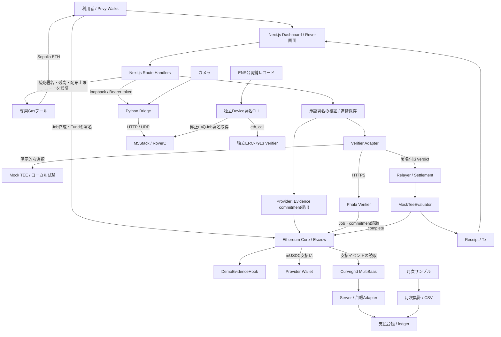
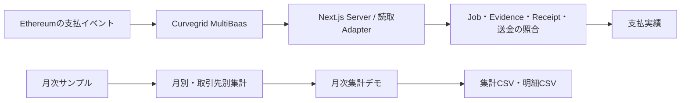

# Verifiable Blackbox — Architecture

作成日: 2026-09-26

実装状況: ローカル通し試験、実Phala接続、模擬EvidenceによるSepolia決済、Sepolia Gas補充APIを確認済み。実機Bridge・カメラの接続復帰を確認し、その後、利用者から動作報告を受けている。実機操作・Privy承認・Sepolia決済を一連で完了した検証記録はまだない。タスクの確認範囲は [TASKS.md](TASKS.md)、起動方法は [README](../README.md) を参照。

`npm run demo:sepolia` はSepolia用Webと実機Python Bridge・カメラを起動する。実Phalaの起動・接続設定は別途必要で、接続先はrootの`.env`とRover Python環境で設定する。`demo:rover` は公開Anvil Wallet・Mock Verifier・模擬Bridgeで動く。`demo:rover-phala` は別プロジェクトのPhala LOCAL_DEVを使う。外部サービスを設定しない `dev:web` はサンプル画面を表示する。Wallet Providerは共通layoutに置き、画面移動中のログインを保持する。

ローカルChainは起動ごとに新しくなるため、承認記録は起動ごとの保存先を使う。通常Serverの保存先は `.demo-reviews/`、上書きはServer専用の `DEMO_REVIEW_DIR`。同じChainにServerだけを再接続する場合は既存の保存先を使用する。過去のJobは作成TxとChain状態を照合する。

WebのAttestation APIではfresh nonceとclaimsを照合するが、Intel quoteの独立した暗号検証は含まない。APIは `quoteVerified=false` を返す。Phala側の独立Verifierではhardware quote・compose measurement・claims bindingの検証成功を記録済みであり、その結果とWeb APIの照合範囲を区別する。Device署名のHTMLはfixture／保存済み署名／今回のAPI取得を区別し、Webの未照合状態を自動で変更しない。

## 1. プロダクトの目的

Verifiable Blackboxは、ロボットの仕事に関する記録を検証し、Ethereum上のEscrowから報酬を支払うアプリケーション。

中心となる体験は「仕事を作成 → Roverを操作 → 利用者が署名して検証・支払いを実行 → 領収書を確認」。Dashboard、実機操作、Evidence検証、決済を一つの導線につなぐ。

### 機能範囲

| 項目 | 機能 |
|---|---|
| Dashboard | Privy Login、Job作成、進捗、履歴、領収書、日英切替 |
| Gas補充 | SepoliaのClient残高確認、所有者署名に基づく専用プールからのETH補充 |
| Rover | `/rover`での自由操作／Job操作、停止、カメラ、グリッパー。Python Bridgeを介して接続 |
| 決済 | 利用者の署名付き承認文書 → Evidence → Phala → Escrow支払い |
| Device署名 | 停止中のM5によるJob識別情報のP-256署名、独立ERC-7913検証、CLI／レポート |
| ENS | 公開鍵レコードの読取と署名照合、領収書への登録情報表示 |
| 支払台帳・月次集計 | `/ledger`でMultiBaasの支払実績、根拠照合、月次サンプル集計、CSV出力を扱う |
| 外部デモ | World／StegaVARは独立したアプリケーションとして扱う |

PhalaはDemoEvidenceのデータとChain上のJobとの整合性を検証する。支払いには利用者の署名付き承認を必要とする。実移動・荷物運搬・映像の意味の自動判定は対象外とする。

Device署名はJob識別情報への署名として独立検証し、支払い条件には含めない。署名鍵はM5のNVSへ保存する。Secure Elementによる鍵保護は将来の拡張とする。

## 2. 全体構成



台帳は支払い処理の後にイベントを読み取り、取得障害を決済フローへ波及させない。

`MockTeeEvaluator` はtrusted signerのVerdictを検証するContract。Mock signerと実Phala signerのどちらを使う場合も、検証元は設定・応答・署名・Attestationの状態で識別する。

### 各境界の責務

| 境界 | 担当すること | 担当しないこと |
|---|---|---|
| Browser | Login、Client署名、Job操作、進捗表示、操作入力 | Provider／Relayer鍵の保管、支払成功の独自判定 |
| Next.js server | 入力・承認署名検証、Chain照会、Gas補充、Evidence提出、Verifier接続、決済、永続化 | 走行指令を物理作業の証明に変換 |
| Python Bridge | 機体認証、session／sequence、停止、Telemetry、JPEG中継 | Job完了判定、支払い |
| PhalaNetwork | 検証policyによるEvidence照合、EIP-712署名、Attestation提供 | 実機の操作、利用者の承認署名検証、送金 |
| Ethereum | Job・預かり金、commitment、Verdict検証、支払い・Receipt | カメラの画像認識、物理移動の測定 |
| Device署名部品 | 登録鍵／ENS鍵とJob署名の照合、結果レポート | Mainの承認・Phala・決済条件の置換 |
| 台帳Adapter | MultiBaas読取、イベント照合、snapshot保存、月次集計、CSV | 送金、月次一括決済、仕訳の確定 |

## 3. 技術構成とディレクトリ

npm workspacesでWebとContractを管理する。WebはNext.js App Router、Contractの開発・試験はFoundryを使用する。

```text
app_Verifiable_Blackbox/
├── README.md                         # セットアップ・動く範囲・制約
├── .env.example / .gitignore
├── package.json / package-lock.json
├── foundry.toml
├── apps/web/
│   ├── app/                          # /、/rover、api/demo/*
│   ├── components/                   # dashboard、progress、receipt、rover、language
│   ├── lib/
│   │   ├── contracts.ts              # ABI・Evidence・Verdict・commitment
│   │   ├── job-flow.ts / job-history.ts
│   │   ├── demo-review.ts            # 承認文書と型
│   │   ├── gas-funding.ts            # Gas補充署名文書と型
│   │   └── server/                   # config、provider、verifier、settlement、review、gas-faucet
│   ├── .demo-reviews/                # 実行時生成、Git対象外
│   └── .demo-gas/                    # Gas補充台帳、実行時生成、Git対象外
├── packages/contracts/
│   ├── src/                         # Core拡張、Hook、Evaluator、mUSDC
│   ├── vendor/erc8183/               # 参照実装の固定snapshot・出典
│   ├── script/
│   └── test/
├── parts/device-signature/           # 独立した署名検証CLI・Contract・tests
├── scripts/                         # 起動・設定確認・各層の試験
├── deployments/                     # 公開可能な接続情報、秘密鍵なし
└── docs/                            # 公開向け設計・依存関係
    ├── ARCHITECTURE.md
    ├── DEPENDENCIES.md
    ├── evidence/                    # Demoのスクリーンショット
    ├── internal/                    # 起動・Demo・復旧・検証記録・API仕様
    └── TASKS.md                     # 実装タスクと完了条件
```

DashboardはJob作成、進捗、履歴、領収書、サンプル決済を責務ごとに分ける。Serverの進捗はファイルへ保存し、外部DBを必要としない構成にする。

主な技術はNext.js、React、TypeScript、viem、Privy。Solidityは`0.8.28`、EVMは`cancun`を使用する。T01で依存関係の組み合わせとクリーンインストールを確認し、利用する版とlockfileを固定する。

## 4. 主要フローと状態

### Job操作から支払いまで

1. ClientがPrivyでLoginし、対象ChainとGas残高を確認する。Sepoliaで不足する場合はGas不要の補充要求メッセージに署名し、専用プールからのETH着金を確認する。Job作成前の確認に加え、画面の補充ボタンからも実行できる。
2. `createAndFundDemo`で100 mUSDCのJobを作成する。Job IDは確定したTransactionの`JobCreated`イベントから取得する。これはテスト用Tokenを使うDemo専用処理である。
3. `/rover`へ同じJobを引き継ぐ。Jobなしの自由操作は別経路として扱う。
4. 利用者が接続し、長押しで操作する。終了時は停止確認後にDashboardへ戻る。ブラウザの「操作終了」はUI進捗であり、検証結果ではない。
5. ServerがChainからClient、Provider、金額、期限等を読み、承認文書を準備する。利用者が「検証して支払う」を押してWalletで署名する。
6. ServerがClient署名・期限・対象Jobと現在のChain状態の一致を検証する。
7. 署名済み文書のhashを`DemoEvidenceV1.imageHash`へ入れる。Providerが同じEvidenceのcommitmentを提出する。
8. VerifierがEvidenceとオンチェーン情報を照合する。Adapterも返却値とtrusted signer、EIP-712署名を確認する。
9. RelayerがEvaluatorの`settle`を呼ぶ。EvaluatorがVerdictを検証し、CoreがProviderへ支払い、Receiptを発行する。
10. 確定Tx・Receipt・commitment・検証元を表示する。エラー時は保存済み進捗とChainを確認して再開する。

### 混同しない状態

| 状態の種類 | 値・保存先 | 判定の根拠 |
|---|---|---|
| Job | `Open / Funded / Submitted / Completed / Rejected / Expired` | ChainのCore |
| 決済処理 | `review → authorized → submitting → submitted → paying → paid` | Serverのreview記録＋Chain照合 |
| Rover操作 | 未接続、接続済み、操作中、停止確認、切断、異常 | Bridge session／Telemetry／停止応答 |
| Browser履歴 | 選択中Job、作成Tx、操作終了の表示 | localStorage。Wallet・Chain・Coreで分離 |
| 機体署名 | 未照合／成功／失敗、対象chain・core・job、取得時刻 | 独立検証結果。支払い状態とは別 |

Server記録は`.demo-reviews/<chainId>-<core>/<jobId>.json`へ保存し、排他lockと一時ファイルからのrenameを使う。Tx hashを保存した後の再試行は同じTxを照会する。`submitting`／`paying`でhash不明のまま中断した場合や異常終了でlockが残った場合は、Chain照合による復旧を必要とし、自動で新しいTxを送らない。

### Sepolia Gas補充

専用GasプールはDeployer・Provider・Relayerと鍵を分離する。補充要求の署名は受取Wallet、chainId、Core、origin、UTC日付に結び付ける。Serverが所有者署名と残高を検証し、WalletごとにUTC日次1回、プール全体で日次0.05 ETHまで補充する。補充目標残高はGas料金に応じて計算し、通常は0.003 ETH、0.01 ETHを超える目標額は拒否する。

補充台帳は`.demo-gas/<chainId>-<poolAddress>/ledger.json`に保存する。排他lockで送金を直列化し、署名済みTransactionを送信前に保存する。再試行時は同じTransactionのReceiptを確認する。復旧時には保存したTransactionとChainのReceiptを照合する。mUSDCは`createAndFundDemo`で準備され、Gas補充APIはETHを扱う。

## 5. データとContract

| 形式 | フィールド・規則 |
|---|---|
| `DemoEvidenceV1` | `jobId, scenario, robotId, challenge, capturedAt, imageHash, checkpoint, sequence`。ABI encodingしたデータのKeccak-256をcommitmentとし、Web・Phala・Contractで順番と型を統一する |
| Wire形式 | 整数は10進文字列で送る。数値入力を受けるparserでは非負のsafe integerだけを許可する |
| Challenge | Demoでは`challenge-${scenario}-${jobId}`を使う |
| `DemoVerdictV1` | `jobId, provider, evidenceCommitment, outcome, issuedAt, validUntil, nonce`。EIP-712 domain・型・Evaluator addressを一致させる |
| 承認context | `chainId, core, evaluator, token, jobId, client, provider, budget, expiresAt, nonce`。`reviewMessage`で署名対象の文面を生成する |
| Device Job署名 | `SHA-256(abi.encode(schemaHash, chainId, core, jobId))`。`schemaHash = SHA-256(UTF-8("DeviceJobSignatureV1"))`、P-256、low-S、64-byte公開鍵と署名 |

承認フローでは`imageHash`フィールドに署名済み承認文書のhashを格納する。画面では検証対象を「承認文書」と表示する。機体署名は、Evidenceとは別のレコードとして対象Job・公開鍵・署名・照合結果を保持する。

Contractの役割は次のとおり。

- `HackathonAgenticCommerce`: 固定ERC-8183参照実装の拡張。Job／EscrowとDemo用一括作成・Fund。
- `DemoEvidenceHook`: 提出されたEvidence commitmentをJobへ結び付ける。
- `MockTeeEvaluator`: trusted signerのVerdict検証、期限・再使用等の制御、Core完了、Receipt。
- `MockUSDC`: 小数点6桁のテスト用Token。100 mUSDCは`100_000_000` base units。
- `DeviceSignatureVerifier`: 独立したP-256／ERC-7913確認。Job管理・送金の機能を持たない。

ERC-8183参照実装はvendor snapshotとして出典とrevisionを固定する。仕様更新は影響範囲を確認してから取り込む。

## 6. 画面・API

画面は`/`にJob作成・進捗・履歴・領収書・別枠の支払いシミュレーション、`/rover`に自由操作／Job操作・カメラ・グリッパーを置く。英語を初期表示にし、日本語へ切り替えられるようにする。サンプルと実機由来の表示を区別する。

`/ledger`とナビゲーションの「台帳 / Ledger」を提供する。共通Header・日英切替を使い、支払実績と月次集計デモをタブで切り替える。

APIはNext.jsのRoute Handlersで実装している。各実装は [API Route Handlers](../apps/web/app/api/) を参照。

| API | 責務 |
|---|---|
| `/api/demo/config` | 秘密を含まないChain・Contract・Verifierの表示設定 |
| `/api/demo/rpc` | 許可したRPCの中継。上流の資格情報をBrowserへ渡さない |
| `/api/demo/faucet` | GET: Sepolia Gas残高・補充可否。POST: 所有者署名を検証してSepolia ETHを補充。ローカルAnvilのETH補充にも対応 |
| `/api/demo/provider` | サンプルEvidenceの提出 |
| `/api/demo/verify`、`/settle` | サンプル検証・決済の各段階 |
| `/api/demo/attestation` | Serverがfresh nonceを発行しPhalaへ問い合わせ |
| `/api/demo/rover/review` | GET:進捗、POST:`prepare`／`verify-and-pay` |
| `/api/demo/rover/complete` | GET:Funded Job情報。POST:409 `PHYSICAL_MOVEMENT_NOT_VERIFIED` |
| `/api/demo/rover/control` | GET:状態。POST:`activate/drive/release/stop/gripper` |
| `/api/demo/rover/camera` | GET:設定／JPEG、POST:ON/OFF／接続先設定 |

## 7. 起動と外部接続

ローカルAnvilとMock、Phala LOCAL_DEV、実Phala／Sepolia、実機の順で接続を確認する。`MOCK_TEE`／`PHALA`は明示選択とし、Phala障害時にMockへ切り替えない。LOCAL_DEVやsimulatorの表示には実TEEと区別できるラベルを付ける。

Webは`127.0.0.1:3000`、Bridgeは`127.0.0.1:8765`を使う。ポート競合時はエラーを表示して起動を中止する。実機接続・カメラ受信はローカルPCで行う。

`npm run demo:sepolia` は既存Rover Python環境の保存済み接続設定を使い、実機Bridgeの待機状態を確認してからWebを起動する。起動ごとに生成するBearer tokenを両者で共有し、終了時は起動した子プロセスも停止する。起動だけでは機体をARMせず、画面での接続操作を待つ。`npm run demo:sepolia -- --no-rover` はWebのみを起動する。

外部コンポーネントの配置は環境変数で指定する。ローカル開発時の既定値は次のとおり。

| 対象 | アプリrootからの既定相対パス |
|---|---|
| Rover Python | `../../M5stack_RoverC/rover-python` |
| Phala local service | `../../PhalaNetwork` |

launcherは`ROVER_PYTHON_ROOT`、ローカル試験用`PHALA_PROJECT_ROOT`を設定として受け取る。絶対パスをコードへ固定せず、存在確認・Python環境確認を行う。E2E runnerは対象のContract・Web・保存先を明示して起動する。

秘密鍵、Privy公開設定、RPC、Phala URL、deployment情報を役割ごとに分け、テンプレートにはダミー値だけを書く。Provider／Relayer／Gasプール秘密鍵、Bridge token、認証付きRPC URLはServer専用にする。Sepolia launcherはEthereum秘密鍵とRPC資格情報をPython Bridgeへ渡さない。実Phala接続時はchainId・Core・Hook・Evaluator・trusted signerの組を照合する。

## 8. ドキュメントと公開範囲

公開対象はソース・設計・再現可能なデモとする。鍵を持つDemo APIと実機操作サーバーをインターネットへ公開する構成は含めない。公開プレビューが必要なら、署名鍵と機体接続を持たないsample／read-only表示を別途設計する。


公開対象はソース、テスト、匿名化したfixture、設定テンプレート、依存lockfile、確認済みの公開deployment情報。`.env*`の実値、`.demo-reviews/`、`.demo-gas/`、`.ledger/`、`docs/internal/`、`parts/device-signature/local/`、録画原本、認証token、ログ、`.tools/`、`node_modules/`、`.next/`、Foundry生成物を持ち込まない。サードパーティのlicense・出典は保持する。

## 9. 支払台帳・月次集計

ロボットの仕事に対する支払いをCurvegrid MultiBaasから取得し、Job・Evidence・Receipt・送金を結び付けて表示する。月次集計では、取引先別の合計から明細と根拠を確認し、経理向けCSVを出力する。

### 画面

| タブ | 機能 |
|---|---|
| 支払実績 | MultiBaasから取得した支払い一覧、根拠の照合結果、詳細、手動更新 |
| 月次集計デモ | サンプル明細の月別・取引先別集計、内訳、集計CSV・明細CSV |



### データ取得と照合

- 対象のChain・Core・Hook・Evaluator・Tokenと、Jobごとの関連Transactionを設定する。履歴の契約構成は、現在の決済設定と区別して管理する。
- 初期範囲は選択した最大10 Job・関連40取引。MultiBaasのtransaction receipt・block APIから取得し、取得対象と時刻を表示する。全履歴の取得とは表示しない。
- このDemoの対象は`apps/web/lib/ledger/selection.json`に指定したJob 1・3取引。日本時間2026年9月26日を含み、9月27日00:00以降の取引を拒否する。対象を自動追加しない。
- 支払額は`PaymentReleased.amount`を使い、同じ成功取引のToken `Transfer`と照合する。入金・mint・手数料のTransferは支払額へ加算しない。
- `JobCreated`、`EvidenceCommitted`、`DemoWorkReceiptIssued`を結び付け、Job・受取先・Evidence hash・イベント発行元・発注から支払いの順序・正規ブロック・確認数を検査する。確認数の初期値は12とする。
- Jobは`chainId + coreAddress + jobId`、イベントは`chainId + transactionHash + logIndex`で識別し、再取得による重複を防ぐ。

支払いの状態は「照合済み」「確認待ち」「根拠不足」「不一致」に分ける。支払い総額と照合済み金額を区別し、根拠不足の支払いを照合済みとして集計しない。イベント照合は物理作業の自動証明とは区別する。

### 保存・集計・CSV

実取得結果はServer側にsnapshotとして保存する。再起動後や取得失敗時には、保存時刻と「保存済み取得結果」を表示する。契約設定・取得対象・MultiBaas接続先が異なるsnapshotは利用しない。更新時は同時実行を抑制し、一時ファイルからのrenameで保存する。

取得状態は「未設定」「取得中」「取得成功」「対象0件」「取得失敗」「保存済み結果表示」を区別する。失敗時にサンプルへ自動切替して成功表示しない。

月次サンプルは実支払いと分離する。金額は最小単位の整数で計算し、対象月はAsia/Tokyoで区切る。初期サンプルは120件・3社・合計12.00 mUSDCとする。実支払いとサンプルの金額を一つの総額へ混ぜず、支払済みJobを未払いとして再計上しない。

CSVは集計用と明細用を用意し、対象月・通貨・件数・金額を画面と一致させる。サンプルであることをファイル名と各行の`source=sample`に含める。引用符・改行をescapeし、数式として解釈される文字列を処理する。

- 集計CSV: `source, period, counterpartyId, counterpartyName, asset, decimals, usageCount, amountMinor, amountDisplay`
- 明細CSV: `source, period, usageId, occurredAt, counterpartyId, description, asset, decimals, amountMinor, amountDisplay, evidenceRef`

CSVは経理へ渡す補助明細とし、出力だけで記帳完了とは扱わない。

### 配置とAPI

```text
apps/web/
├── app/ledger/page.tsx
├── app/api/ledger/
│   ├── route.ts                 # GET: 支払実績と取得状態
│   ├── refresh/route.ts         # POST: MultiBaas再取得
│   ├── monthly/route.ts         # GET: 月次サンプル集計
│   └── export/route.ts          # GET: CSV
├── components/ledger/           # タブ・一覧・詳細・集計
├── lib/ledger/                  # データ型・照合・集計・CSV
├── lib/server/curvegrid/        # SDK・設定・取得・snapshot
└── .ledger/                     # 実行時保存、Git対象外
```

`monthly`は`period=YYYY-MM`、`export`は`period`と`kind=summary|details`を受け取る。対象月と出力種別を検査し、CSVをattachmentとして返す。API応答はno-storeとする。

`MULTIBAAS_URL`と`MULTIBAAS_API_KEY`はServer専用にする。更新要求は同一Originから受け付け、同時実行と短時間の連続取得を抑制する。SDKはServer側で利用し、資格情報をBrowser・CSV・snapshotへ出力しない。

接続設定のテンプレートは [`.env.ledger.example`](../.env.ledger.example)。rootの`.env`へ設定し、Webを再起動する。snapshotは設定のfingerprintごとに`.ledger/`へ保存し、APIキーそのものをfingerprintへ含めない。更新間隔は4秒以上とし、ファイルlockで同時更新を抑制する。lockが残った場合は更新プロセスを停止してから対象の`.lock`だけを除去する。

実接続の確認ではSepolia Job 1の100.00 mUSDC支払いをMultiBaasから取得し、Job・Evidence・Receipt・Token送金を照合した。月次サンプル120件・3社・12.00 mUSDC、CSV、日英表示、390px幅の表示を確認した。台帳の照合結果は機体の作業完了を証明するものではない。

台帳は読取と集計を担当する。月次一括送金、新しい精算Contract、仕訳の自動確定は対象外とする。取得障害がJob作成・Rover操作・Phala検証・決済を妨げない構成にする。

## 10. 実装計画

[TASKS.md](TASKS.md)に、開発環境から画面・Contract・Phala・実機接続・台帳統合までのタスクと完了条件を定義する。
